# 🚨 Nexus 變更影響分析報告 (Architectural Impact Report)

## 📝 變更摘要 (Change Summary)
本次 PR 涉及以下核心檔案，可能觸發跨語言連鎖反應：
- `setup_database.sql`

---

## 🕸️ 變更波及圖譜 (Impact Visualization)

```mermaid
graph TD
    classDef highRisk fill:#f96,stroke:#333,stroke-width:4px;
    classDef source fill:#69c,stroke:#333,stroke-width:2px;

    SCHEMA_ENTITY:quiz_summary["quiz_summary"]:::source
    SCHEMA_ENTITY:questions["questions"]:::source
    SCHEMA_ENTITY:answer_log["answer_log"]:::source
    SCHEMA_ENTITY:questions --> SYMBOL_ACTOR:test_quiz_service.test_load_questions_file_not_found
    SCHEMA_ENTITY:quiz_summary --> SYMBOL_ACTOR:build_db.generate_sql_file
    SCHEMA_ENTITY:questions --> SYMBOL_ACTOR:quiz_service.load_questions_from_markdown
    SCHEMA_ENTITY:questions --> SYMBOL_ACTOR:build_db.parse_markdown_table
    SCHEMA_ENTITY:questions --> UI_COMPONENT:mobile.js
    SCHEMA_ENTITY:questions --> SYMBOL_ACTOR:build_db.generate_sql_file
    SCHEMA_ENTITY:questions --> SYMBOL_ACTOR:test_game_api.db_session
    SCHEMA_ENTITY:questions --> SYMBOL_ACTOR:init_db.main
    SCHEMA_ENTITY:questions --> SYMBOL_ACTOR:test_quiz_service.mock_md_file
    SCHEMA_ENTITY:questions --> SYMBOL_ACTOR:test_game_api.override_get_db_for_test
    SCHEMA_ENTITY:questions --> SYMBOL_ACTOR:init_db.seed_talents
    SCHEMA_ENTITY:questions --> SYMBOL_ACTOR:test_quiz_service.test_load_questions_idempotency
    SCHEMA_ENTITY:answer_log --> SYMBOL_ACTOR:build_db.parse_markdown_table
    SCHEMA_ENTITY:quiz_summary --> UI_COMPONENT:script.js
    SCHEMA_ENTITY:answer_log --> SYMBOL_ACTOR:build_db.generate_sql_file
    SCHEMA_ENTITY:questions --> SYMBOL_ACTOR:create_db.main
    SCHEMA_ENTITY:questions --> SYMBOL_ACTOR:test_game_api.test_full_game_flow
    SCHEMA_ENTITY:questions --> UI_COMPONENT:script拷貝.js
    SCHEMA_ENTITY:questions --> SYMBOL_ACTOR:test_quiz_service.db_session
    SCHEMA_ENTITY:quiz_summary --> UI_COMPONENT:script拷貝.js
    SCHEMA_ENTITY:questions --> UI_COMPONENT:script.js
    SCHEMA_ENTITY:questions --> SYMBOL_ACTOR:test_game_api.test_client
    SCHEMA_ENTITY:questions --> SYMBOL_ACTOR:test_quiz_service.test_load_questions_from_markdown_success
    SCHEMA_ENTITY:quiz_summary --> SYMBOL_ACTOR:build_db.parse_markdown_table
    
    %% Highlight high-risk sites
    class UI_COMPONENT:mobile.js highRisk;
    class UI_COMPONENT:script.js highRisk;
    class UI_COMPONENT:script拷貝.js highRisk;
    class UI_COMPONENT:script.js highRisk;
    class UI_COMPONENT:script拷貝.js highRisk;
```

---

## 🛡️ 治理預警 (Governance Alerts)
> [!WARNING]
> **Fragile Binding**: `mobile.js` directly consumes a backend schema. Any non-compatible change will break the UI.

> [!WARNING]
> **Fragile Binding**: `script.js` directly consumes a backend schema. Any non-compatible change will break the UI.

> [!WARNING]
> **Fragile Binding**: `script拷貝.js` directly consumes a backend schema. Any non-compatible change will break the UI.

> [!WARNING]
> **Fragile Binding**: `script.js` directly consumes a backend schema. Any non-compatible change will break the UI.

> [!WARNING]
> **Fragile Binding**: `script拷貝.js` directly consumes a backend schema. Any non-compatible change will break the UI.

---

## 🛠️ 下游影響點 (Affected Downstream Sites)
| 類型 | 符號 / 檔案 | 路徑 | 建議行動 |
| :--- | :--- | :--- | :--- |
| SYMBOL_ACTOR | build_db.parse_markdown_table | `build_db.py` | Review Usage |
| SYMBOL_ACTOR | build_db.generate_sql_file | `build_db.py` | Review Usage |
| SYMBOL_ACTOR | test_quiz_service.db_session | `my-spec-project/backend/tests/test_quiz_service.py` | Review Usage |
| SYMBOL_ACTOR | test_quiz_service.mock_md_file | `my-spec-project/backend/tests/test_quiz_service.py` | Review Usage |
| SYMBOL_ACTOR | test_quiz_service.test_load_questions_from_markdown_success | `my-spec-project/backend/tests/test_quiz_service.py` | Review Usage |
| SYMBOL_ACTOR | test_quiz_service.test_load_questions_file_not_found | `my-spec-project/backend/tests/test_quiz_service.py` | Review Usage |
| SYMBOL_ACTOR | test_quiz_service.test_load_questions_idempotency | `my-spec-project/backend/tests/test_quiz_service.py` | Review Usage |
| SYMBOL_ACTOR | test_game_api.db_session | `my-spec-project/backend/tests/test_game_api.py` | Review Usage |
| SYMBOL_ACTOR | test_game_api.test_client | `my-spec-project/backend/tests/test_game_api.py` | Review Usage |
| SYMBOL_ACTOR | test_game_api.test_full_game_flow | `my-spec-project/backend/tests/test_game_api.py` | Review Usage |
| SYMBOL_ACTOR | test_game_api.override_get_db_for_test | `my-spec-project/backend/tests/test_game_api.py` | Review Usage |
| SYMBOL_ACTOR | init_db.seed_talents | `my-spec-project/backend/init_db.py` | Review Usage |
| SYMBOL_ACTOR | init_db.main | `my-spec-project/backend/init_db.py` | Review Usage |
| SYMBOL_ACTOR | create_db.main | `my-spec-project/backend/src/create_db.py` | Review Usage |
| SYMBOL_ACTOR | quiz_service.load_questions_from_markdown | `my-spec-project/backend/src/services/quiz_service.py` | Review Usage |
| UI_COMPONENT | mobile.js | `mobile.js` | **URGENT: Verify Binding** |
| UI_COMPONENT | script.js | `chrome-devtools-mcp/build/src/tools/script.js` | **URGENT: Verify Binding** |
| UI_COMPONENT | script拷貝.js | `script拷貝.js` | **URGENT: Verify Binding** |
| SYMBOL_ACTOR | build_db.parse_markdown_table | `build_db.py` | Review Usage |
| SYMBOL_ACTOR | build_db.generate_sql_file | `build_db.py` | Review Usage |
| SYMBOL_ACTOR | build_db.parse_markdown_table | `build_db.py` | Review Usage |
| SYMBOL_ACTOR | build_db.generate_sql_file | `build_db.py` | Review Usage |
| UI_COMPONENT | script.js | `chrome-devtools-mcp/build/src/tools/script.js` | **URGENT: Verify Binding** |
| UI_COMPONENT | script拷貝.js | `script拷貝.js` | **URGENT: Verify Binding** |

---
%% 由 Nexus CPG Lite 自動產生 %%
