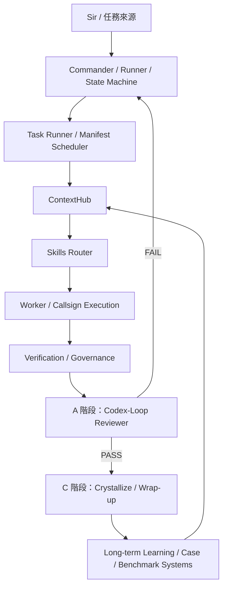

# 🛡️ Nexus System Architecture & Lifecycle Blueprint (v9)

> [!warning] Historical architecture snapshot
>
> This document describes the Nexus v9 architecture and is preserved for
> historical reconstruction only.
>
> It is not the current Nexus architecture SSoT and must not be used to infer
> present runtime wiring, readiness, route authority, provider behavior,
> capability status, or production state.
>
> Current operational state:
> [`../nexus_wiki_vault/00_Home/CURRENT_STATE.md`](../nexus_wiki_vault/00_Home/CURRENT_STATE.md)
>
> Newer architecture reference:
> [`../nexus_wiki_vault/01_System/SYSTEM_ARCHITECTURE_BLUEPRINT.md`](../nexus_wiki_vault/01_System/SYSTEM_ARCHITECTURE_BLUEPRINT.md)

> [!abstract] 核心意圖
> 本文件定義 Nexus 系統的工業級架構與生命週期規範。v9 正式化 DX/XD 變體、quick/direct/full/conversation 模式與 X 階段 provider fallback，確保複雜任務的原子化執行、知識回灌與自動化治理。

---

## 🧭 Agent-Guide
- **核心定位**: 此文件為 Nexus v9 架構的最高行為準則。
- **適用場景**: 當開發新 Phase、調整路由邏輯或重構 Worker 角色時，必須以此為基準。
- **治理邏輯**: 嚴禁在未修改本藍圖的情況下，私自變更 `phase transition`、`ContextHub` 的決策權重或 `mode gate`。 ✅

## 🗂️ Agent-Index
1. **Overall Architecture** (總體架構圖) ✅
2. **Lifecycle Flow** (生命週期主流程與詳細流程圖) ✅
3. **Core Components** (Commander, ContextHub, Skills Router) ✅
4. **Execution Layer** (Worker / Callsign Layer) ✅
5. **Governance & Audit** (Verification, Codex-Loop, 退回邏輯) ✅
6. **Knowledge Ecosystem** (External Research, Learning System, Crystallization) ✅
7. **Assets & Benchmarks** (Offline Case / Benchmark 系統) ✅

## ⚡ Agent-Actions
- **If** 任務進入 `A 階段 (Audit)` 失敗 -> **Then** 依據本文件第 11 節執行「定向退回」邏輯。 ✅
- **If** 偵測到內部知識缺口 -> **Then** 強制觸發 `X 階段 (External Research)` 並產出 `researchpack.json`。 ✅
- **If** 任務完成 -> **Then** 執行 `C 階段 (Crystallize)` 並更新 `Daily_Log` 與 `LanceDB`。 ✅

---

## 1. Nexus 總體架構圖 (System Architecture)



---

## 2. 生命周期主流程圖 (Lifecycle Main)

正式生命周期主軌遵循 **P → D → X → R → A → C** 軌跡（DX-default）：

- **P** = Plan / Scout (計畫與探索)
- **D** = Diagnose (診斷與分析)
- **X** = External Research (外部研究，選用)
- **R** = Repair / Produce (執行與產出)
- **A** = Audit / Codex-Loop (審核與循環)
- **C** = Crystallize / Wrap-up (結晶與收尾)

v9 補充：
- **預設主軌**：`DX`（先 Diagnose 再 External Research）。
- **合法變體**：`XD`（先 External Research 再 Diagnose），僅在高不確定任務觸發。
- **XD 觸發條件**（任一命中）：
  - 第三方 SDK / 協議型整合（如 Stripe/WebSocket/複雜 Webhook）
  - `needs_research=true`
  - 高未知度任務（ContextHub 評分達門檻）

---

## 3. 生命周期詳細流程圖 (Detailed Pipeline)

```text
主軌：DX-default（P→D→X→R→A→C）
任務進來
  ↓
Task Runner（控制平面）
  - 讀取 task_manifest.yaml
  - 依 depends_on 排程任務
  - 套用 ask_policy / retry / timeout / evidence
  ↓
P：Plan / Scout
  - 任務理解 / 初步規劃
  - lessons / memory / Daily_Log 喚醒
  - 視需要產生外部研究需求
  ↓
D：Diagnose
  - 問題分析 / root cause
  - 診斷書 / 修復藍圖
  - 若內部知識不足，標記 needsresearch
  ↓
X：External Research（可選）
  - 執行外部研究 (Felo/Web Fetch)
  - 產出 researchpack.json
  - 回灌 D / R / A
  ↓
R：Repair / Produce
  - 真正執行工作 (修 Bug / 寫功能 / 創作)
  - 最多 5 次迭代
  ↓
A：Audit / Codex-Loop
  - reviewer pass / fail / skipped
  - 若 fail，視情況退回 P / D / R
  - 若多輪未過，Codex 可給最佳答案
  ↓
C：Crystallize / Wrap-up
  - lessons 提煉 / 向量化
  - Daily_Log / commit / case promotion
  - 最多 3 次收束
  ↓
完成
```

> [!note] v9 變體規則
> 當 `XD` 觸發條件命中時，允許流程採 `P→X→D→R→A→C`，但仍需保留 A 階段最小治理與完整 trace。

---

## 4. Commander / Runner / State Machine 關係圖

| 負責事項 | 禁忌 (不直接做的事) |
| :--- | :--- |
| 任務初始化 | 不直接當作 Formal Skill |
| Phase Transition (P/D/X/R/A/C) | 不直接等同於 Worker |
| Retry / Return Routing | 不直接等同於 Codex Reviewer |
| Task Manifest 排程（depends_on / on_fail / timeout） | 不直接手動指定技能清單 |
| Worktree / State 管理 | |
| Transcript / Timeline 記錄 | |
| 觸發 ContextHub 與後續報表 | |

> [!important] 控制平面 vs 執行平面
> - **Task Runner / Manifest** = 控制平面（排程與治理）。
> - **ContextHub + Skills Router + Worker** = 執行平面（技能決策與實作）。
> - 規則：排程階段不得手動綁定 skill；skill 由 Router 依 phase 與訊號自動決策。

---

## 5. ContextHub 結構圖

**定義**: ContextHub 是上下文組裝與路由前決策中樞。

- **Context Assembly**:
    - Task goal, state snapshot
    - Memory / Lessons / Reflection
    - Prior outputs / Research context
- **Pre-routing Decisions**:
    - Need external research?
    - Prompt compression
    - Routing signals preparation

---

## 6. Skills Router 結構圖

**定義**: Skills Router 是依 Phase 與任務訊號做技能選擇、記錄與路由的獨立元件。

- **Inputs**: Phase, Language, Task scale, Feature/Repair type, Failure signature.
- **Decision**: Decision tree, Scorecard, Threshold.
- **Output**: Selected skills, Rejected candidates, Skill invocations history.
- **Boundary**: Skills Router 的決策來源是 phase/context 訊號，不是 task_manifest 的手動技能配置。

---

## 7. Worker / Callsign 與 Skills 的關係圖

- **Worker / Callsign**: 執行角色 (如 Scout, Architect)。
- **Skills Router**: 選擇的是正式的 `formal skills` (如 `replace`, `grep_search`)。

```text
ContextHub → Skills Router (選 formal skills) → Worker / Callsign Layer (執行角色) → Execution Result
```

---

## 8. Worker / Callsign Layer 角色定義

| 角色 | 核心任務 | 常調用技能 (Formal Skills) |
| :--- | :--- | :--- |
| **Scout** | 前期探索、依賴調查 | `codebase_investigator`, `pseudo-code.gen` |
| **Architect** | 需求收斂、規格規劃、BDD 設計 | `prd.gen`, `sequence-diagram.gen`, `tech-stack.gen` |
| **Red-Test** | 測試先行、失敗案例構造 | `pytest-bdd.feature`, `e2e.red` |
| **Green-Coder** | 實作、Patch、主要產出 | Repair / Implementation 類技能 |
| **Refactor** | 重構、清理、品質提升 | `e2e.refactor`, `code-quality` |
| **QA / Audit** | 驗證、Review 輔助 | `audit`, `deterministic-gate` |

---

## 9. Verification / Governance (治理層)

在進入 **A 階段** 前，Worker 產出必須經過：
- **Artifact Checks**: 文件/代碼實體檢查。
- **Environment Checks**: 執行環境與依賴驗證。
- **Governance**: 品質、風險與成本管控。
- **Evidence**: 產生 Audit-ready 的證據鏈。

---

## 10. A 階段：Codex-Loop 關係圖

**Codex 角色**: 
- 最後一關 Reviewer。
- 不是主工作者，也不是 Runner。
- 輸出結果：`APPROVED`, `REJECTED`, `BEST_ANSWER`, `SKIPPED_QUOTA`。

---

## 11. A 階段退回邏輯 (Return Routing)

- **APPROVED**: 進入 C 階段。
- **REJECTED**: 視情況退回：
    - 回 **P** (規劃理解錯誤)
    - 回 **D** (診斷錯誤)
    - 回 **R** (實作錯誤)
- **BEST_ANSWER**: Codex 給予最佳答案，直接記錄為學習資產。
- **SKIPPED_QUOTA**: Reviewer 跳過，不阻塞流程。

---

## 12. X 階段：External Research 圖

**定義**: X 是可選的 External Research phase，用來填補知識缺口。

- **觸發**: P 或 D 階段由 ContextHub 標記為 `needsresearch`。
- **執行**: Felo search, Web fetch.
- **輸出**: `researchpack.json`, `externalused`, Research summary.
- **回灌**: 修正 D 診斷、增加 R 約束、補充 A 審核背景。

---

## 13. Learning 系統與 C 階段知識結晶

### 13.1 即時學習 (Learning System)
任務過程中產生的 `transcripts`, `timeline`, `failure signature`, `review comments` 會實時回流至 ContextHub 與 Learning Sinks。

### 13.2 C 階段結晶 (Crystallization)
**定義**: C 不是單純收尾，而是長期知識結晶 Phase。
- Lessons extraction (教訓提煉)
- `codex_lessons` 與 `Daily_Log` 更新
- Vector memory (LanceDB) 注入
- Case promotion (案例晉升)

---

## 14. Offline Case / Benchmark 系統

**定位**: 長期知識資產層。
- **檔案**: `cases/`, `catalog.json`, `replay_case.py`, `run_benchmarks.py`.
- **作用**: 提供正式案例資產、Benchmark Replay 與檢索提示 (Retrieval Hints)。

---

## 15. 全系統閉環圖 (The Grand Loop)

```text
Task / Sir
   ↓
Commander / Runner
   ↓
Task Runner / Manifest Scheduler (Control Plane)
   ↓
ContextHub (組裝與決策)
   ↓
Skills Router (技能調度)
   ↓
Worker Execution (角色分工執行)
   ↓
Governance (品質治理)
   ↓
A Phase (Codex 審核)
   ↓
C Phase (結晶化)
   ↓
Long-term Learning & Benchmark Systems
   ↓
回流到 ContextHub / 未來任務
```

---
%% 
由 Muse-Core Lvl 15 總體架構師於 2026-03-17 完成 Nexus v9 終極藍圖寫入。
本文件曾作為 Nexus v9 時期的系統開發與執行事實來源；其權威範圍已凍結於該歷史版本。
%%
