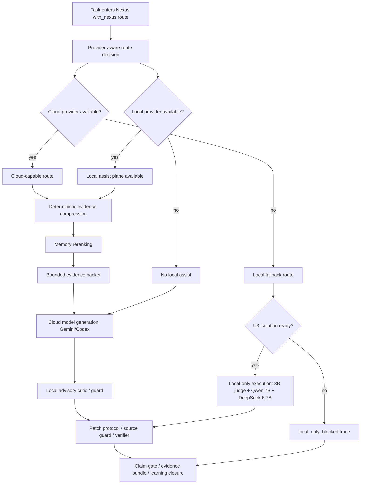
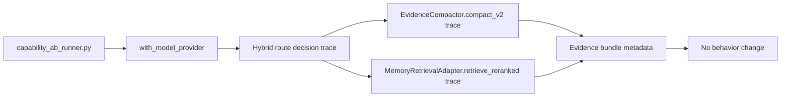
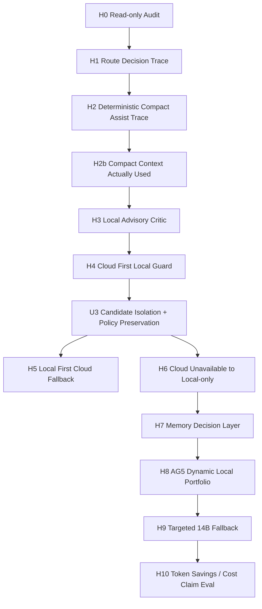

# Nexus Hybrid Dynamic Route 完整計劃與 MCP 查證來源

**日期**: 2026-06-22  
**狀態裁決**: `HYBRID_DYNAMIC_ROUTE_DIRECTION_CONFIRMED_WITH_PHASED_EXECUTION`  
**用途**: 提供給後續 Agent / Gemini / LocalHeal / Nexus 實作者作為統一設計文件，避免把第一版 Trace、後續 Local Assist、Local-only fallback、AG5/U3、Memory decision layer 混在一起。  
**治理邊界**: `public_claim_allowed=false`, `production_ready=false`, `training_export_allowed=false`, `internal_only=true`

---

## 0. Executive Summary

本計劃的核心目標是讓 Nexus 具備 **Hybrid Dynamic Route**：

```text
雲端模型可用時：
    Nexus 使用本地小模型與 deterministic armor 協助雲端模型，降低 context/token/retry 成本。

雲端模型不可用時：
    Nexus 切換到本地模型 portfolio 執行，但必須等 U3 candidate isolation / selected re-apply 完成後才能宣稱 local-only full execution。
```

MCP 對照後，這個方向 **適合 Nexus 且可執行**，原因是 repo 已有下列承載點：

| 需求 | MCP 查到的既有基礎 |
|---|---|
| Cloud / local provider abstraction | `scripts/bench/capability_ab_runner.py` 已有 `--with-model-provider gemini/codex/ollama` |
| 本地 Ollama provider env | `NEXUS_OAUTH_PROVIDER=ollama`, `NEXUS_OLLAMA_ACTIVE_MODEL`, `NEXUS_OLLAMA_MODEL` |
| Route/cost/context policy | `route_cost_controls`, `context_mode == compact`, `candidate_cap`, `max_rounds`, `lite_route` |
| Evidence compression | `EvidenceCompactor.compact_v2` |
| LocalHeal context guard | `ContextGuard.protect()` 已用 `compact_v2` |
| Memory reranking | `MemoryRetrievalAdapter.retrieve_reranked()` |
| Memory trace | `HealOrchestrator._attach_memory_influence_trace()` |
| Local U3 runtime hook | `NEXUS_USE_COMMITTEE=1`, `CommitteeOrchestrator`, `pipeline.py` runtime switch |
| Evidence bundle provider context | `ollama_model_name`, `ollama_active_model`, `compact_prompt`, `model_uses_nexus_rate` |

第一版不能直接做完整 cloud/local 動態執行。正確順序是：

```text
H0 Audit
→ H1 Route Decision Trace
→ H2 Deterministic Compact Assist Trace
→ H2b Compact Context Actually Used, gated by env
→ H3 Local Advisory Critic After Cloud
→ H4 Cloud First Local Guard
→ U3 Candidate Isolation + Policy Preservation
→ H6 Local-only Executed
→ H7 Memory Decision Layer
→ H8 AG5 Dynamic Local Portfolio
→ H9 Targeted 14B Fallback
→ H10 Token Savings / Cost Claim Eval
```

第一版 MVP 僅做：

```text
H0 + H1 + H2 trace mode
```

也就是：

```text
provider-aware hybrid route trace
+ deterministic compact_v2 / memory reranked trace
+ evidence bundle metadata
+ 不改實際模型調用行為
```

---

## 1. MCP 查證來源總表

> 注意：以下來源為 2026-06-22 使用 Nexus MCP 對本地 repo 查證所得。若之後程式變動，行號可能偏移；但檔案與語義位置仍應優先作為接線依據。

### 1.1 Provider / Runner 主路徑

| 查證結論 | 來源 |
|---|---|
| `capability_ab_runner.py` 是 `with_nexus` 主路徑，`run_with_nexus()` 接收 `with_model_provider` | `scripts/bench/capability_ab_runner.py:5329-5339` |
| Runner 已有 `--with-model-provider` CLI，支援 `gemini`, `codex`, `ollama` | `scripts/bench/capability_ab_runner.py:9652-9654` |
| Runner 若 `with_model_provider == ollama`，會設定 `NEXUS_OAUTH_PROVIDER=ollama` | `scripts/bench/capability_ab_runner.py:9861-9863` |
| Runner 已有 `_external_model_name_for_provider("ollama")`，會讀 `NEXUS_OLLAMA_ACTIVE_MODEL` / `NEXUS_OLLAMA_MODEL` | `scripts/bench/capability_ab_runner.py:4412-4417` |
| Runner 已有 `_ollama_model_for_task()`，可按 difficulty/env 選本地模型 | `scripts/bench/capability_ab_runner.py:4429-4437` |
| Runner 在 with_nexus execution 中會為 Ollama 設定 `NEXUS_OLLAMA_ACTIVE_MODEL` / `NEXUS_OLLAMA_MODEL` | `scripts/bench/capability_ab_runner.py:5977-6006` |
| Runner config/evidence 中已記錄 `with_model_provider` | `scripts/bench/capability_ab_runner.py:10045`, `scripts/bench/capability_ab_runner.py:10504` |

### 1.2 Route cost / compact context / token accounting

| 查證結論 | 來源 |
|---|---|
| `route_cost_controls` 已支援 `context_mode == compact`、`max_rounds == 1`、`candidate_cap == 1` 等 cost/context policy signal | `scripts/bench/capability_ab_runner.py:3264-3271` |
| Runner 會把 `route_cost_controls` 寫入 row，如 `candidate_cap`, `lite_route`, `context_mode`, `max_rounds`, `route_lane` | `scripts/bench/capability_ab_runner.py:5571-5582`, `scripts/bench/capability_ab_runner.py:6231-6242`, `scripts/bench/capability_ab_runner.py:6704-6715` |
| Runner/evidence bundle 已記錄 `compact_prompt` env | `scripts/bench/capability_ab_runner.py:8849-8851`, `scripts/bench/evidence_bundle_provider_context.py:41-42` |
| `ab_eval.py` 已有 local-only token accounting，如 `token_capture_status=not_applicable_local_only`、`token_local_only_rate` | `scripts/bench/ab_eval.py:563-566`, `scripts/bench/ab_eval.py:631`, `scripts/bench/ab_eval.py:671` |
| evidence payload 已有 `model_uses_nexus_rate` | `scripts/bench/evidence_bundle_payload.py:156-182`, `scripts/bench/evidence_bundle_payload.py:217-224` |

### 1.3 Evidence compression / local deterministic assist

| 查證結論 | 來源 |
|---|---|
| `EvidenceCompactor.compact_v2()` 已存在，提供 anchor-proximity scoring、dedup、bounded output | `nexus/services/local_heal/evidence_compactor.py:117-180` |
| `ContextGuard.protect()` 已使用 `EvidenceCompactor.compact_v2()` 壓縮 `ctx.op.repro_evidence` | `nexus/services/local_heal/context_guard.py:8-29` |
| `ContextGuard` 還限制 localized files 數量與總字元 | `nexus/services/local_heal/context_guard.py:31-62` |
| `NEXUS_GATEWAY_COMPACT_PROMPT` 已被 evidence bundle provider context 讀取 | `scripts/bench/evidence_bundle_provider_context.py:41-42` |

### 1.4 Memory retrieval / trace / learning closure

| 查證結論 | 來源 |
|---|---|
| `MemoryRetrievalAdapter.retrieve_reranked()` 已存在，會擴大 retrieval window、按 anchor symbol/file rerank | `nexus/services/local_heal/memory_retrieval_adapter.py:267-335` |
| `NativeEvidencePacketBuilder` 已使用 `memory_adapter.retrieve_reranked()` | `nexus/services/local_heal/native_evidence_packet.py:170` |
| `HealOrchestrator._attach_memory_influence_trace()` 會建立 query、呼叫 `retrieve_reranked()`，並寫 `_memory_influence_trace` | `nexus/services/local_heal/orchestrator.py:450-520` |
| memory trace 會標記 `prompt_included`, `evidence_packet_included`, `verifier_status` 等欄位 | `nexus/services/local_heal/orchestrator.py:483-492` |
| Learning Closure 寫入由 `_write_learning_closure()` 呼叫 `write_learning_closure(ctx)` | `nexus/services/local_heal/orchestrator.py:520+` 附近 |

### 1.5 Local U3 / Committee hook

| 查證結論 | 來源 |
|---|---|
| `pipeline.py` 根據 `NEXUS_USE_COMMITTEE=1` 選擇 `CommitteeOrchestrator`，否則用 `HealOrchestrator` | `nexus/services/local_heal/pipeline.py:199-205` |
| `CommitteeOrchestrator` 由 `NEXUS_USE_COMMITTEE` 啟用 | `nexus/services/local_heal/committee_orchestrator.py:32` |
| 目前 U3 scaffold 已有 `CommitteeOrchestrator`，但 candidate isolation / selected re-apply 仍是 blocker | 先前 MCP diff 查證：`committee_orchestrator.py` 固定 proposer specs、同一 ctx 連續 patch phase、selected non-applied fail-closed guard |
| Targeted 14B fallback 已有 `TargetedFallbackGate` | `nexus/services/local_heal/targeted_fallback.py:9+` |
| Local-only full execution 不應在 U3 candidate isolation 前宣稱 ready | 由 `CommitteeOrchestrator` 現況與 fail-closed guard 推導 |

---

## 2. 架構總圖

### 2.1 目標 Hybrid Dynamic Route 架構



### 2.2 第一版 MVP 只做 Trace + Deterministic Assist



### 2.3 後續升級路徑



---

## 3. 設計原則

### 3.1 不新增獨立 runner

**決策**: 不建立新 `hybrid_runner.py` 或新 `backend_profile` 作為第一版主路徑。

**MCP 查證來源**:

- `capability_ab_runner.py` 已有 `--with-model-provider gemini/codex/ollama`：`scripts/bench/capability_ab_runner.py:9652-9654`
- `run_with_nexus()` 已接收 `with_model_provider`：`scripts/bench/capability_ab_runner.py:5329-5339`
- Ollama provider env 已在既有 runner 設定：`scripts/bench/capability_ab_runner.py:5977-6006`, `9861-9863`

**理由**:

```text
5 月 with_nexus 主路徑已經存在。
Hybrid route 應擴充該主路徑，而不是繞開它。
```

### 3.2 第一版只做 Trace，不改模型調用

**決策**: H1 只產生 `hybrid_route` trace，不改 prompt、不呼叫額外本地模型、不切換 local-only execution。

**MCP 查證來源**:

- Runner 已能寫 row/evidence metadata，如 `route_cost_policy_*`：`scripts/bench/capability_ab_runner.py:5571-5582`, `6231-6242`, `6704-6715`
- Evidence bundle 已有 provider context，可加入新的 route metadata：`scripts/bench/evidence_bundle_provider_context.py:39-42`
- `model_uses_nexus_rate` 已是 evidence bundle 既有概念：`scripts/bench/evidence_bundle_payload.py:156-182`

**理由**:

```text
先讓每個 run 可觀測 hybrid route 判斷，避免 agent 直接大改模型行為。
```

### 3.3 Token/context reduction 第一版使用 deterministic compression

**決策**: 不讓本地小模型自由摘要 cloud context 作為第一版 token saving；先用 `EvidenceCompactor.compact_v2` 與 memory reranking trace。

**MCP 查證來源**:

- `EvidenceCompactor.compact_v2` 已有 anchor-proximity/dedup/bounded behavior：`nexus/services/local_heal/evidence_compactor.py:117-180`
- `ContextGuard.protect` 已使用 `compact_v2`：`nexus/services/local_heal/context_guard.py:8-29`
- `MemoryRetrievalAdapter.retrieve_reranked` 已存在：`nexus/services/local_heal/memory_retrieval_adapter.py:267-335`

**理由**:

```text
Deterministic compression 可追溯、可測試、可 fail-closed。
本地小模型自由摘要可能丟失關鍵 evidence，不適合第一版。
```

### 3.4 Local-only execution 必須等 U3 isolation

**決策**: 在 U3 candidate isolation / selected re-apply 完成前，cloud unavailable 時只能輸出 `local_only_blocked` 或 `local_only_planned`，不得宣稱 `local_only_executed`。

**MCP 查證來源**:

- `pipeline.py` 可透過 `NEXUS_USE_COMMITTEE` 切到 `CommitteeOrchestrator`：`nexus/services/local_heal/pipeline.py:199-205`
- 先前 MCP diff 查證 `CommitteeOrchestrator` 仍存在 candidate isolation / selected re-apply 問題，已有 selected-non-applied fail-closed guard。

**理由**:

```text
沒有 candidate isolation，local-only 可能產生 receipt 與實際 applied patch 不一致的假成功。
```

---

## 4. Route Mode Schema

為避免 agent 混淆「計劃」、「trace」、「真正執行」，route mode 必須細分。

```text
cloud_assisted_by_local_trace_only
cloud_assisted_by_local_compact_context
cloud_first_local_guard_advisory
cloud_first_local_guard_fail_closed
local_first_cloud_fallback
local_only_planned
local_only_blocked
local_only_executed
```

### 4.1 H1 trace-only schema

```json
{
  "hybrid_route": {
    "schema": "nexus.hybrid_route_decision.v1",
    "route_mode": "cloud_assisted_by_local_trace_only",
    "with_model_provider": "gemini",
    "cloud_provider": "gemini",
    "cloud_available": true,
    "local_provider": "ollama",
    "local_available": true,
    "local_assist_planned": true,
    "local_assist_roles": [
      "evidence_compactor",
      "memory_reranker",
      "route_critic"
    ],
    "fallback_route": "local_only_blocked",
    "fallback_block_reason": "u3_candidate_isolation_not_ready",
    "reason_codes": [
      "cloud_provider_selected",
      "local_ollama_probe_available",
      "compact_context_possible",
      "u3_local_only_not_yet_executable"
    ],
    "authority": "trace_only"
  }
}
```

### 4.2 H2 deterministic compact assist schema

```json
{
  "local_assist": {
    "schema": "nexus.hybrid_local_assist.v1",
    "mode": "deterministic_pre_cloud",
    "evidence_compactor": "compact_v2",
    "memory_reranked": true,
    "raw_context_chars": 18420,
    "compact_context_chars": 5120,
    "compression_ratio": 0.278,
    "raw_artifact_ref": "verification_report.txt",
    "omitted_bytes": 13300,
    "prompt_replaced": false,
    "authority": "trace_only"
  }
}
```

### 4.3 H3 local advisory critic schema

```json
{
  "local_guard": {
    "schema": "nexus.hybrid_local_guard.v1",
    "enabled": true,
    "model": "qwen2.5-coder:3b-instruct",
    "roles": [
      "evidence_consistency_critic",
      "patch_protocol_critic",
      "claim_precheck"
    ],
    "verdict": "pass|warn|fail",
    "authority": "advisory_only",
    "blocked_delivery": false,
    "reason_codes": []
  }
}
```

### 4.4 H6 local-only executed schema

```json
{
  "hybrid_route": {
    "route_mode": "local_only_executed",
    "cloud_available": false,
    "local_available": true,
    "cloud_model_invoked": false,
    "local_models_invoked": [
      "qwen2.5-coder:3b-instruct",
      "qwen2.5-coder:7b-instruct",
      "deepseek-coder:6.7b-instruct"
    ],
    "u3_candidate_isolation_passed": true,
    "selected_candidate_hash": "...",
    "applied_patch_hash": "...",
    "selected_candidate_hash_matches_applied": true,
    "verifier_executed": true,
    "claim_gate_executed": true
  }
}
```

---

## 5. Full Phased Plan with Verified Sources

## Phase H0: Read-only Hybrid Route Audit

### Goal

確認 hybrid route 的接點、資料流與 evidence bundle 欄位，不改 code。

### Work Items

1. 定位 `with_model_provider` 的 parse / propagation。
2. 定位 cloud provider failure classification。
3. 定位 Ollama availability check 可復用來源。
4. 定位 `hybrid_route` metadata 應寫入 row/evidence bundle 的位置。
5. 定位 `compact_v2` 與 `retrieve_reranked` 可插入點。
6. 確認 `local-only` fallback 是否必須等 U3 candidate isolation。
7. 輸出 route mode schema draft。

### Verified Sources

| 計劃依據 | MCP 查證來源 |
|---|---|
| `with_model_provider` 是現有 provider 切換點 | `scripts/bench/capability_ab_runner.py:5329-5339`, `9652-9654` |
| Ollama provider 已有 env 設定 | `scripts/bench/capability_ab_runner.py:5977-6006`, `9861-9863` |
| route/cost/context controls 已存在 | `scripts/bench/capability_ab_runner.py:3264-3271`, `5571-5582` |
| evidence bundle 可記錄 provider context | `scripts/bench/evidence_bundle_provider_context.py:39-42` |
| compact prompt flag 已存在 | `scripts/bench/capability_ab_runner.py:8849-8851` |

### Output

```text
docs/reports/hybrid_dynamic_route_h0_audit_v0.md
artifacts/runtime/hybrid_dynamic_route_h0_audit_v0/integration_point_matrix.json
artifacts/runtime/hybrid_dynamic_route_h0_audit_v0/route_mode_schema_draft.json
```

### Gates

```text
No code changes.
No model calls.
No benchmark.
No public claim.
```

---

## Phase H1: Hybrid Route Decision Trace Only

### Goal

在 `with_nexus` run 中產生 provider-aware `hybrid_route` trace，但不改任何模型行為。

### Work Items

1. 新增 route decision builder，或在 runner 中最小封裝。
2. 根據 `with_model_provider` 判斷 cloud/local route mode。
3. 根據 Ollama availability / env 判斷 local availability。
4. 把 `hybrid_route` 寫入 row。
5. 把 `hybrid_route` 寫入 evidence bundle。
6. 保持 `solve`、`verifier`、`claim gate` 行為不變。

### Verified Sources

| 計劃依據 | MCP 查證來源 |
|---|---|
| row 可寫 route cost policy controls | `scripts/bench/capability_ab_runner.py:6231-6242`, `6704-6715` |
| evidence bundle 已記錄 provider model lock 與 Ollama fields | `scripts/bench/capability_ab_runner.py:8846-8851` |
| `model_uses_nexus_rate` 已存在於 evidence payload | `scripts/bench/evidence_bundle_payload.py:156-182`, `217-224` |
| `with_model_provider` 被傳入 `run_with_nexus` | `scripts/bench/capability_ab_runner.py:5329-5339` |

### Acceptance Gates

```text
with_model_provider=gemini → row/evidence bundle 有 hybrid_route
with_model_provider=codex → row/evidence bundle 有 hybrid_route
with_model_provider=ollama → row/evidence bundle 有 hybrid_route
route_mode 可區分 trace_only / blocked / planned
不影響既有 verifier / claim gate
不改 model behavior
```

### Scope Limit

```text
Max touched files: 3-5
No new runner
No benchmark beyond unit/smoke
```

---

## Phase H2: Deterministic Local Assist Before Cloud, Trace Mode

### Goal

使用現有 deterministic 能力產生 context compression / memory reranking trace，但不替換 cloud prompt。

### Work Items

1. 呼叫或復用 `EvidenceCompactor.compact_v2`。
2. 呼叫或復用 `MemoryRetrievalAdapter.retrieve_reranked`。
3. 記錄 raw/compact char counts。
4. 記錄 `compression_ratio`。
5. 記錄 raw artifact ref。
6. `prompt_replaced=false`。
7. 寫入 row/evidence bundle。

### Verified Sources

| 計劃依據 | MCP 查證來源 |
|---|---|
| `EvidenceCompactor.compact_v2` 已存在 | `nexus/services/local_heal/evidence_compactor.py:117-180` |
| `ContextGuard.protect()` 已用 `compact_v2` | `nexus/services/local_heal/context_guard.py:8-29` |
| `retrieve_reranked()` 已存在且有 anchor-aware reranking | `nexus/services/local_heal/memory_retrieval_adapter.py:267-335` |
| Native evidence packet 已能使用 memory reranking | `nexus/services/local_heal/native_evidence_packet.py:170` |
| compact prompt flag 已在 evidence provider context | `scripts/bench/evidence_bundle_provider_context.py:41-42` |

### Acceptance Gates

```text
compact_v2 invoked or trace-proven available
retrieve_reranked invoked or trace-proven available
raw_context_chars and compact_context_chars present
compression_ratio present
prompt_replaced=false
No solve behavior change
No cloud prompt mutation
```

---

## Phase H2b: Compact Context Actually Used

### Goal

在 env gate 下，真的將 compacted context 用於 cloud prompt。

### Env Gate

```text
NEXUS_HYBRID_USE_COMPACT_CONTEXT=1
```

### Work Items

1. 僅在 env gate 開啟時替換 cloud prompt 的 evidence section。
2. 保留 raw artifact ref。
3. verifier / claim gate 必須照常。
4. 若 compact context 導致 verifier regression，fail closed 或回退 raw context。

### Verified Sources

| 計劃依據 | MCP 查證來源 |
|---|---|
| compact prompt env 已存在 | `scripts/bench/capability_ab_runner.py:8849-8851`, `scripts/bench/evidence_bundle_provider_context.py:41-42` |
| route_cost_controls 已有 `context_mode == compact` | `scripts/bench/capability_ab_runner.py:3264-3271` |

### Acceptance Gates

```text
prompt_replaced=true only under env gate
raw artifact retained
compact context chars recorded
verifier non-regression required
claim gate unchanged
```

---

## Phase H3: Local Advisory Critic After Cloud

### Goal

讓本地小模型在 cloud output 後做 advisory-only guard。

### Work Items

1. 使用 3B 或小模型做 evidence consistency / patch protocol / claim precheck。
2. 儲存 local critic raw output。
3. 儲存 advisory verdict。
4. 不改 cloud patch。
5. 不阻擋 delivery，除非未來升級到 fail-closed mode。

### Verified Sources

| 計劃依據 | MCP 查證來源 |
|---|---|
| LocalModelPolicy / Ollama env 已可選 local models | `scripts/bench/capability_ab_runner.py:4412-4437`, `5977-6006` |
| Patch protocol / source guard 已是 LocalHeal 安全路線的一部分 | `nexus/services/local_heal/action_protocol.py`, `source_hash_guard.py`, `ast_locator.py`；前序 MCP 查證 |
| Claim/evidence bundle 已有 model_uses_nexus / claim gate concepts | `scripts/bench/evidence_bundle_payload.py:156-224` |

### Acceptance Gates

```text
authority=advisory_only
blocked_delivery=false
critic does not modify cloud output
critic raw output persisted
verifier still authoritative
```

---

## Phase H4: Cloud First with Local Guard

### Goal

Cloud model 先生成，本地模型作為 cheaper guard / retry advisor，降低壞 patch 進入後續流程或 cloud retry 的成本。

### Work Items

1. Cloud generates patch / solution.
2. Local guard evaluates protocol/evidence consistency.
3. Local guard suggests retry / no retry.
4. Verifier remains authoritative.
5. Claim gate remains authoritative.

### Verified Sources

| 計劃依據 | MCP 查證來源 |
|---|---|
| Cloud provider path 已存在：Gemini/Codex | `scripts/bench/capability_ab_runner.py:9652-9654`, `4862+` Codex path, `4569+` Gemini direct path |
| Local provider path 已存在：Ollama | `scripts/bench/capability_ab_runner.py:5977-6006` |
| verifier / claim/evidence bundle 已存在於 with_nexus runner | `scripts/bench/capability_ab_runner.py`, `evidence_bundle_payload.py` |

### Acceptance Gates

```text
cloud_model_invoked=true
local_guard_invoked=true
local_guard authority initially advisory_only
verifier_executed=true
claim_gate_executed=true
retry decision reason recorded
```

---

## Phase H5: Local First, Cloud Fallback

### Goal

成本敏感時，本地先嘗試；本地失敗或 confidence 低時才 cloud fallback。

### Prerequisite

```text
U3 candidate isolation complete
selected candidate re-apply complete
policy preservation complete
selected_candidate_hash == applied_patch_hash
```

### Work Items

1. Local route attempts first.
2. If verifier pass, no cloud call.
3. If verifier fail / low confidence / semantic limit, cloud fallback.
4. Record fallback reason.

### Verified Sources

| 計劃依據 | MCP 查證來源 |
|---|---|
| `NEXUS_USE_COMMITTEE` 可切換 CommitteeOrchestrator | `nexus/services/local_heal/pipeline.py:199-205`, `committee_orchestrator.py:32` |
| Runner 已有 provider local/ollama path | `scripts/bench/capability_ab_runner.py:5977-6006` |
| ab_eval 已能表示 local-only token not applicable | `scripts/bench/ab_eval.py:563-566`, `631`, `671` |

### Acceptance Gates

```text
local_model_invoked=true
cloud_model_invoked=false when local solves
cloud_model_invoked=true only with fallback_reason
verifier pass required before cost-saving claim
```

---

## Phase H6: Cloud Unavailable to Local-only

### Goal

雲端不可用時，自動切本地模型 portfolio。

### Prerequisite

```text
U3 2A candidate isolation PASS
U3 2B policy preservation PASS
selected_candidate_hash == applied_patch_hash
verifier available
claim gate available
```

### Work Items

1. Detect cloud unavailable.
2. Check local available.
3. If U3 isolation ready, execute local-only route.
4. If not ready, emit `local_only_blocked`.

### Verified Sources

| 計劃依據 | MCP 查證來源 |
|---|---|
| Ollama provider/env exists | `scripts/bench/capability_ab_runner.py:5977-6006`, `9861-9863` |
| Local U3 committee hook exists | `nexus/services/local_heal/pipeline.py:199-205` |
| Token accounting has local-only markers | `scripts/bench/ab_eval.py:563-566`, `631`, `671` |

### Acceptance Gates

```text
cloud_model_invoked=false
local_models_invoked present
3B judge invoked
Qwen/DeepSeek candidate hashes present
selected_candidate_hash == applied_patch_hash
verifier_executed=true
claim_gate_executed=true
learning_closure_written=true
```

---

## Phase H7: Memory Decision Layer

### Goal

讓 Memory 從 evidence/prompt/trace 層升級為 conservative route signal。

### Work Items

1. 建立 `memory_signal_quality_gate`。
2. 僅允許高品質 memory signal 影響 route caution。
3. 初版只允許：
   - `memory_hard_signal=true` → increase caution
   - `memory_known_failure_pattern=true` → enable second proposer / candidate_cap=2
4. 不允許 memory 直接選模型、觸發 14B、判斷 solved。

### Verified Sources

| 計劃依據 | MCP 查證來源 |
|---|---|
| `retrieve_reranked()` 已有 anchor-aware memory selection | `nexus/services/local_heal/memory_retrieval_adapter.py:267-335` |
| Memory influence trace already attaches to ctx/receipt path | `nexus/services/local_heal/orchestrator.py:450-520` |
| Learning closure bridge already called after run | `nexus/services/local_heal/orchestrator.py:520+` |

### Acceptance Gates

```text
memory signal has provenance
memory signal quality gate pass
decision_authority=caution_only
bad/low-quality memory cannot affect route
```

---

## Phase H8: AG5 Dynamic Local Portfolio

### Goal

補完整 AG5 語義：不是固定雙 proposer，而是動態 local portfolio。

### Work Items

1. 查是否已有 AG5 classifier。
2. 若無，標為 new policy implementation。
3. 實作/接入：
   - 3B gate + critic + evidence judge
   - bucket-specific primary proposer
   - disagreement-triggered second proposer
   - cost-optimized default
   - hard-task complex route

### Verified Sources

| 計劃依據 | MCP 查證來源 |
|---|---|
| 目前 `CommitteeOrchestrator` 可由 `NEXUS_USE_COMMITTEE` 啟用，但固定 proposer scaffold 尚非 AG5 完整語義 | `nexus/services/local_heal/committee_orchestrator.py:32`, 前序 MCP diff |
| `route_cost_controls` 可作為 cost/bucket signal 承載點 | `scripts/bench/capability_ab_runner.py:3264-3271`, `5571-5582` |

### Acceptance Gates

```text
easy/simple 不固定雙跑
second proposer only on disagreement/low confidence/hard task
second proposer invocation reason recorded
candidate_cap route-controlled
```

---

## Phase H9: Targeted 14B Fallback

### Goal

只在 `MODEL_SEMANTIC_LIMIT` 等符合條件時觸發 14B fallback。

### Work Items

1. 復用 `TargetedFallbackGate`。
2. 接入 LocalModelPolicy/resource guard。
3. 尊重 `NEXUS_14B_RESOURCE_BLOCKED` / `NEXUS_DISABLE_14B_RETRY`。
4. receipt 記錄 fallback eligibility / resource guard / invoke result。

### Verified Sources

| 計劃依據 | MCP 查證來源 |
|---|---|
| `TargetedFallbackGate` exists | `nexus/services/local_heal/targeted_fallback.py:9+` |
| Ollama model env / selection exists | `scripts/bench/capability_ab_runner.py:4412-4437`, `5977-6006` |

### Acceptance Gates

```text
14B never default
resource blocked is clean skip
fallback attempt receipt-backed
no fallback without verifier
```

---

## Phase H10: Token Savings / Cost Claim Eval

### Goal

驗證 Hybrid Dynamic Route 是否真的降低 cloud token/retry，且不降低品質。

### Work Items

1. 記錄 before/after context chars。
2. 若 provider 支援，記錄 provider tokens。
3. 記錄 cloud retry count。
4. 記錄 verifier result。
5. 記錄 trust mismatch / claim gate。
6. 建立 quality non-regression gate。

### Verified Sources

| 計劃依據 | MCP 查證來源 |
|---|---|
| Runner/evidence bundle 已有 provider token measured gate | `scripts/bench/capability_ab_runner.py:9299-9300`, `10050-10051`, `10520-10521` |
| `ab_eval.py` 已有 local-only token rate / token metrics | `scripts/bench/ab_eval.py:563-566`, `631`, `671` |
| evidence bundle 已有 `model_uses_nexus_rate` | `scripts/bench/evidence_bundle_payload.py:156-224` |

### Claim Gate

只有同時滿足以下條件才能談 token/cost claim：

```text
context/tokens decreased
cloud retry decreased or unchanged
verified result non-regressed
trust mismatch not increased
claim gate pass
sample sufficient
```

否則只能宣稱：

```text
context compression observed
```

不可宣稱：

```text
token savings proven
```

---

## 6. First Version MVP

### Scope

```text
H0 Read-only audit
H1 Hybrid route decision trace
H2 deterministic compact/memory trace mode
```

### Must Not Do

```text
No local model critic yet
No cloud prompt replacement yet
No local-first
No local-only execution
No 14B fallback
No memory decision layer
No AG5 full portfolio
No public token savings claim
```

### MVP Acceptance Gates

```text
1. with_model_provider=gemini/codex/ollama 都能產生 hybrid_route trace。
2. hybrid_route 能區分 cloud/local availability。
3. route_mode 能區分 trace_only / planned / blocked。
4. compact_v2 trace 能記錄 raw/compact context size。
5. retrieve_reranked trace 能記錄 memory source / selected ids。
6. evidence bundle 保留 hybrid route metadata。
7. 不改 solve behavior。
8. 不破壞 existing public gate。
```

---

## 7. Agent Execution Boundary

任何 agent 接此任務時必須遵守：

```text
Do not create a new runner.
Use scripts/bench/capability_ab_runner.py.
Do not replace with_model_provider.
Extend provider-aware route metadata instead.
Do not use MEMORY-EVAL as mainline.
Do not use U3 committee as cloud helper until candidate isolation is complete.
Do not let local model free-summarize cloud context in first version.
Use EvidenceCompactor.compact_v2 first.
Use MemoryRetrievalAdapter.retrieve_reranked as trace/evidence first.
No public claim.
No production ready claim.
No git add -A.
No benchmark before route trace and receipt tests pass.
```

---

## 8. Suggested Agent Prompt for H0

```text
Read-only task. Do not edit files.

Goal:
Audit integration points for Nexus Hybrid Dynamic Route.

Context:
Nexus already has a with_nexus main route in scripts/bench/capability_ab_runner.py.
The plan is to support:
- cloud_assisted_by_local_trace_only
- cloud_assisted_by_local_compact_context
- cloud_first_local_guard_advisory
- local_only_blocked
- local_only_executed later after U3 candidate isolation

Check:
1. where --with-model-provider is parsed and passed into run_with_nexus
2. how gemini/codex/ollama providers are represented in env and evidence bundle
3. where route_cost_controls can carry hybrid route metadata
4. where EvidenceCompactor.compact_v2 can be reused before cloud prompt construction
5. where MemoryRetrievalAdapter.retrieve_reranked can be reused
6. where evidence_bundle_payload or provider_context should record hybrid_route
7. why local_only_executed must wait for U3 candidate isolation

Output:
- docs/reports/hybrid_dynamic_route_h0_audit_v0.md
- artifacts/runtime/hybrid_dynamic_route_h0_audit_v0/integration_point_matrix.json
- artifacts/runtime/hybrid_dynamic_route_h0_audit_v0/route_mode_schema_draft.json
- max 5 file touch plan for H1
- test plan

No code changes.
No model calls.
No benchmark.
```

---

## 9. Final Verdict

```text
HYBRID_DYNAMIC_ROUTE_DIRECTION_CONFIRMED
PLAN_EXECUTABLE_IF_PHASED
FIRST_VERSION_MUST_BE_TRACE_AND_DETERMINISTIC_COMPRESSION_ONLY
LOCAL_ONLY_EXECUTION_MUST_WAIT_FOR_U3_CANDIDATE_ISOLATION
TOKEN_SAVINGS_CLAIM_MUST_WAIT_FOR QUALITY_NON_REGRESSION
```

白話：

```text
這方向可以做，而且很適合 Nexus。
但第一版要保守：先讓路由判斷、compact_v2、memory rerank、evidence bundle trace 接起來。
後面再逐步加 local guard、local-first、local-only、memory decision、AG5、14B fallback、token savings claim。
```
