# NEXUS R/hyper Critical Path Topology Report

> **Methodology**: Context+ Diagnostic Assist
> **Focus**: R-Phase Wall-time & High-Cost/Low-Yield Nodes
> **Context**: v26.5 Hardened Baseline

## 1. R-Phase Execution Topology (Critical Path)

本拓樸圖展示了 Nexus 在 R (Repair) 階段執行 `run_hyper_sprint` 時的物理與邏輯路徑，並標註出耗時瓶頸。

```mermaid
graph TD
  START[P-Phase Completion] --> INTAKE[R-Intake: Manifest Load]
  INTAKE --> PREFLIGHT{Preflight Sensor}
  
  subgraph "The High-Cost Loop (R/hyper)"
    PREFLIGHT -- "Risk >= 70" --> HYPER[run_hyper_sprint]
    HYPER --> LLM_GEN[LLM Candidate Generation]
    LLM_GEN --> EVAL_LOOP{Evaluation Loop}
    EVAL_LOOP -- "Round N of 5" --> TEST_EXEC[Subprocess Pytest Execution]
    TEST_EXEC -- "Fail" --> SEMANTIC_FAIL[Semantic Failure Sensor]
    SEMANTIC_FAIL -- "Likely Fix" --> LLM_GEN
  end

  EVAL_LOOP -- "Score = 1.0" --> PROMOTER[Patch Promotion]
  PROMOTER --> CRYSTAL[C-Phase Crystallization]

  %% Hotspots (High Cost / Low Yield)
  style HYPER fill:#4c1d1d,stroke:#f85149,stroke-width:2px
  style LLM_GEN fill:#3e2e0e,stroke:#d29922,stroke-width:2px
  style TEST_EXEC fill:#4c1d1d,stroke:#f85149,stroke-width:2px
```

---

## 2. 高成本、低收益節點分析 (Diagnostic Findings)

根據 P22 報告與 `phase_writeback.jsonl` 的數據分析，以下是導致 R 階段 `avg_wall=60s+` 的「發炎節點」：

### 🔴 Node A: `run_hyper_sprint` (Orchestration Bloat)
*   **成本**: 佔 R 階段總耗時的 **90%** 以上。
*   **問題**: 目前的設計是「全量注入」。即使只是修復一個變數名稱，`run_hyper_sprint` 仍會載入完整的代碼上下文與 D 階段的診斷書。
*   **收益**: 在簡單修復 (Lite-fix) 場景下，收益極低。

### 🔴 Node B: `LLM Candidate Generation` (Input Redundancy)
*   **成本**: 每次 Model Call 約 15-25s。
*   **問題**: 缺乏「物理快取」。同一個任務的 5 輪重試中，約 70% 的 Prompt 內容是重複的。
*   **收益**: 產生過多相似的 `mutants`，增加了後續 `Equivalent Mutant` 的偵測開銷。

### 🟡 Node C: `Subprocess Pytest Execution` (I/O Penalty)
*   **成本**: 每次執行測試約 5-10s（主要為啟動開銷）。
*   **問題**: 頻繁的進程彈跳（Process Bouncing）。對於 12 題一組的 Benchmark，這裡產生了數百次的 `python3` 啟動。
*   **收益**: 這是物理驗證的底線，但「執行方式」極度不經濟。

---

### 🚀 治理關鍵路徑 (Critical Path Optimization)

為了將 Flash+Nexus 的 `wall ratio` 從 **1.62x** 降至 **< 1.0x**，應優化以下路徑：

1.  **實作「短路徑 (Fast-Path)」**：
    *   **邏輯**：當 `harness_preflight_sensor` 回報 `simple_hidden_bugfix` 時，物理阻斷 `run_hyper_sprint` 的執行，改用 `local_reflex` 或單輪 `micro_patch`。
2.  **Payload 脫水 (Prompt Distillation)**：
    *   **邏輯**：針對 `Round >= 2` 的重試，禁止再次發送全量代碼上下文，僅發送「錯誤片段」與「修正建議」。
3.  **常駐測試伺服器 (Persistent Pytest Runner)**：
    *   **邏輯**：將 `evaluate_candidate` 的子進程呼叫改為長連接或 `pytest-xdist` 模式，消滅 90% 的啟動延遲。

---

## 3. 下一步精讀清單 (Next 5 Reads)

1.  `nexus/research/sprint_service.py` (L654: `run_hyper_sprint` 內部循環)
2.  `nexus/engine/harness_sensors.py` (感知器如何與 R 階段對接)
3.  `nexus/research/local_sprint_mutator.py` (理解本地生成的邊界)
4.  `nexus/research/runtime/runtime_resilience.py` (時間預算與超時邏輯)
5.  `scripts/bench/capability_ab_runner.py` (如何更精確地切分 R 階段內耗)

---
[NEXUS IDENTITY: 8cb42212 + v2.8 RUNTIME-ALIGNED]
