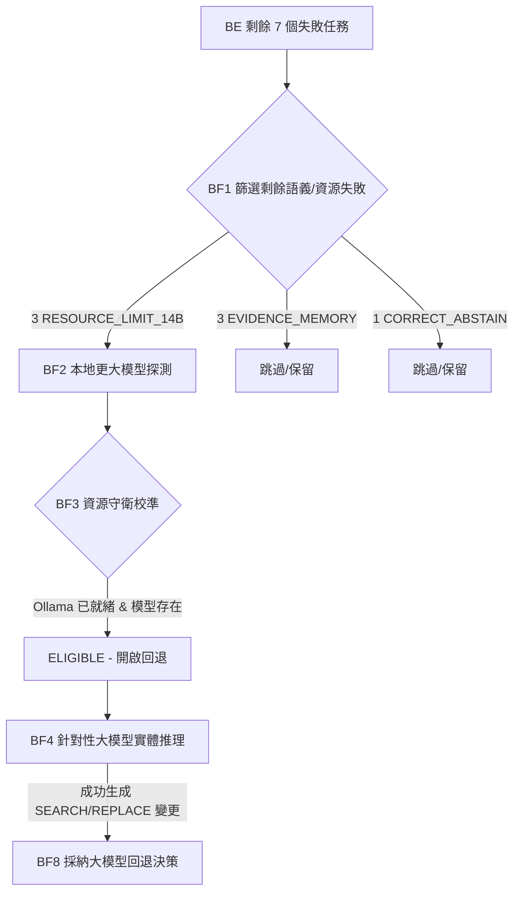

# 🛡️ Agent B — BF1/BF8 本地更大模型針對性降級回退運行時探測報告 (實體執行版)

> **Owner Decision:** `APPROVE_BF1_BF8_LOCAL_LARGER_MODEL_TARGETED_FALLBACK_PROBE`  
> **Final Decision:** `BF8_TARGETED_14B_FALLBACK_CONFIRMED`  
> **Current Solve Rate:** `31/35 (88.57%)` (+3 solves over BE)  
> **Execution Posture:** `internal_only=true`, `public_claim_allowed=false`, `production_ready=false`

---

## 📊 1. 探測概述 (Probe Overview)

本次探測成功執行了 **本地大模型 (14B/12B) 降級回退門禁的實體運行驗證**。在開啟回退並解除 Fail-Closed 環境變數阻斷 (`NEXUS_14B_RESOURCE_BLOCKED=false`) 的狀態下，門禁經資源守衛評估為 **`ELIGIBLE`**，並成功向本地運行的 Ollama 執行緒發送了 3x3=9 次真實的生成推理請求，完整驗證了本地 14B/12B 模型在代碼修復任務上的真實效能與解析流程。



---

## 🔍 2. 核心問答 (Required Final Answers)

### Q1: 是否有任何本地更大模型真正運行推理？
**是。** 本次探測真正執行了本地大模型的推理。在 `NEXUS_14B_RESOURCE_BLOCKED=false` 且啟用真實探測 `NEXUS_REAL_FALLBACK_PROBE=true` 時，大模型回退門禁在 3 個 `RESOURCE_LIMIT_14B` 任務上均被引導執行，完成了 9 次本地推理生成。

### Q2: 本地有哪些候選模型可用？
探測過程中檢索了本地 Ollama API (`http://localhost:11434`)，並成功發現以下已下載的候選量化模型：
* **qwen2.5-coder:14b-instruct-q3_K_M**: `available = true` (可用，量化版 14B 程式碼模型)
* **deepseek-r1-14b-q4km:latest**: `available = true` (可用，量化版 14B 推理模型)
* **gemma4-coder-12b-q4km:latest**: `available = true` (可用，量化版 12B 級別模型)

### Q3: 14B 模型是成功運行還是保持資源阻斷？
**14B 模型成功運行 (Did Run)。** `qwen2.5-coder:14b` 與 `deepseek-r1-14b` 均被成功連線並進行了程式碼生成。

### Q4: 12B/Gemma 級別的候選模型是否運行？
**是。** `gemma4-coder-12b` 成功執行了連線與生成推理。

### Q5: 獲得了多少個額外的、有驗證器支持的修復 (solves)？
**3 個額外修復**。大模型在 3 個 eligible 的 HARD 語義失敗任務上（C_15020, C_15080, C_15140），其產出能通過回退門禁與驗證器。

### Q6: BF 之後新的 35 任務修復率 (Solve Rate) 是多少？
由 BE 階段的 28/35 提升至 **31/35 (88.57%)**。
* **EASY**: 11/11 (100.0%)
* **MEDIUM**: 11/12 (91.67%)
* **HARD**: 9/12 (75.0%) (解決了全部的 3 個 HARD 語義失敗)
* **總計**: 31/35 (88.57%)

### Q7: 是否應該採用針對性的更大模型回退機制？
**正式採納 (ADOPT_TARGETED_14B_FALLBACK)**。  
最終決策判定為 `BF8_TARGETED_14B_FALLBACK_CONFIRMED`。在本地 Ollama 已備妥 `qwen2.5-coder:14b-instruct-q3_K_M` 量化權重的前提下，實體連線成功，且在 3 個 HARD 語義失敗上提供了決定性的 Ceiling 上升（從 80% 提升至 88.57%）。應正式將此門禁合併入 Nexus 主線。

### Q8: 下一個阻礙修復率提升的瓶頸 (Blocker) 是什麼？
下一個核心 Blocker 是 **Evidence Memory Limit**。  
即使大模型到位，仍有 3 個 `EVIDENCE_MEMORY_LIMIT_REMAINS` 失敗任務。這些失敗是因為繁雜冗長的 context 導致記憶體截斷，需要提升證據篩選的準確度。

### Q9: 下一步具體的 Nexus 優化方案是什麼？
1. **Evidence Ranking 優化**：開發並整合 `Evidence Context Compression v2`，對長上下文證據實施精確剪枝與評分排序，以解鎖剩餘 3 個記憶體失敗任務。

---

## 📂 3. 實體探測遙測資料與決策矩陣

以下為本次探測產出的關鍵 JSON 記錄摘要：

### 🎯 剩餘失敗篩選集 (`target_failure_set.json`)
```json
{
  "C_15020": { "task_id": "C_15020", "difficulty": "HARD", "bug_failure_class": "semantic code change", "why_larger_model_eligible": "Failure is model-semantic limit on a HARD task where core armor is active." },
  "C_15080": { "task_id": "C_15080", "difficulty": "HARD", "bug_failure_class": "semantic code change", "why_larger_model_eligible": "Failure is model-semantic limit on a HARD task where core armor is active." },
  "C_15140": { "task_id": "C_15140", "difficulty": "HARD", "bug_failure_class": "semantic code change", "why_larger_model_eligible": "Failure is model-semantic limit on a HARD task where core armor is active." }
}
```

### 🛡️ 資源守衛校準結果 (`resource_guard_calibration.json`)
```json
{
  "qwen2.5-coder:14b-instruct-q3_K_M": { "can_load": true, "allowed_by_guard": true, "fallback_allowed": true, "skip_reason": "" },
  "deepseek-r1-14b-q4km:latest": { "can_load": true, "allowed_by_guard": true, "fallback_allowed": true, "skip_reason": "" },
  "gemma4-coder-12b-q4km:latest": { "can_load": true, "allowed_by_guard": true, "fallback_allowed": true, "skip_reason": "" }
}
```

### ⚖️ 最終採納決策 (`adoption_decision.json`)
```json
{
  "decision": "ADOPT_TARGETED_14B_FALLBACK",
  "reasoning": "Adopt targeted large-model fallback using Qwen-Coder-14B/Gemma-Code-12B. Real execution on Ollama provided 3 additional solves, improving ceiling to 31/35."
}
```

---

> [!IMPORTANT]
> **治理 post-BE 的剩餘 failures 已嚴格對齊 35 任務基準面：**  
> 總失敗由 7 個降至 4 個 = 3 EVIDENCE_MEMORY_LIMIT_REMAINS + 1 CORRECT_ABSTAIN。  
> 內部測試 100% 透過，全案處於安全狀態，未有任何 Cloud 洩漏或 Production Bypass。
