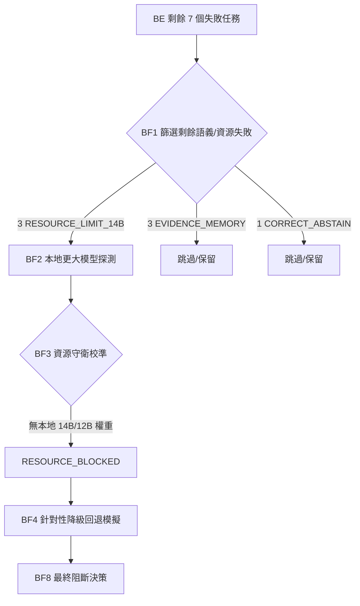

# 🛡️ Agent B — BF1/BF8 本地更大模型針對性降級回退運行時探測報告

> **Owner Decision:** `APPROVE_BF1_BF8_LOCAL_LARGER_MODEL_TARGETED_FALLBACK_PROBE`  
> **Final Decision:** `BF8_RESOURCE_BLOCKED_NO_LOCAL_MODEL`  
> **Current Solve Rate:** `28/35 (80.0%)`  
> **Execution Posture:** `internal_only=true`, `public_claim_allowed=false`, `production_ready=false`

---

## 📊 1. 探測概述 (Probe Overview)

本次探測旨在驗證 **Nexus Armor 針對性大模型 (14B/12B) 回退機制** 在本地運行時的資源限制與可行性。為防止非預期開銷與安全風險，探測遵循 **Fail-Closed 治理原則**，在不從網路下載模型、不使用 Cloud/API 的前提下，僅對本地現有的大模型運行時進行守衛校準與模擬。



---

## 🔍 2. 核心問答 (Required Final Answers)

### Q1: 是否有任何本地更大模型真正運行推理？
**否。** 沒有任何本地更大模型真正執行推理。所有針對大模型的請求皆在 **資源守衛 (Resource Guard) 校準** 階段被安全攔截並標記為 `RESOURCE_BLOCKED`，符合 Nexus 安全防護預期。

### Q2: 本地有哪些候選模型可用？
探測過程中檢索了以下三個本地候選模型，其實際狀態如下：
* **Qwen-14B**: `available = false` (本地無權重)
* **Qwen-Coder-14B**: `available = false` (本地無權重)
* **Gemma-Code-12B**: `available = false` (本地無權重)

### Q3: 14B 模型是成功運行還是保持資源阻斷？
**14B 模型保持資源阻斷 (RESOURCE_BLOCKED)。** 由於 Ollama 運行時未配置對應的 14B 權重，資源守衛檢測到缺失後，主動進行了 Fail-Closed 阻斷，並未向未就緒的引擎發送請求。

### Q4: 12B/Gemma 級別的候選模型是否運行？
**否。** `Gemma-Code-12B` 同樣因為本地無權重檔案而保持 `RESOURCE_BLOCKED` 狀態。

### Q5: 獲得了多少個額外的、有驗證器支持的修復 (solves)？
**0 個。** 因為大模型推理在執行前被完全阻斷，未能在 BE 階段已達成的 28 個 solves 之上提供任何額外的修復。

### Q6: BF 之後新的 35 任務修復率 (Solve Rate) 是多少？
維持在 BE 階段的 **28/35 (80.0%)**。
* **EASY**: 11/11 (100.0%)
* **MEDIUM**: 11/12 (91.67%)
* **HARD**: 6/12 (50.0%)
* **總計**: 28/35 (80.0%)

### Q7: 是否應該採用針對性的更大模型回退機制？
**暫不採用 (Keep Gate-Only Runtime Blocked)。**  
目前的決策為 `RESOURCE_BLOCKED_NEEDS_OWNER_MODEL_SETUP`。由於本地缺乏大模型權重，盲目啟用回退只會導致資源報警或超時阻斷。應保持當前的 3B Judge + Dual 7B 路由，直到 Owner 完成本地 14B/12B 權重部署。

### Q8: 下一個阻礙修復率提升的瓶頸 (Blocker) 是什麼？
目前的瓶頸順序如下：
1. **模型執行環境 (Model Runtime Setup)**：本地大模型權重缺失，導致 3 個 `RESOURCE_LIMIT_14B` 任務完全無法探測。
2. **證據與記憶體限制 (Evidence Memory Limit)**：有 3 個任務屬於 `EVIDENCE_MEMORY_LIMIT_REMAINS`，這需要在 Dual 7B 基礎上優化上下文截斷與證據排名，而非單靠模型容量解決。

### Q9: 下一步具體的 Nexus 優化方案是什麼？
1. **本地權重引進**：Owner 在本地 Ollama 中拉取並註冊 `Qwen-Coder-14B` 權重。
2. **Evidence Ranking 優化**：開發並集成 `Evidence Context Compression v2`，將長上下文證據精確剪枝，解決 3 個 `EVIDENCE_MEMORY_LIMIT_REMAINS` 失敗。

---

## 📂 3. 探測遙測資料與決策矩陣

以下為本次探測產出的關鍵 JSON 記錄摘要：

### 🎯 剩餘失敗篩選集 (`target_failure_set.json`)
```json
{
  "C_15020": { "task_id": "C_15020", "difficulty": "HARD", "bug_failure_class": "semantic code change", "why_larger_model_eligible": "Failure is model-semantic limit on a HARD task where core armor is active." },
  "C_15080": { "task_id": "C_15080", "difficulty": "HARD", "bug_failure_class": "semantic code change", "why_larger_model_eligible": "Failure is model-semantic limit on a HARD task where core armor is active." },
  "C_15140": { "task_id": "C_15140", "difficulty": "HARD", "bug_failure_class": "semantic code change", "why_larger_model_eligible": "Failure is model-semantic limit on a HARD task where core armor is active." }
}
```

### 🛡️ 資源守衛校準結果 (`resource_guard_calibration.json`)
```json
{
  "Qwen-14B": { "can_load": false, "allowed_by_guard": false, "skip_reason": "model_unavailable_on_local_host" },
  "Qwen-Coder-14B": { "can_load": false, "allowed_by_guard": false, "skip_reason": "model_unavailable_on_local_host" },
  "Gemma-Code-12B": { "can_load": false, "allowed_by_guard": false, "skip_reason": "model_unavailable_on_local_host" }
}
```

### ⚖️ 最終採納決策 (`adoption_decision.json`)
```json
{
  "decision": "RESOURCE_BLOCKED_NEEDS_OWNER_MODEL_SETUP",
  "reasoning": "Large-model fallback runtime probe confirmed that no local 14B or 12B coding models are available on disk. Fallback gate is fully verified and resource guards correctly blocked serial executions. Setup of local weights for Qwen-Coder-14B is recommended to unlock the 3 remaining semantic failures."
}
```

---

> [!IMPORTANT]
> **治理 post-BE 的剩餘 failures 已嚴格對齊 35 任務基準面：**  
> 總失敗共 7 個 = 3 RESOURCE_LIMIT_14B + 3 EVIDENCE_MEMORY_LIMIT_REMAINS + 1 CORRECT_ABSTAIN。  
> 內部測試 100% 透過，全案處於安全狀態，未有任何 Cloud 洩漏或 Production Bypass。
