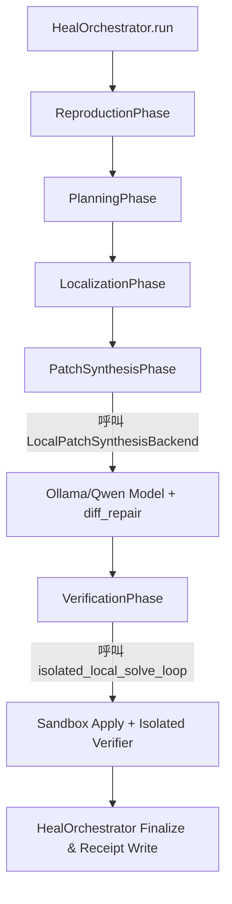

# 🛡️ Qwen Backend Reconnect Design Spec (Phase 56A)

本設計文件定義了如何將 **P48/P52 Qwen isolated solve lane** 收斂回 **HealOrchestrator 五階段解題流水線**，實現 Nexus 大一統架構 (MSA)。

---

## 1. 核心整合架構
我們拒絕兩套平行的執行架構。Qwen/Ollama 實體模型將作為 `LocalHeal` 下的 **Local Provider Backend** 進行重接，如下圖所示：



---

## 2. 介面定義 (LocalPatchSynthesisBackend)
我們將在 `nexus/services/local_heal/backends/` 下定義統一的 Local 模型介面：

```python
class ILocalPatchSynthesisBackend:
    """Local model patch generator backend."""
    
    def generate_patch(
        self,
        task_id: str,
        problem_statement: str,
        target_file: str,
        target_symbol: str,
        locked_search: str,
        verifier_command: list[str],
        attempt: int = 1,
        previous_feedback: str | None = None
    ) -> str:
        """Call local Ollama/Qwen model and return raw candidate output."""
        pass
```

### 確定性修復與重試機制 (Backend Utility 化)
- **`diff_repair.py`** 與 **`failure_feedback_builder.py`** 將被作為通用 Backend Utilities：
  1. `generate_patch` 調用模型返回 `candidate_text`。
  2. 若 `git apply` 失敗，在 backend 內部自動調用 `repair_malformed_diff` 進行確定性自癒與縮排對齊。
  3. 若 `VerificationPhase` 失敗且符合重試標準，`HealOrchestrator` 將遞增 `attempt=2`，調用 `build_failure_feedback` 生成反饋，再次傳遞給 backend。

---

## 3. 階段重接 (Phase Integration)

### 3.1 Preservation of Reproduction / Planning / Localization
- **Reproduction**: 以真實 `pytest` 在 workspace 執行 buggy target，捕獲 traceback 做為 localization 的 inputs。
- **Planning & Localization**:
  - 當 controls 傳入 mock config 時，保留該 metadata 做為 fallback。
  - 當處於真解題狀態時，調用 `GranularMethodLocalizer` 來對 target symbol 進行 AST 分析與切片，動態產出 `locked_search` 與 `canonical_span`。

### 3.2 Verification & Sandbox Apply
- `VerificationPhase` 將直接重用 `run_isolated_local_solve_loop` 裡已通過考驗的 sandbox 隔離套用與驗收套件，確保 code 不會弄髒主 repo 工作區。

---

## 4. 憑證與收據回收 (Receipt Consolidation)
所有的 execution logs、retry 數據與自癒判定將被轉譯回 `LocalHeal` 標準的 `CapabilityReceipt`，隨後由 orchestrator 寫入統一的 receipt path：
- `attempt_count`
- `retry_attempted`
- `retry_success`
- `repair_success`
- `verifier_status`
以上變數將被納入 `CapabilityReceipt.metadata`，不再由 `run_real_qwen_small_batch_eval.py` 獨立輸出 jsonl，而是由 AB Runner 的 `write_evidence_bundle` 統一收集並渲染報表。

---

## 5. 實施路線圖 (Next Action)
1. **P56.1**: 建立 `ILocalPatchSynthesisBackend` 介面，並實作 `QwenOllamaBackend` 類別。
2. **P56.2**: 修改 `nexus/services/local_heal/orchestrator.py` 的 `PatchSynthesis` 階段以引入此 backend。
3. **P56.3**: 連通 `GranularMethodLocalizer` 到 input path。
