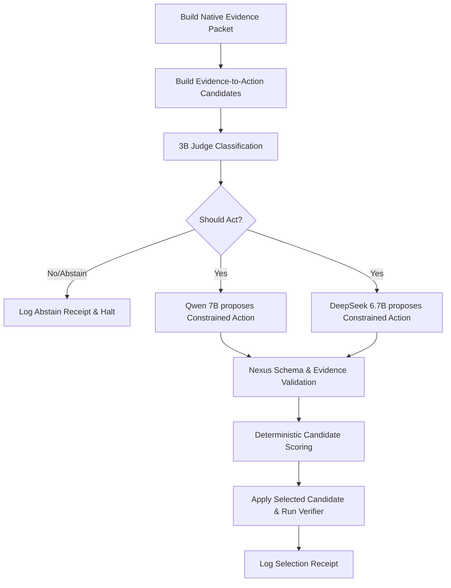

# R5 — Shadow Route Integration

**狀態**: `R5_SHADOW_ROUTE_READY`  
**評估日期**: 2026-06-21  
**旁路路由名稱**: `local_heterogeneous_portfolio_shadow_v0`

---

## 1. 旁路路由設計與執行流 (Execution Flow)

為了對比「單一模型」與「異質模型組合」，我們在不變更 production 路由的前提下，實現了 shadow 路由。其完整執行流為：

---

## 2. 核心架構元件說明

*   **3B 路由評判者 (`judge_schema.json`)**:
    - 使用 `qwen2.5-coder:3b-instruct` 作為輕量門禁。評判者會對 `evidence_sufficiency` 進行判定。若評判為 `INSUFFICIENT`，則觸發 `should_abstain`，以防止 proposer 重試耗費算力。
*   **動作約束與提案者模型 (`proposer_schema.json`)**:
    - 受限於 Armored mode，提案者被禁止進行任何 direct tool calls 或 free-form patch，必須輸出嚴格的 constrained JSON (如 `REPLACE_EXPR` 等)，且必須標明對應的 `evidence_id`。
*   **確定性篩選與衝突解決策略 (`selection_policy.json`)**:
    - 本路由嚴格**禁止模型多數決 (No Majority Vote)** 與**模型間討論 (No Debate)**。
    - 當 Qwen 7B 與 DeepSeek 6.7B 提案不一致時，Nexus 引擎透過確定性評分來裁決：
      $$\text{Score} = w_1 \cdot \text{SchemaPass} + w_2 \cdot \text{EvidenceCorrect} + w_3 \cdot \text{DryRunSuccess} - w_4 \cdot \text{PriorFailurePenalty}$$
      評分最高者被送往 Nexus Verifier 進行最終 dry-run 和實體測試。
*   **安全與合規門禁 (`safety_policy.json` 與 `resource_guard.json`)**:
    - 嚴格限定為旁路測試（shadow mode），設定 `public_claim_allowed=false` 且結果僅供 internal-only。
    - 動態監控 16GB 記憶體，14B Fallback 模型預設 Gated Blocked，防止 CPU-only 推理。
