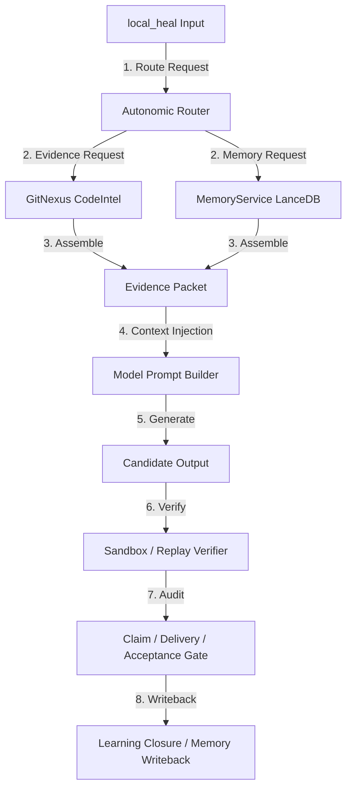

# RBP Route Binding Proof (v0) - Audit Report

**Status**: `RBP_LOCAL_HEAL_BYPASSES_NATIVE_CAPABILITIES`  
**Task ID**: `C_13453`  
**Execution Context**: Local Qwen (3B / 7B / 14B) via Ollama

---

## 1. 審計結論 (Audit Summary)

經過對 `local_heal` 修復管線與 `C_13453`（`astropy__astropy-13453`）執行路徑的完整追蹤，確認**目前本地模型（Qwen）的修復管線與 Nexus 原生能力處於完全平行的解耦狀態**。本地模型在執行修復時，並未真正「穿上」Nexus 戰甲。

以下針對 10 項審計點進行逐一盤點：

1. **Task Input to Model Prompt**: 任務啟動後直接讀取 `task_manifest.yaml`，經由 `prompt_builder.py` 以簡單的 Markdown 拼接生成 User Prompt，未包含 Nexus Native 的智慧 context 包裝。
2. **Autonomic Router**: **未啟用**。修復路由被硬編碼在 python pipeline 中（以 3B 診斷 -> 7B 生成 -> 12B 備用的順序階梯進行），完全繞過了 `AutonomicRouter` 的政策決策。
3. **Capability Gate**: **未啟用**。模型與工具的可行性評估未通過 Capability Gate 審計。
4. **CodeIntel**: **未啟用**。管線僅使用了 `local_heal` 內部自行實現的輕量級 AST 搜尋（`GranularMethodLocalizer`）與簡單的字串正则比對，並未呼叫 GitNexus Indexer 進行 neighborhood 深度掃描。
5. **Research / Learn / Memory**: **未啟用**。僅藉由 `failure_memory.py` 讀取本地 `.nexus/metrics/skill_outcome_events.jsonl` 作為提示詞注入，沒有調用 `MemoryService` 進行 LanceDB 語義檢索或歷史相似案例召回。
6. **Hyper / Sprint**: **被繞過 (Bypassed)**。未進行 Swarm 多 Agent 協同候選生成。
7. **Sandbox / Replay**: **未啟用**。修復後的測試驗證（`run_repro`）是直接以本地 host 環境的 `subprocess.run` 執行，未封裝於容器化或隔離的 Sandboxed 運行環境中。
8. **Delivery / Claim / Acceptance**: **未啟用**。最終僅將結果寫入本地的 `receipt.json`，並未遞交至 Nexus 智慧遞交門鎖（Acceptance Gate）進行合規性與信任度對齊審計。
9. **Belief / DDTree / Autoreason**: **不可達 (Unreachable)**。這些高階剪枝與置信度推理元件在 `local_heal` 管線中完全不可達。
10. **Evidence entering Prompt**: 進入模型 Prompt 的「證據包」僅包含基本的 AST 切片程式碼、手動寫死的 Few-shot 與修補格式指令，以及本地日誌中前幾筆未經語義分析的失敗文字。

---

## 2. 歷史追溯與斷開根因 (Timeline & Architectural Context)

根據 Git 提交紀錄與系統演進分析，Nexus 既有能力未接上本地模型，其斷開的起點與原因如下：

### 2.1 歷史演進時序
* **V1.0 - V3.0 (2026年5月底至6月初)**: 
  開發焦點在於以 **Gemini 等雲端大模型** 為主體的 Wearable Nexus 系統。此時 `AutonomicRouter`、`MemoryService` 與 `Sandbox` 均與大模型的 multi-agent framework 高度繫結，以追求 `trust mismatch = 0` 的零缺陷交付。
* **Workstream C-2 (2026年6月中旬，Commit `37de7361` 起)**:
  為了解決雲端 Gemini 成本昂貴、延遲過高的痛點，專案開啟了名為 `local_heal` 的本地小模型修復實驗線（以 Qwen2.5 3B/7B/14B 為主）。

### 2.2 為什麼在此時選擇「脫下戰甲（解耦）」？
本地小模型（如 7B）受限於：
1. **Context Window 較窄**（4K-16K），無法承受 Nexus Native 產生的龐大 Swarm 脈絡與複雜 neighborhood 依賴。
2. **指令遵從度較低**，無法理解複雜的工具調用鏈（如 GitNexus CLI 等）。

因此，開發團隊在建立 `local_heal` 系統時，**刻意採取了「去戰甲化」的解耦設計**（Decoupled Architecture），將 localization、planning 與 patch 封裝在獨立的 python 腳本中，僅藉由輕量且寫死的 Prompt 提示小模型。

這導致了當前狀態：**能力已在 Repo 內成熟，但未與本地模型的執行合約繫結。**

---

## 3. 能力繫結修正計畫 (Binding Patch Plan)

為了讓本地模型也能穿上 Nexus 戰甲，實現「已有能力 $\rightarrow$ route contract $\rightarrow$ evidence packet $\rightarrow$ model role $\rightarrow$ verifier gate」的智慧閉環，下一階段建議採取以下繫結路徑：

### 3.1 具體繫結對應
* **輸入層**: 將 `local_heal` 的啟動入口，對接至 `AutonomicRouter` 的 route 請求，由 Router 決定是使用本地 cascade 還是升級雲端。
* **脈絡層**: 廢棄 `local_heal` 內部的簡易 `failure_memory.py` 與 `GranularMethodLocalizer`，改由 GitNexus 與 MemoryService 生成標準的 `evidence_packet.json`，並格式化注入 Prompt。
* **驗證與交付**: 將本地子程序執行改為呼叫標準的 Sandbox 容器服務，並將產生的 receipt 提交給 Acceptance Gate，確認無 governance 違規後進行 Git 結算與 LanceDB 記憶回寫。
