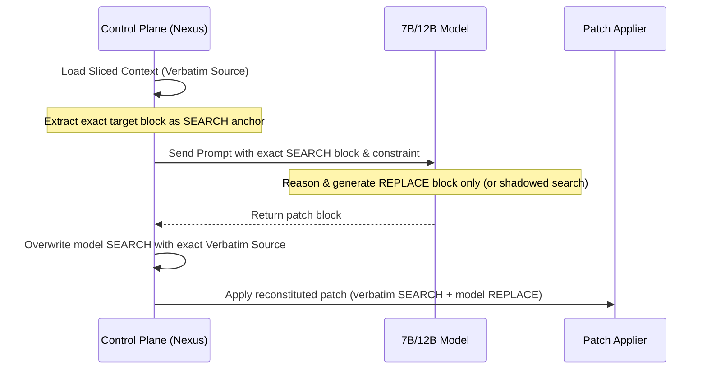

# S2 — Anchor-Supplied Edit Protocol Design Report

**Status**: S2_DESIGN_COMPLETED
**Track**: Search-Mismatch Capability Recovery Track

---

## 1. Selected Protocol: Control-Plane SEARCH / Model REPLACE

為了徹底根治 7B 本地模型的 `SEARCH_MISMATCH` 阻斷，本設計選擇 **Control-Plane SEARCH / Model REPLACE** 作為實作方案。

### 1.1 工作原理與流程

1.  **控制平面提取真值**:
    控制平面載入目標 localized file（通常已由 AST 模組切片）。我們將該切片（或目標 symbol 區段）之程式碼儲存為 `canonical_search_block`。
2.  **模型生成約束**:
    在 prompt 中指示模型不需要自行尋找/修改 SEARCH 錨點。如果模型依然以 `<<<<<<< SEARCH ... ======= ... >>>>>>> REPLACE` 格式回傳，控制平面在 Parser 階段將會**強行將模型產生的 SEARCH 區塊覆寫為 `canonical_search_block`**。
3.  **Patch 合成與套用**:
    透過此覆寫機制，合成一個 100% 能夠 verbatim 匹配的合法 patch，送入 `PatchApplier` 執行。

---

## 2. Codebase 修改 Seams 分析

1.  **`nexus/services/local_heal/patch_protocol.py`**:
    - 在解析或驗證 patch 時，引入 `control_plane_search_model_replace` 協定模式。
    - 當啟用此模式時，若 parser 發現 `SEARCH` 區塊不匹配，直接使用控制平面的 `canonical_search` 強制覆寫。
2.  **`nexus/services/local_heal/corrector.py`**:
    - 修改 retry generation 邏輯，如果需要 retry，直接在 context 中塞入 exact `canonical_search`，告訴模型：「你只需要專注於調整 REPLACE 區塊，SEARCH 區塊已被鎖定」。
3.  **`nexus/services/local_heal/orchestrator.py`**:
    - 在 pipeline 啟動時，初始化 `HealContext` 的 `canonical_search` 變數。

---

## 3. Telemetry 與 門禁影響
- 新增 `protocol_mode: "control_plane_search_model_replace"` telemetry。
- `search_supplied_by: "control_plane"`，`model_generated_search: false`。
- 保留 `match_authority: "CONTROL_PLANE_VERBATIM"`，以防 match_authority 為 None。
- 防止 `FUZZY_CANDIDATE_ONLY` 漏洞：因為 SEARCH 已被控制平面強行改為 100% 真值 verbatim，因此不需要任何 fuzzy match 機制（Fuzzy similarity 將永遠是 1.0），實現真正的 verbatim 套用。

---

## 4. 決策推薦
- **S2_READY_FOR_CONTROL_PLANE_SEARCH_MODEL_REPLACE** (已就緒，推薦實作)
- 本案最符合 constraints 且侵入性最小，直接進入 S3 原型開發。
