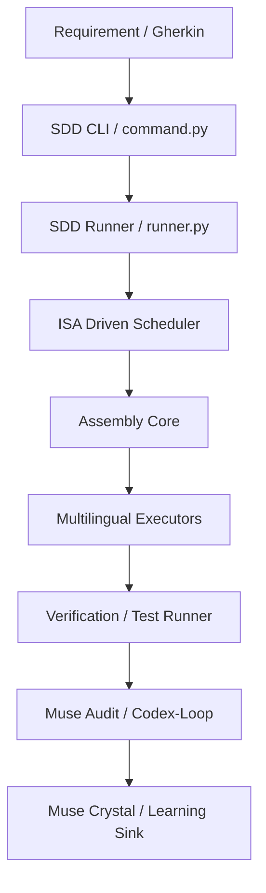

## Agent-Guide
- **核心定位**: 此文件為系統中關於 01_Projects 領域的知識存檔。
- **管理邏輯**: 遵循 Refinement 3.0 標準進行檢索與對位。 ✅

## Agent-Index
- `section_main`: 核心內容與實作細節。 ✅

## Agent-Actions
- **If** 偵測到相關任務 -> **Then** 執行語義召回與跨域連結。 ✅
---

# 🛡️ SDD.OS 系統架構與 BDD 驅動生命週期藍圖 (v1.0)

> [!abstract] 核心意圖
> 本文件定義 SDD.OS (Spec-Driven Development OS) 的核心架構。SDD.OS 透過「規格即代碼 (Spec-as-Code)」與「ISA 指令集驅動」的設計，實現了從 Gherkin 需求到多語言實作 (Go/Java/Python) 的自動化生產線。

---

## 🧭 Agent-Guide
- **核心定位**: 此文件為 SDD.OS 的實體架構與生命週期映射。
- **治理邏輯**: SDD.OS 採用「ISA 驅動」的調度策略，所有階段轉換必須符合 `src/assembly/policies` 定義的決策樹。 ✅

## 🗂️ Agent-Index
1. **SDD.OS 總體架構圖** ✅
2. **P-D-R-A-C 實體化路徑** ✅
3. **組件詳解 (Assembly & ISA)** ✅
4. **Worker / Executor 角色矩陣** ✅
5. **多語言 BDD 執行鏈** ✅

---

## 1. SDD.OS 總體架構圖 (System Architecture)



---

## 2. P-D-R-A-C 實體化路徑 (Lifecycle Implementation)

SDD.OS 的生命週期透過 `src/sdd/scripts` 下的 `muse_*` 腳本群實體化：

| 階段 (Phase) | 實體腳本 (Implementation) | 核心職責 |
| :--- | :--- | :--- |
| **P (Plan)** | `muse_plan.py` | 任務分解、Gherkin 語法解析、`muse_plan.json` 生成。 |
| **D (Diagnose)** | `muse_diag.py` | 透過 `isa_driven.py` 診斷知識缺口與 ISA 匹配度。 |
| **R (Repair)** | `muse_repair.py` | 調用 `executors/` (Go/Java/Python) 執行 Patch 與代碼生成。 |
| **A (Audit)** | `muse_audit.py` | 執行 `codex_audit.log` 紀錄，驗證 BDD 測試通過率。 |
| **C (Crystal)** | `muse_crystal.py` | 結晶 Lessons 到 `shared_knowledge/lessons.md`。 |

---

## 3. 組件詳解 (Component Deep Dive)

### 3.1 Assembly & Policy Hub (`src/assembly/`)
- **ISA Driven Scheduler**: 位於 `scheduler/isa_driven.py`，負責根據 Spec 模式匹配最優執行策略。
- **Policy Engine**: 包含 `pattern_matching_based.py`，定義了從需求到指令的映射邏輯。

### 3.2 AI Provider Layer (`src/ai_providers/`)
- **多模型支持**: 原生集成 `claude_code`, `gemini_cli`, `codex_cli`。
- **Privacy Isolation**: 透過 `privacy.py` 確保敏感數據不流向公有雲模型。

---

## 4. Worker / Executor 角色矩陣 (Executor Layer)

SDD.OS 針對不同語言與領域實作了專屬的 Executor：

- **Golang (Backend)**: 位於 `executors/golang/backend`，支援 `godog_httpexpect` 測試生成。
- **Java (Spring)**: 位於 `executors/java/backend`，支援 `mockmvc_openapi` 與 `springjpa_pojo`。
- **Python (FastAPI)**: 支援 `fastapi_pytest` 執行路徑。
- **Gherkin Spec**: 透過 `gherkin_spec/gherkin_runner.py` 驅動所有語言的 BDD 驗證。

---

## 5. 多語言 BDD 執行鏈 (Verification Layer)

```text
Gherkin (.feature)
  ↓
Spec Reader (spec_reader.py)
  ↓
Language Specific Executor (Go/Java/Py)
  ↓
Verification (verify_mvn.sh / verify_gotest.sh / verify_python_pytest.sh)
  ↓
Evidence Generation (sdd_output.log)
```

---

## 6. 知識沉澱與 Benchmarking

- **Shared Knowledge**: 存放於 `shared_knowledge/`，利用 LanceDB 進行向量化存儲。
- **Benchmark System**: 位於 `benchmark/guessing_game`，作為系統效能與準確度的基準測試集。

---
%% 
由 Muse-Core Lvl 15 架構師於 2026-03-17 完成 SDD.OS 實體架構對位。
本文件定義了 SDD.OS 作為 Nexus 下層執行引擎的技術規格。
%%