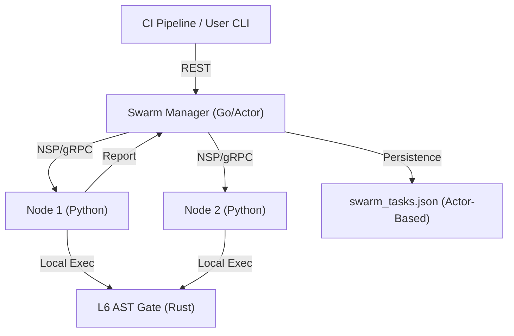

# NEXUS_ARCHITECTURE_V24

## 系統拓樸

## 模組說明
- **Swarm Manager**: 高性能並發調度器。採用 Actor 模型管理狀態與非同步批次寫入。
- **Nesting Node**: 分佈式執行單元。負責隔離環境與任務實作。
- **NSP Protocol**: 定義了兩端通訊的語言與遙測標準（W3C TraceContext）。

## 主要資料流
1. **任務進度**：CI 端注入 Pending 任務。
2. **分發**：Manager 依區域延遲 (Region-aware) 自動分派至最優 Node。
3. **回報**：Node 執行完畢後透過 /metrics 與 /report 回傳結果。
