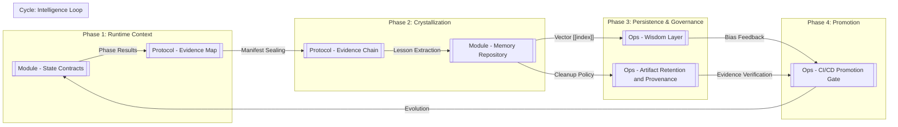

---
aliases:
- Artifact Chain
- SSoT Flow
confidence: high
last_compiled: 2026-04-06
owner: agent
related_pages:
- '[[Protocol - Evidence Map|Evidence Map]]|[[Protocol - [[Protocol - Evidence Map|Evidence
  Map]]|Protocol - [[Protocol - Evidence Map|Evidence Map]]]]]]'
- '[[System Overview|System Overview]]'
- '[[System - Unknowns and Conflicts|Unknowns]] and Conflicts|[[System - [[System
  - Unknowns and Conflicts|Unknowns]] and Conflicts|System - [[System - Unknowns and
  Conflicts|Unknowns]] and Conflicts]]]]'
source_of_truth: MUSE-NEXUS-v22#DataFabric
status: active
tags:
- protocol
- evidence
- chain
- manifest
title: Protocol - Evidence Chain
type: protocol
version_scope:
- v17.1
- v22
- v23
---


# Protocol - Evidence Chain

## One-sentence summary
本頁定義 Nexus 證據鏈 (Evidence Chain) 的權威對索引順序、封印邏輯與 `manifest.json` 的穩定性規範。 [Source: MUSE-NEXUS-Engine-Specification-v22-Eternal.md]

## Role / responsibility
- **鏈式追蹤**: 確保 `manifest.json` 完整包含單次任務的所有子工件。 [Source: 00_Home/System Overview.md]
- **誠信校驗**: 透過 `write_proof.json` 驗證所有的文件寫入均為真實且已授權。 [Source: ci_gate.py]
- **歸檔準備**: 轉換為加密封印格式以供 Arweave 存儲。 [Source: 00_Home/System Overview.md]

## Upstream
- **[[Protocol - Evidence Map]]**: 提供依賴圖譜。
- **Phase Runners**: 提交通知至 Manifest Sealer。 [Code: nexus_cli.py]

## Downstream
- **Crystallizer (Phase C)**: 根據證據鏈萃取教訓。 [Code: nexus_crystal.py]
- **[[Ops - CI/CD Promotion Gate]]**: 作為晉升的實體依據。

## Related modules / files
- `nexus/core/manifest_factory.py`: 證據鏈封裝工廠。 [Code: manifest_factory.py]
- `scripts/ops/index_to_manifest.py`: 手動修復工具。 [Code: 00_Home/System Overview.md]

## Source notes
- Hardened v17.1 Spec: 定義原始「證據工件」清單。
- v22 Engine Spec: 確立 `SSoT` (Single Source of Truth) 必須表現為單一連通鏈。 [Source: MUSE-NEXUS-Engine-Specification-v22-Eternal.md]

## Open questions / conflicts
- [ ] **Chain Fragmentation**: 當某一相位崩潰時，局部證據鏈的提取邏輯。
- [ ] **Encrypted Payload**: 是否應在 manifest 中包含工件的加密摘要而非純文字路徑。

---
[[System Overview]]
---
aliases:
- Evidence Map
- Artifact Linkage
confidence: high
last_compiled: 2026-04-06
owner: agent
raw_sources:
- MUSE-NEXUS Engine Specification v22
- MUSE-NEXUS Engine Specification v17.1
- manifest_schema.json
related_pages:
- '[[Module - State Contracts|State Contracts]]|[[Module - [[Module - State Contracts|State
  Contracts]]|Module - [[Module - State Contracts|State Contracts]]]]]]'
- '[[Protocol - Evidence Chain|Protocol - Evidence Chain]]'
- Ops - CI/[[CD Promotion Gate|Promotion Gate]]|[[CD [[CD Promotion Gate|Promotion
  Gate]]|CD [[CD Promotion Gate|Promotion Gate]]]]]]
- '[[System Overview|System Overview]]'
- '[[System - Unknowns and Conflicts|Unknowns]] and Conflicts|[[System - [[System
  - Unknowns and Conflicts|Unknowns]] and Conflicts|System - [[System - Unknowns and
  Conflicts|Unknowns]] and Conflicts]]]]'
source_of_truth: compiled-wiki
status: active
tags:
- protocol
- evidence
- map
- trace
title: Protocol - Evidence Map
type: protocol
version_scope:
- v17.1
- v22
- v23
---


# Protocol - Evidence Map

## One-sentence summary
本頁定義 Nexus 任務執行過程中工件 (Artifacts) 之間的依賴圖譜、產生者與門禁關鍵度。 [Source: MUSE-NEXUS-Engine-Specification-v22-Eternal.md]

## Role / responsibility
- **地圖導航**: 呈現從 Planning 到 Crystallize 的資料流向。 [Source: nexus_cli.py]
- **對帳追蹤**: 標註 `task_id` 與 `trace_id` 在不同階段的責任變更。 [Source: 00_Home/System Overview.md]
- **門禁可視化**: 標註哪些工件是 [[CD Promotion Gate|Promotion Gate]] 的強制輸入。 [Source: ci_gate.py]

## Upstream
- **Phase P-R**: 產出原始 JSON 工件。 [Source: 02_Modules/Module - State Contracts.md]]]
- **Manifest Sealer**: 彙整全量證據。 [Source: 00_Home/System Overview.md]

## Downstream
- **[[Ops - CI/CD Promotion Gate]]**: 提供指標對位的實體證據。
- **[[System - Unknowns and Conflicts]]**: 登記工件鏈斷裂衝突。

## Evidence Dependency Map

```mermaid
graph TD
    subgraph "Phase P: Planning"
        P1[plan.json] --> |"task_id"| D1
    end

    subgraph "Phase D: Diagnosis"
        D1[diagnosis.json] --> |"trace_id"| R1
    end

    subgraph "Phase R: Repair"
        R1[repair_final.json] --> |"task_id + trace_id + patch_hash"| A1
    end

    subgraph "Phase A: Audit"
        A1[audit_result.json] --> |"audit_trace_id -> Ref: trace_id"| M1
        A1 --> |"revision"| M1
    end

    subgraph "Phase C: Crystallize"
        M1[manifest.json] --> |"Seal Status: LOCKED"| C1[lesson_events.jsonl]
    end

    subgraph "v23 Intelligence"
        C1 --> |"Vectorize"| W1[[[Module - Memory Repository|Wisdom Memory]]]
        W1 --> |"Bias / Feedback"| P1
    end
```

## Evidence Alignment Matrix (高保真對位矩陣)

| Artifact | Producer (產生者) | Gate Criticality | Retention Path | Source File |
|---|---|---|---|---|
| `plan.json` | Planner (P) | MEDIUM | `.nexus/runs/<id>/` | [Source: 00_Home/System Overview.md] |
| `diagnosis.json` | Diagnoser (D) | **HIGH** | `.nexus/runs/<id>/` | [Source: 00_Home/System Overview.md] |
| `repair_final.json`| Repairer (R) | **HIGH** | `.nexus/runs/<id>/` | [Source: 00_Home/System Overview.md] |
| `write_proof.json` | Repairer (R) | **CRITICAL** | `.nexus/runs/<id>/` | [Source: ci_gate.py] |
| `audit_result.json`| Auditor (A) | **CRITICAL** | `.nexus/runs/<id>/` | [Source: 00_Home/System Overview.md] |
| `manifest.json` | Manifest Sealer (C) | **CRITICAL** | Root: `manifest.json` | [Source: 00_Home/System Overview.md] |
| `lesson_events.jsonl`| Crystallizer (C) | MEDIUM | `.nexus/knowledge/` | [Source: memory_indexer.py] |

## Related modules / files
- `.nexus/runs/`: 任務實體存放區。
- `manifest.json`: 全量工件索引。 [Source: 00_Home/System Overview.md]

## Source notes
- Hardened v17.1 Spec: 定義 4.1 跨檔一致性與 6.1 Manifest 索引。
- v22 Engine Spec: 確立 SSoT 必須同步至 `.nexus/knowledge/`。 [Source: MUSE-NEXUS-Engine-Specification-v22-Eternal.md]

## Open questions / conflicts
- [ ] **Handoff Path**: v23.1 的 `last_handoff.json` 在地圖中的精確切入點。
- [ ] **Drift Register**: 如何在地圖中標註「預期工件缺失」的處理邏輯。

---
[[System Overview]]
---
aliases:
- Lineage Map
- Knowledge Data Fabric
confidence: high
last_compiled: 2026-04-06
owner: agent
related_pages:
- '[[Module - State Contracts|State Contracts]]|[[Module - [[Module - State Contracts|State
  Contracts]]|Module - [[Module - State Contracts|State Contracts]]]]]]'
- '[[Protocol - Evidence Map|Evidence Map]]|[[Protocol - [[Protocol - Evidence Map|Evidence
  Map]]|Protocol - [[Protocol - Evidence Map|Evidence Map]]]]]]'
- '[[Module - Memory Repository|Module - Memory Repository]]'
- '[[Ops - Artifact Retention and Provenance|Ops - Artifact Retention and Provenance]]'
- Ops - CI/[[CD Promotion Gate|Promotion Gate]]|[[CD [[CD Promotion Gate|Promotion
  Gate]]|CD [[CD Promotion Gate|Promotion Gate]]]]]]
- '[[System Overview|System Overview]]'
- '[[System - Unknowns and Conflicts|Unknowns]] and Conflicts|[[System - [[System
  - Unknowns and Conflicts|Unknowns]] and Conflicts|System - [[System - Unknowns and
  Conflicts|Unknowns]] and Conflicts]]]]'
source_of_truth: MUSE-NEXUS-v22#DataFabric
status: active
tags:
- protocol
- knowledge
- lineage
- fabric
title: Protocol - Knowledge Lineage
type: protocol
version_scope:
- v17.1
- v22
- v23
---


# Protocol - Knowledge Lineage

## One-sentence summary
本頁呈現 Nexus 從 Runtime 工件到長期記憶與治理決策的完整知識血緣全景圖。 [Source: MUSE-NEXUS-Engine-Specification-v22-Eternal.md]

## Role / responsibility
- **全景視覺化**: 將破碎的 Wiki 頁面串聯成單一的知識演化流向圖。 [Source: 00_Home/System Overview.md]]]
- **生命週期追蹤**: 描述知識如何從「瞬時狀態」萃取為「智慧經驗」。 [Source: 02_Modules/Module - Memory Repository.md]]]
- **治理校準**: 確保 Lineage 中的每一個節點都有對應的 Wiki 治理定義。 [Source: 06_Ops/Ops - Provenance Exceptions and Waivers.md]]]

## Knowledge Lineage Map (全血緣地圖)



## Upstream
- **[[System Overview]]**: 提供宏觀數據演化背景。
- **Runtime Trace**: 實體任務執行紀錄。

## Downstream
- **[[Ops - Wisdom Layer]]**: 指導智慧層的教訓應用。
- **[[Ops - CI/CD Promotion Gate]]**: 提供全鏈路審核證據。

## Related modules / files
- `05_Protocols/[[Protocol - Evidence Map]].md`: 原始證據圖譜。 [Source: 05_Protocols/Protocol - Evidence Map.md]]]
- `06_Ops/[[Ops - Artifact Retention and Provenance]].md`: 保存政策。 [Source: 06_Ops/Ops - Artifact Retention and Provenance.md]]]

## Source notes
- v22 Engine Spec: 確立 Knowledge Lineage 作為 Data Fabric 的最高層現。 [Source: MUSE-NEXUS-Engine-Specification-v22-Eternal.md]

## Open questions / conflicts
- [ ] **Lineage Drift**: 智慧層產出的決策是否應建立獨立的血緣分支。
- [ ] **Storage Tiers**: 線上 (Hot) 與 離線 (Cold) 知識資產在 Lineage 中的區隔顯示。