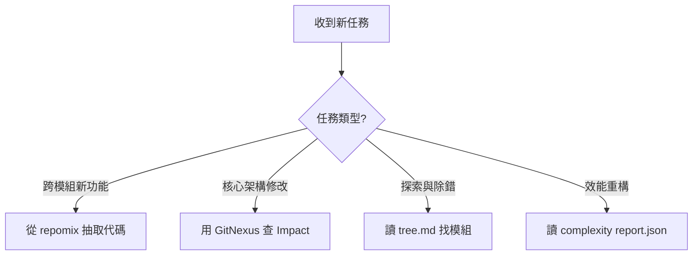

# Agent 戰略上下文載入與工具產物使用指南 (Context Strategy Guide)

**建立日期**: 2026-06-05
**背景**: 基於 Nexus 專案的多工具大規模掃描實戰經驗 (存放於 `docs/perplexity/` 與 `.gitnexus/`)。

本專案擁有超過上萬個檔案，未來的 Agent 在執行任務時，**絕對禁止無腦的全域 `grep` 或盲目的深度迴圈搜尋**。必須依據任務屬性，精準選擇對應的「靜態分析快取」來載入上下文。

以下是各類掃描產物的**核心用途比較**與**決策建議**：

---

## 1. 任務場景：需要「理解全貌」或「跨模組修改」
👉 **首選武器**：`repomix` (全量代碼打包)

* **資料位置**: `/Users/jameschen/Workspace/nexus/docs/perplexity/repomix/repomix-output.txt`
* **資料特性**: 高達 196MB，將全專案程式碼合併為單一文件，包含 XML 標籤標記檔案邊界。
* **Agent 使用建議**: 
  - 這是最「暴力但有效」的 Context 來源。
  - **不要用 `read_file` 直接讀整包**（會立刻 OOM 或爆 Token）。
  - **正確作法**: 使用 `grep_search` 或 Shell 的 `grep -A 50 "<file path=...` 針對性地從中抽取出你需要的幾個模組內容。這比你在專案樹裡慢慢找快上百倍。

---

## 2. 任務場景：需要「評估修改風險 (Blast Radius)」或「找尋呼叫來源」
👉 **首選武器**：`GitNexus` (高精度關聯查詢) 或 `graphify` (靜態拓撲)

* **資料位置 (GitNexus)**: `/Users/jameschen/Workspace/nexus/.gitnexus/`
* **資料位置 (Graphify)**: `/Users/jameschen/Workspace/nexus/docs/perplexity/graphify/graph.json`
* **Agent 使用建議**:
  - 當你要修改核心模組（如 `NexusState` 或 `TacticalDrone`）前，**必須**先查詢誰依賴了它。
  - **GitNexus 優先**: 直接在終端機執行 `gitnexus impact <ClassName>` 或 `gitnexus context <FunctionName>`，這是最精確的 360 度視角。
  - **Graphify 備用**: 如果 GitNexus 剛好因環境掛點，請寫一個短的 Python 腳本去 Parse `graph.json`，算出該節點的 incoming/outgoing edges。

---

## 3. 任務場景：需要「了解目錄結構」或「尋找特定職責的模組」
👉 **首選武器**：`contextplus-repo` (AST 結構樹) 與 `understand-anything` (宏觀統計)

* **資料位置 (結構樹)**: `/Users/jameschen/Workspace/nexus/docs/perplexity/contextplus/tree.md`
* **資料位置 (宏觀統計)**: `/Users/jameschen/Workspace/nexus/docs/perplexity/understand-anything/knowledge-graph.json`
* **Agent 使用建議**:
  - 剛接手專案時，直接 `cat` 讀取 `tree.md` (僅 343KB)，你就能一秒獲得專案的「骨架」，不用狂下 `ls` 指令。
  - 如果你需要知道某個資料夾下到底是 Python 代碼多還是 Markdown 文件多，請查閱 `knowledge-graph.json`。

---

## 4. 任務場景：需要「效能調優」或「重構技術債」
👉 **首選武器**：`codex-complexity-optimizer` (效能瓶頸雷達)

* **資料位置**: `/Users/jameschen/Workspace/nexus/docs/perplexity/codex-complexity-optimizer/report.json`
* **Agent 使用建議**:
  - 任務若是「Refactor」或「Optimize」，**第一步就是讀這個 JSON**。
  - 它已經幫你標記好了所有的 `HIGH nested-loop` (雙重迴圈 O(N^2)) 與 `HIGH io-or-query-in-loop` (N+1 查詢問題)。直接針對這些明確的座標進行重構，不要自己瞎找。

---

## 🚀 總結決策樹 (Decision Tree for Agents)

**最高守則**：這些工具已經為你準備好了高價值的「預先計算 (Pre-computed)」資產。聰明的 Agent 懂得利用既有資產，愚蠢的 Agent 才會從頭發明輪子。
