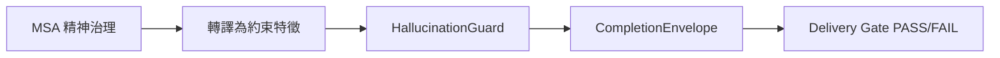

# ADR-042 - MSA Physical Hallucination Interlock

## Context (背景)

在 Nexus 多 Agent 蜂群協作架構中，大腦決策涉及楊定一博士的「全部生命系列」思想中的 **MSA (Multi-System Alignment) 精神治理模型**。然而，精神治理若僅停留在哲學層面，會產生語意懸空，無法直接對運行期的代碼品質與 LLM 推理幻覺產生硬性約束。

同時，LLM 在產出代碼、憑證或報告時，經常會出現幻覺（Hallucination）。我們需要一個實體對位機制，將 MSA 精神治理哲學，轉譯為實體層面的 **物理安全攔截網（HallucinationGuard & CompletionEnvelope）**。

---

## Decision (決策)

我們決議在 Nexus 核心底座中，全面將 MSA 精神治理模型轉譯為 **物理安全防禦聯鎖 (Physical Hallucination Interlock)**：

### 1. 哲學思想對接代碼實體表：

| MSA 精神治理哲學 | 實體代碼轉譯與物理約束 | 運行期對接類別 / 模組 |
| :--- | :--- | :--- |
| **臣服與完全接納 (Acceptance)** | 沙盒環境中對異常與未知回傳值進行安全、唯讀、無損的捕捉，不引發系統崩潰。 | `nexus/core/context_hub.py` 的容錯機制 |
| **實相觀察與覺察 (Awareness)** | 物理證據鏈審計與 LLM 推理特徵特徵比對，稽查輸出事實一致性，攔截虛假宣稱。 | `nexus/core/hallucination_guard.py` |
| **五位一體與 MSA 融合** | 連接 LanceDB 向量、Memory 記憶、MemPalace 物理邊界、Belief 信任與 Artifact 契約，五維一體防禦。 | `nexus/engine/autonomic_routing_service.py` |

### 2. 運行期 3% 效能邊界鎖定 (Performance Constraints)
* 為避免 MSA 治理對系統造成不必要的延遲，防禦聯鎖被設計為 **雙重被動觸發 (Dual Passive Trigger)**：
  - **初次觸發**: 僅在 **「路由決定 (Autonomic Route)」** 階段被動調用一次。
  - **二次觸發**: 僅在 **「任務結算與收據生成 (Closeout Check)」** 階段調用一次。
* **限制**: 絕不在常規、高頻的業務計算迴圈中引入治理調用，確保治理邏輯在運行期的總 CPU 與 Token 開銷小於 **3%**。

---

## Consequences (影響與結果)

1. **幻覺攔截率大幅提升**: `HallucinationGuard` 獲得了 MSA 信任分數的動態輸入。若 LLM 產生的報告缺少實體代碼與測試對位特徵，其信任分會被扣除，進而引發 `Delivery Gate FAIL`，徹底封鎖「裸模型宣稱已穿戰甲」的幻覺。
2. **無損回滾 (Lossless Rollback)**: 任何因防禦聯鎖攔截的任務，皆可透過 `git revert` 與 `recovery_directive` 進行自動且無損的狀態回滾，確保生產環境零污染。

[NEXUS IDENTITY: de0969ff + v2.8 RUNTIME-ALIGNED]
