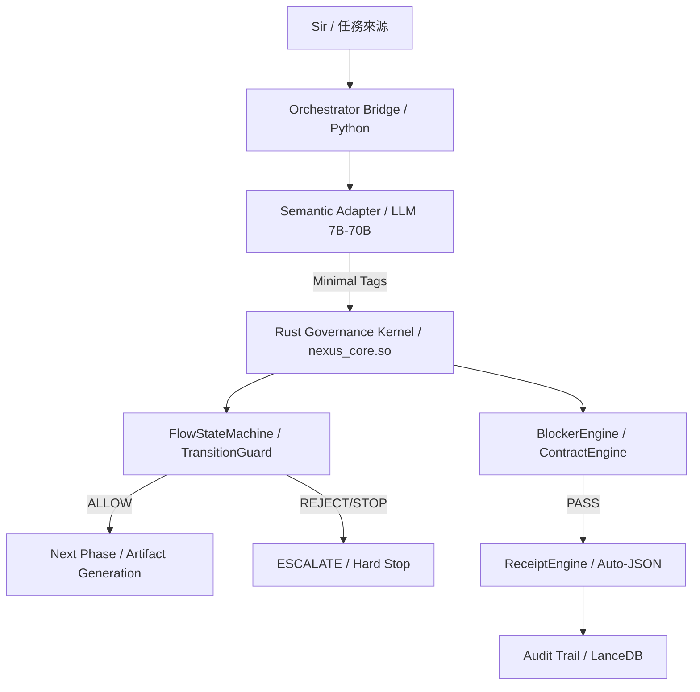

# 🛡️ Nexus System Architecture & Lifecycle Blueprint (v24.0)

> [!abstract] 核心意圖
> 本文件定義 Nexus v24.0 (Hybrid Governance 2.4) 的工業級架構。系統已全面轉向以 **Rust Governance Kernel** 為核心的物理硬治理模式。模型不再負責生成治理產物，僅作為語義建議者（Semantic Suggester），確保系統在任何模型失效或幻覺下均能維持 Fail-Closed。

---

## 🧭 Agent-Guide
- **核心定位**: 此文件為 Nexus Hybrid 架構的最高行為準則。
- **適用場景**: 當調整狀態轉移、Blocker 判定或模型接口時，必須以此為基準。
- **治理邏輯**: 嚴禁在未修改 Rust Kernel (`nexus_core`) 的情況下變更狀態機轉移矩陣。 ✅

---

## 1. Nexus 總體架構圖 (System Architecture v24)



---

## 2. 生命周期主流程 (PXDRAC Hybrid)

正式生命周期遵循 **P → X → D → R → A → C** 軌跡，由 Rust 物理層強制執行：

- **P** (Plan): 任務解構與規劃（由 Rust 驗證 `task_breakdown`）。
- **X** (Explore): 外部研究（選用，由 `ContaminationGuard` 監控）。
- **D** (Diagnose): 根因分析（由 Rust 驗證 `root_cause`）。
- **R** (Repair): 實作執行（由 `TypedContract` 檢查產物）。
- **A** (Audit): 證據審計（由 `ReceiptVerifier` 進行跨層對齊）。
- **C** (Crystallize): 知識結晶（由 `CrystallizationEngine` 寫入 LanceDB）。

---

## 3. 治理分層責任 (Responsibility Matrix)

| 層級 | 組件 | 核心職責 |
| :--- | :--- | :--- |
| **語義層** | LLM + Semantic Adapter | 意圖識別、語義標籤化 (r:x, d:x, p:x)。 |
| **裁決層** | **Rust Governance Kernel** | 物理狀態機、非法跳步攔截、Blocker 判定、Fail-Closed。 |
| **編排層** | Python Orchestrator | I/O 處理、工具鏈接線、自動化 Receipt 補全。 |
| **資料層** | LanceDB + Memory | 歷史軌跡、成功模式、Long-term Learning。 |

---

## 4. 關鍵安全機制 (Safety Guards)

### 4.1 LangSec 語法識別器
模型輸出必須符合嚴格的標籤文法。任何自然語言「回聲」或幻覺將被 Rust `IntentNormalizer` 在進核心前物理阻斷，並安全降級至 `ESCALATE`。

### 4.2 三層測試矩陣
1. **Unit (Rust)**: 驗證狀態機與契約邏輯。
2. **Contract (Python)**: 驗證模型無關性與隔離度。
3. **E2E Regression**: 驗證全鏈路回歸穩定性。

---

## 3. 生命周期詳細流程圖 (Detailed Pipeline)

```text
主軌：DX-default（P→D→X→R→A→C）
任務進來
  ↓
Task Runner（控制平面）
  - 讀取 task_manifest.yaml
  - 依 depends_on 排程任務
  - 套用 ask_policy / retry / timeout / evidence
  ↓
P：Plan / Scout
  - 任務理解 / 初步規劃
  - lessons / memory / Daily_Log 喚醒
  - 視需要產生外部研究需求
  ↓
D：Diagnose
  - 問題分析 / root cause
  - 診斷書 / 修復藍圖
  - 若內部知識不足，標記 needsresearch
  ↓
X：External Research（可選）
  - 執行外部研究 (Felo/Web Fetch)
  - 產出 researchpack.json
  - 回灌 D / R / A
  ↓
R：Repair / Produce
  - 真正執行工作 (修 Bug / 寫功能 / 創作)
  - 最多 5 次迭代
  ↓
A：Audit / Codex-Loop
  - reviewer pass / fail / skipped
  - 若 fail，視情況退回 P / D / R
  - 若多輪未過，Codex 可給最佳答案
  ↓
C：Crystallize / Wrap-up
  - lessons 提煉 / 向量化
  - Daily_Log / commit / case promotion
  - 最多 3 次收束
  ↓
完成
```

> [!note] v9 變體規則
> 當 `XD` 觸發條件命中時，允許流程採 `P→X→D→R→A→C`，但仍需保留 A 階段最小治理與完整 trace。

---

## 4. Commander / Runner / State Machine 關係圖

| 負責事項 | 禁忌 (不直接做的事) |
| :--- | :--- |
| 任務初始化 | 不直接當作 Formal Skill |
| Phase Transition (P/D/X/R/A/C) | 不直接等同於 Worker |
| Retry / Return Routing | 不直接等同於 Codex Reviewer |
| Task Manifest 排程（depends_on / on_fail / timeout） | 不直接手動指定技能清單 |
| Worktree / State 管理 | |
| Transcript / Timeline 記錄 | |
| 觸發 ContextHub 與後續報表 | |

> [!important] 控制平面 vs 執行平面
> - **Task Runner / Manifest** = 控制平面（排程與治理）。
> - **ContextHub + Skills Router + Worker** = 執行平面（技能決策與實作）。
> - 規則：排程階段不得手動綁定 skill；skill 由 Router 依 phase 與訊號自動決策。

---

## 5. ContextHub 結構圖

**定義**: ContextHub 是上下文組裝與路由前決策中樞。

- **Context Assembly**:
    - Task goal, state snapshot
    - Memory / Lessons / Reflection
    - Prior outputs / Research context
- **Pre-routing Decisions**:
    - Need external research?
    - Prompt compression
    - Routing signals preparation

---

## 6. Skills Router 結構圖

**定義**: Skills Router 是依 Phase 與任務訊號做技能選擇、記錄與路由的獨立元件。

- **Inputs**: Phase, Language, Task scale, Feature/Repair type, Failure signature.
- **Decision**: Decision tree, Scorecard, Threshold.
- **Output**: Selected skills, Rejected candidates, Skill invocations history.
- **Boundary**: Skills Router 的決策來源是 phase/context 訊號，不是 task_manifest 的手動技能配置。

---

## 7. Worker / Callsign 與 Skills 的關係圖

- **Worker / Callsign**: 執行角色 (如 Scout, Architect)。
- **Skills Router**: 選擇的是正式的 `formal skills` (如 `replace`, `grep_search`)。

```text
ContextHub → Skills Router (選 formal skills) → Worker / Callsign Layer (執行角色) → Execution Result
```

---

## 8. Worker / Callsign Layer 角色定義

| 角色 | 核心任務 | 常調用技能 (Formal Skills) |
| :--- | :--- | :--- |
| **Scout** | 前期探索、依賴調查 | `codebase_investigator`, `pseudo-code.gen` |
| **Architect** | 需求收斂、規格規劃、BDD 設計 | `prd.gen`, `sequence-diagram.gen`, `tech-stack.gen` |
| **Red-Test** | 測試先行、失敗案例構造 | `pytest-bdd.feature`, `e2e.red` |
| **Green-Coder** | 實作、Patch、主要產出 | Repair / Implementation 類技能 |
| **Refactor** | 重構、清理、品質提升 | `e2e.refactor`, `code-quality` |
| **QA / Audit** | 驗證、Review 輔助 | `audit`, `deterministic-gate` |

---

## 9. Verification / Governance (治理層)

在進入 **A 階段** 前，Worker 產出必須經過：
- **Artifact Checks**: 文件/代碼實體檢查。
- **Environment Checks**: 執行環境與依賴驗證。
- **Governance**: 品質、風險與成本管控。
- **Evidence**: 產生 Audit-ready 的證據鏈。

---

## 10. A 階段：Codex-Loop 關係圖

**Codex 角色**: 
- 最後一關 Reviewer。
- 不是主工作者，也不是 Runner。
- 輸出結果：`APPROVED`, `REJECTED`, `BEST_ANSWER`, `SKIPPED_QUOTA`。

---

## 11. A 階段退回邏輯 (Return Routing)

- **APPROVED**: 進入 C 階段。
- **REJECTED**: 視情況退回：
    - 回 **P** (規劃理解錯誤)
    - 回 **D** (診斷錯誤)
    - 回 **R** (實作錯誤)
- **BEST_ANSWER**: Codex 給予最佳答案，直接記錄為學習資產。
- **SKIPPED_QUOTA**: Reviewer 跳過，不阻塞流程。

---

## 12. X 階段：External Research 圖

**定義**: X 是可選的 External Research phase，用來填補知識缺口。

- **觸發**: P 或 D 階段由 ContextHub 標記為 `needsresearch`。
- **執行**: Felo search, Web fetch.
- **輸出**: `researchpack.json`, `externalused`, Research summary.
- **回灌**: 修正 D 診斷、增加 R 約束、補充 A 審核背景。

---

## 13. Learning 系統與 C 階段知識結晶

### 13.1 即時學習 (Learning System)
任務過程中產生的 `transcripts`, `timeline`, `failure signature`, `review comments` 會實時回流至 ContextHub 與 Learning Sinks。

### 13.2 C 階段結晶 (Crystallization)
**定義**: C 不是單純收尾，而是長期知識結晶 Phase。
- Lessons extraction (教訓提煉)
- `codex_lessons` 與 `Daily_Log` 更新
- Vector memory (LanceDB) 注入
- Case promotion (案例晉升)

---

## 14. Offline Case / Benchmark 系統

**定位**: 長期知識資產層。
- **檔案**: `cases/`, `catalog.json`, `replay_case.py`, `run_benchmarks.py`.
- **作用**: 提供正式案例資產、Benchmark Replay 與檢索提示 (Retrieval Hints)。

---

## 15. 全系統閉環圖 (The Grand Loop)

```text
Task / Sir
   ↓
Commander / Runner
   ↓
Task Runner / Manifest Scheduler (Control Plane)
   ↓
ContextHub (組裝與決策)
   ↓
Skills Router (技能調度)
   ↓
Worker Execution (角色分工執行)
   ↓
Governance (品質治理)
   ↓
A Phase (Codex 審核)
   ↓
C Phase (結晶化)
   ↓
Long-term Learning & Benchmark Systems
   ↓
回流到 ContextHub / 未來任務
```

---

## 16. 三條執行鏈與架構缺口 (2026-07-13 驗證)

> [!important] 架構現狀
> Nexus 目前存在三條獨立執行路徑，它們各有不同入口、生命週期與用途，尚未整合為單一 runtime。

### 16.1 三條執行鏈全景

```
┌─────────────────────────────────────────────────────────────────────┐
│                     Nexus 系統全景                                   │
├─────────────────────────────────────────────────────────────────────┤
│                                                                     │
│  ┌─────────────────────┐  ┌──────────────────┐  ┌───────────────┐  │
│  │  世界 A             │  │  世界 B          │  │  世界 C       │  │
│  │  Agent-Operated     │  │  Benchmark       │  │  Local Armor  │  │
│  │  Nexus Governance   │  │  A/B Harness     │  │  Executor     │  │
│  │                     │  │                  │  │               │  │
│  │  入口:              │  │  入口:           │  │  入口:        │  │
│  │  enforced.sh        │  │  capability_ab_  │  │  LocalModel   │  │
│  │  -> gemini CLI      │  │  runner.py       │  │  Executor.run │  │
│  │  -> nexus CLI       │  │  -> LocalModel   │  │               │  │
│  │                     │  │  Executor        │  │  實際 caller: │  │
│  │  用途:              │  │                  │  │  benchmark    │  │
│  │  日常開發治理        │  │  用途:           │  │  scripts only │  │
│  │                     │  │  證明 uplift     │  │               │  │
│  │  已驗證:            │  │                  │  │  已驗證:      │  │
│  │  governance wearing │  │  已驗證:         │  │  full local   │  │
│  │                     │  │  Bare vs Nexus   │  │  pipeline     │  │
│  │  未驗證:            │  │  比較            │  │               │  │
│  │  runtime local      │  │                  │  │  未驗證:      │  │
│  │  assist injection   │  │  未驗證:         │  │  日常 CLI     │  │
│  │                     │  │  作為產品 runtime │  │  dispatch     │  │
│  └─────────────────────┘  └──────────────────┘  └───────────────┘  │
│                                                                     │
│  ──────────────────── 最大缺口 ──────────────────                    │
│  world A <-> world C 之間沒有 runtime bridge                       │
│  world B 是驗證儀器，不是產品主線                                     │
└─────────────────────────────────────────────────────────────────────┘
```

### 16.2 世界 A：Agent-Operated Nexus（日常治理穿甲）

```
使用者 -> start_gemini_nexus_enforced.sh -> Gemini CLI -> Agent 自行使用 Nexus CLI
```

- **已存在**：governance briefing、startup gate、操作規則、agent-facing CLI 工具
- **未證明**：automatic local assist、local model context injection
- **Agent 仍然是長任務主控者**

### 16.3 世界 B：Benchmark A/B Harness（能力驗證）

```
benchmark runner -> with_nexus arm -> CapabilityPlanner -> LocalModelExecutor -> receipt
benchmark runner -> without_nexus arm -> bare baseline
```

- **用途**：隔離因果，回答「Nexus 是否提升 solve」
- **不是產品 runtime**

### 16.4 世界 C：Local Armor / LocalModelExecutor

```
LocalModelExecutor.run() -> topology dispatch -> candidate/verifier/receipt
```

- **已存在**：topology、executor、candidate provider、verifier、receipt、ledger
- **主要 caller**：benchmark scripts，非日常 CLI

### 16.5 核心缺口

| Gap | 描述 | 影響 |
|-----|------|------|
| Gap 1 | Canonical CLI 沒有 Executor Dispatch Bridge | 一般 nexus run 不走 LocalModelExecutor |
| Gap 2 | Online Agent Path 與 Local Armor Path 完全分離 | 日常 Agent 沒有自動 Local Assist |
| Gap 3 | cloud_with_local_assist 使用 Fake Cloud | Contract 存在但無真實 provider |
| Gap 4 | Local Assist 沒有 Agent-facing 輸出契約 | 缺少 assist envelope |
| Gap 5 | 兩個控制模式沒有共同的任務 lineage | 無法追溯 local 貢獻 |
| Gap 6 | benchmark_run 語義混亂 | 可能造成錯誤路由 |
| Gap 7 | Local Assist 節省 token/時間沒有入口可量測 | 無法證明 ROI |

### 16.6 系統狀態

```
Online Agent Wearing       = governance/tool layer proven
Canonical Nexus CLI        = pipeline exists
Local Model Armor          = benchmark runtime proven
Online + Local Hybrid      = NOT WIRED
Universal execution seam   = MISSING
```

---
%% 
由 Muse-Core Lvl 15 總體架構師於 2026-03-17 完成 Nexus v9 終極藍圖寫入。
本文件為系統開發與執行的唯一事實來源 (SSoT)。
%%
