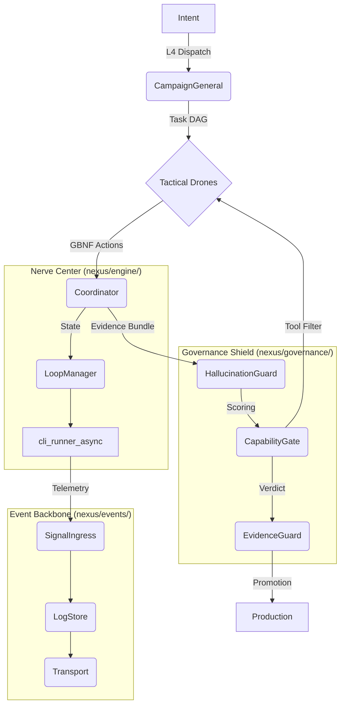

# System - Relationship & Dependency Graph (v26 Hardened)

## 1. 核心管線與領域解耦 (Today's Decoupled Update)
Nexus 已完成**治理層 (Governance)** 與 **事件層 (Events)** 的深度物理解耦。最新的組件交互如下：

## 2. 關鍵依賴變更 (April 21 Refactor)
- **事件層 (Events)**: 廢棄了舊有的 `event_bus.py` 單體架構，拆分為 `SignalIngress` (輸入)、`LogStore` (存儲) 與 `Transport` (傳輸)。
- **能力閘門 (CapabilityGate)**: 實施了「外觀模式 (Facade)」，實體邏輯移至 `nexus/governance/`，並在運行時根據 P-X-D-R-A-C 階段動態攔截 Agent 工具。
- **物理路徑校正**: 
    - `cli_runner_async.py` -> `nexus/engine/`
    - `capability_gate.py` -> `nexus/governance/`

---
Back to [[System Overview]]

## One-sentence summary
系統關係圖定義 L4-L3-L2 的核心依賴邊界與事件流向，作為架構變更的對位參考。

## Role / responsibility
- 提供組件邊界、依賴方向與監控對位的可讀圖譜，降低跨層變更風險。

## Upstream
- [[01_System/Code_Ownership_Matrix|Code Ownership Matrix]]
- [[01_System/Supreme_Master_Loop_Spec|Supreme_Master_Loop_Spec]]

## Downstream
- [[06_Ops/Ops - Architecture Decision Records|Architecture Decision Records]]
- [[05_Protocols/Protocol - Master Loop|Protocol - Master Loop]]

## Related modules / files
- [Source: compiled-wiki]
- [Source: 02_Modules/Module - Core Orchestrator.md]
- [[System Overview]]

## Source notes
- [Source: compiled-wiki]

## Open questions / conflicts
- Graph 邊界是否需要補上事件一致性保證的「回寫順序」欄位？

## 3. 實體圖譜依賴熱點 (Empirical Architectural Hubs)
*(Data Extracted on 2026-06-05 via graphify AST analysis of 150k+ nodes)*

以下為全 codebase 中**「被依賴次數最高 (In-Degree)」**的前 10 大上帝類別/模組。這些模組牽一髮動全身，是系統的真實爆炸半徑核心，任何修改皆需嚴格評估：

1. **NexusState** (In-Degree: 539) -> nexus/core/state_contracts.py 
   - *洞察*: 全局狀態合約，幾乎所有模組都在讀寫它，是系統最脆弱的單點瓶頸。
2. **LearnModeService** (In-Degree: 208) -> nexus/research/learn_mode.py
   - *洞察*: 學習閉環與動態演化的核心驅動者。
3. **CapabilityTask** (In-Degree: 202) -> scripts/bench/capability_ab_runner.py
   - *洞察*: A/B 測試驅動的核心任務單元，所有演化驗證的基礎。
4. **FindingsMemoryStore** (In-Degree: 187) -> nexus/research/findings_memory.py
5. **FindingsCard** (In-Degree: 180) -> nexus/research/findings_memory.py
   - *洞察*: 歷史記憶與決策經驗的實體存儲結構。
6. **CapabilityPlanner** (In-Degree: 166) -> nexus/engine/capability_planner.py
   - *洞察*: 動態能力路由的大腦，決定任務該分配給哪些工具。
7. **SkillRegistry** (In-Degree: 132) -> nexus/learning/skill_registry.py
8. **CliRunner** (In-Degree: 126) -> scripts/bench/capability_ab_runner.py
9. **SkillFrontmatter** (In-Degree: 106) -> nexus/learning/skill_schema.py
10. **NexusCliActionError** (In-Degree: 103) -> scripts/engine/commands/exception_translation.py

> **防禦守則**: 在對上述 10 大 Hub 進行重構時，必須開啟最高層級的迴歸測試，並強制執行 L5.7 雙平面治理檢查。
