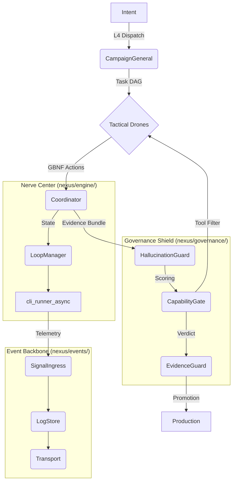

# System - Relationship & Dependency Graph (v26 Hardened)

## 1. 核心管線與領域解耦 (Today's Decoupled Update)
Nexus 已完成**治理層 (Governance)** 與 **事件層 (Events)** 的深度物理解耦。最新的組件交互如下：

## 2. 關鍵依賴變更 (April 21 Refactor)
- **事件層 (Events)**: 廢棄了舊有的 `event_bus.py` 單體架構，拆分為 `SignalIngress` (輸入)、`LogStore` (存儲) 與 `Transport` (傳輸)。
- **能力閘門 (CapabilityGate)**: 實施了「外觀模式 (Facade)」，實體邏輯移至 `nexus/governance/`，並在運行時根據 P-X-D-R-A-C 階段動態攔截 Agent 工具。
- **物理路徑校正**: 
    - `cli_runner_async.py` -> `nexus/engine/`
    - `capability_gate.py` -> `nexus/governance/`

---
Back to [[System Overview]]
