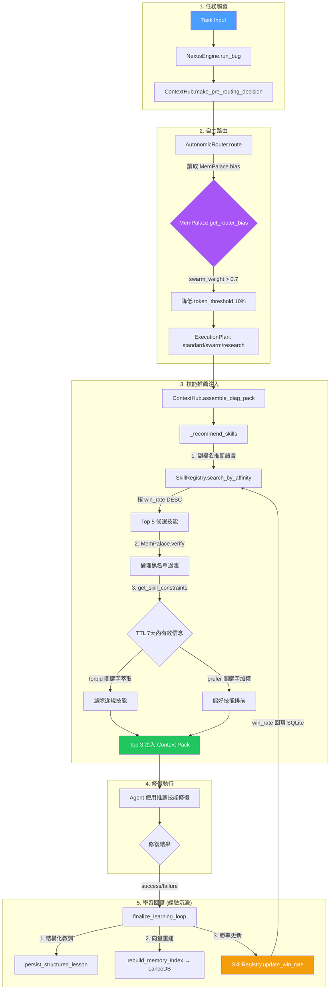

---
aliases:
- Skill Memory Closed Loop
- Three System Integration
- Learning Closed Loop
- Autonomic Routing Intelligence
confidence: high
last_compiled: 2026-04-09
owner: agent
related_pages:
- '[Module - Memory Pipeline Deep Dive](Module - Memory Pipeline Deep Dive.md)'
- '[Module - Intelligence and Context Core](Module - Intelligence and Context Core.md)'
- '[Module - Policy and Learning Governance](Module - Policy and Learning Governance.md)'
source_of_truth: nexus/core/context_hub.py
status: active
tags:
- core
- learning
- skill
- memory
- lance
- mempalace
- routing
- closed-loop
- phase13
title: Module - Skill Memory Closed Loop
type: module
version_scope:
- v24
- v26
---


# Module - Skill Memory Closed Loop

## One-sentence summary
本頁定義 Nexus 三系統（LanceDB / Memory / MemPalace）與技能選取、學習回寫之間的完整閉環資料流，是 Phase 13 Autonomic Routing Intelligence 的架構存根。

---

## 設計動機 (Why)

在 Phase 12 以前，Nexus 的技能選取是**靜態映射**：路由器按照關鍵字或任務類型寫死切換 standard / swarm / research_first。技能從未根據歷史勝敗動態排序，治理信念也未回饋至路由決策。這造成三個斷裂：

1. **技能與記憶斷裂** — SkillRegistry 儲存了歷史教訓但從未被 ContextHub 查詢。
2. **信念與路由斷裂** — MemPalace 持有倫理約束但 AutonomicRouter 完全忽視。
3. **學習與結晶斷裂** — 任務結束後 `finalize_learning_loop` 回寫教訓，但未更新技能勝率。

Phase 13 透過以下閉環修復了三者的聯動。

---

## 三系統架構 (Three Systems)

```
┌──────────────────────────────────────────────────────────────┐
│                    Nexus Intelligence Layer                   │
├───────────────┬──────────────────┬───────────────────────────┤
│   LanceDB     │   Memory         │   MemPalace               │
│   (向量檢索)   │   (索引/RAG)      │   (倫理/信念)             │
├───────────────┼──────────────────┼───────────────────────────┤
│ • 儲存結晶化   │ • 短期任務記憶    │ • 信念修正 (Belief Rev.)  │
│   的 Pattern   │ • RAG 語義召回    │ • 倫理防火牆              │
│ • 驅動 Wisdom  │ • Episode 歸檔   │ • Router Bias 偏誤向量    │
│   Prior 查詢   │ • 記憶索引重建    │ • 技能約束 (TTL 控制)     │
└───────────────┴──────────────────┴───────────────────────────┘
```

| 系統 | 角色 | 核心檔案 | 閉環中的位置 |
|------|------|---------|------------|
| **LanceDB** | 積/向量引擎 | `nexus/infrastructure/storage_implementations.py` | 技能結晶儲存 → 信念查詢 → 治理約束提取 |
| **Memory** | 基/索引引擎 | `nexus/services/memory.py` | RAG 召回 → 記憶提醒注入 → Episode 歸檔 |
| **MemPalace** | 魂/倫理引擎 | `nexus/services/mem_palace.py` | 信念過濾 → 技能約束 → Router Bias 偏誤 |

---

## 完整閉環資料流 (Data Flow)



---

## 技能選取閉環 (Skill Selection Closed Loop)

### 步驟 1：語言特徵萃取

`ContextHub._recommend_skills()` 從修復目標檔案路徑中提取語言特徵：

| 副檔名 | 推斷語言 | 檔案模式 |
|--------|---------|---------|
| `.py` | python | `*.py` |
| `.rs` | rust | `*.rs` |
| `.ts` / `.tsx` | typescript | `*.ts`, `*.tsx` |
| `.js` | javascript | `*.js` |
| `.go` | go | `*.go` |

**Source**: [context_hub.py](../../nexus/core/context_hub.py) → `_EXT_LANG_MAP`

### 步驟 2：親和力檢索 (Affinity Search)

`SkillRegistry.search_by_affinity()` 使用 SQLite B-Tree 索引進行多維查詢：

```sql
SELECT * FROM skills
WHERE (languages LIKE '%"rust"%')
  AND (file_patterns LIKE '%"*.rs"%')
  AND win_rate >= 0.30
ORDER BY win_rate DESC,
  CASE trust_level
    WHEN 'production' THEN 4
    WHEN 'tested' THEN 3
    WHEN 'reviewed' THEN 2
    ELSE 1
  END DESC
LIMIT 5
```

**Source**: [skill_registry.py](../../nexus/learning/skill_registry.py) → `search_by_affinity()`

### 步驟 3：MemPalace 倫理過濾

候選技能必須通過兩道倫理防線：

1. **倫理黑名單** (`MemPalace.verify`) — 比對 `ethical_blacklist.json` 中的全域禁止模式。
2. **信念約束** (`MemPalace.get_skill_constraints`) — 從活躍信念中萃取治理規則：

| 信念類型 | 中文觸發詞 | 英文觸發詞 | 效果 |
|---------|----------|----------|------|
| **forbid** | 禁止 | forbid | 候選技能含關鍵字 → 濾除 |
| **prefer** | 優先 | prefer | 候選技能含關鍵字 → 加權排前 |
| **require** | 必須 | require | 保留供未來硬性約束 |

**關鍵字萃取邏輯**：信念全句 → 移除停用詞（禁止/使用/不能等） → 萃取實質關鍵字（如 `pip install`、`cargo clippy`）

**Source**: [context_hub.py](../../nexus/core/context_hub.py) → `_extract_keywords()` / `_STOPWORDS`

### 步驟 4：7 天 TTL 信念過期

所有信念節點受 **7 天 TTL (Time-To-Live)** 控制：

```python
created_time = datetime.fromisoformat(created_at_str)
if (now - created_time).days > 7:
    continue  # 過期信念不再影響路由
```

**設計原理**：防止過時的治理判定永久限制系統行為，保持組織敏捷性。

**Source**: [mem_palace.py](../../nexus/services/mem_palace.py) → `get_skill_constraints()`

---

## 學習閉環 (Learning Closed Loop)

### 經驗沉澱 (Win Rate Convergence)

任務結束時，`finalize_learning_loop()` 觸發三階段回寫：

```
任務結束
  │
  ├─► 1. persist_structured_lesson (結構化教訓寫入 .nexus/reports)
  │
  ├─► 2. rebuild_memory_index (LanceDB 向量索引重建)
  │
  └─► 3. SkillRegistry.update_win_rate (勝率重算回寫 SQLite)
         │
         ├─ 讀取現有 repair_success / retry_count
         ├─ success → successes + 1
         ├─ win_rate = successes / total_uses
         └─ 寫回 skills 表
```

### 達爾文市場效應 (Darwinian Marketplace)

| 勝率區間 | 系統行為 |
|---------|---------|
| **≥ 0.80** | 頂級推薦，跨專案可移植 |
| **0.30 ~ 0.79** | 正常參與路由排序 |
| **< 0.30** | 自動退出路由候選池 (`min_win_rate=0.30`) |

**驗證數據**（來自 Phase 13 Accept Test — 10 輪收斂測驗）：

```
Round 01 🟢  wins=1/1   win_rate=1.0000
Round 02 🟢  wins=2/2   win_rate=1.0000
Round 03 🔴  wins=2/3   win_rate=0.6667
Round 04 🟢  wins=3/4   win_rate=0.7500
Round 05 🟢  wins=4/5   win_rate=0.8000
Round 06 🔴  wins=4/6   win_rate=0.6667
Round 07 🟢  wins=5/7   win_rate=0.7143
Round 08 🔴  wins=5/8   win_rate=0.6250
Round 09 🔴  wins=5/9   win_rate=0.5556
Round 10 🟢  wins=6/10  win_rate=0.6000 ← 穩定收斂
```

**Source**: [continuous_learning.py](../../nexus/services/continuous_learning.py) → `finalize_learning_loop()`

---

## Router Bias 偏誤校正 (AutonomicRouter × MemPalace)

AutonomicRouter 在路由決策前，會從 MemPalace 讀取方向性偏誤向量：

```python
bias = self.mem_palace.get_router_bias()
# bias = [standard_weight, swarm_weight, research_weight, self_heal_weight]
if bias[1] > 0.7:  # swarm 偏好超過閾值
    effective_config["token_threshold"] = int(base * 0.9)  # 降低 10%
```

**效果**：當組織信念傾向「大規模平行探索」時，系統自動降低單機處理的門檻，使更多任務升級至蜂群模式。

**驗證數據**：

| 場景 | base_threshold | bias | effective_threshold | 7660 tokens 路由 |
|------|------|------|------|------|
| 無偏誤 | 8400 | N/A | 8400 | `standard` ✅ |
| swarm_bias=0.85 | 8400 | [0.05, 0.85, 0.05, 0.05] | 7560 | `swarm` ✅ |

**Source**: [autonomic_router.py](../../nexus/engine/autonomic_router.py) → `route()`

---

## Schema 與物理儲存

### SkillRegistry SQLite Schema (v2.0 + Phase 13)

```sql
CREATE TABLE skills (
    id              INTEGER PRIMARY KEY,
    name            TEXT NOT NULL,
    description     TEXT,
    task_id         TEXT NOT NULL,
    origin_node_id  TEXT DEFAULT 'local',
    trust_level     TEXT DEFAULT 'auto-generated',
    task_type       TEXT,
    keywords        TEXT,           -- JSON array
    languages       TEXT,           -- JSON array  [Phase 13]
    file_patterns   TEXT,           -- JSON array  [Phase 13]
    win_rate        REAL DEFAULT 0, -- 0.0~1.0     [Phase 13]
    repair_success  INTEGER DEFAULT 0,
    retry_count     INTEGER DEFAULT 0,
    orchestration_pattern TEXT,
    context_fingerprint   TEXT,
    decision_boundary     TEXT,
    created_at      TEXT NOT NULL,
    updated_at      TEXT NOT NULL
);
```

### 物理檔案路徑對照

| 組件 | 路徑 | 職責 |
|------|------|------|
| SkillRegistry | `nexus/learning/skill_registry.py` | SQLite 技能索引與親和力搜尋 |
| SkillFrontmatter | `nexus/learning/skill_schema.py` | 技能後設資料 dataclass |
| SkillArtifact | `nexus/learning/skill_artifact.py` | 結晶化產物語言推斷 |
| ContextHub | `nexus/core/context_hub.py` | 動態技能注入與推薦 |
| MemPalace | `nexus/services/mem_palace.py` | 倫理過濾與信念約束 |
| AutonomicRouter | `nexus/engine/autonomic_router.py` | 路由偏誤校正 |
| ContinuousLearning | `nexus/services/continuous_learning.py` | 勝率回寫與經驗沉澱 |
| NexusEngine | `nexus/engine/coordinator.py` | DI 注入與組件對位 |

---

## Upstream

- **[Module - Memory Pipeline Deep Dive](Module - Memory Pipeline Deep Dive.md)**: 三系統架構定義源頭。
- **[Module - Intelligence and Context Core](Module - Intelligence and Context Core.md)**: ContextHub 與 Belief 引擎。
- **[Module - Policy and Learning Governance](Module - Policy and Learning Governance.md)**: 治理政策與學習評分。

## Downstream

- **[Module - Core Orchestrator Deep Dive](Module - Core Orchestrator Deep Dive.md)**: NexusEngine DI 注入入口。
- **[Module - Task Scheduling and Swarm Adapters](Module - Task Scheduling and Swarm Adapters.md)**: Swarm 升級觸發。

## Acceptance Evidence

Phase 13 驗收測試套件: `scripts/scratch/phase13_acceptance.py`

| 場景 | 測試數 | 結果 |
|------|--------|------|
| A – 語言精準路由 | 7 | ✅ 全通過 |
| B – TTL 信念過濾 | 5 | ✅ 全通過 |
| C – Router 偏誤校正 | 4 | ✅ 全通過 |
| D – 勝率收斂 | 2 | ✅ 全通過 |
| E – 完整 E2E | 9 | ✅ 全通過 |
| **合計** | **27** | **🎯 27/27** |

## Open questions / conflicts

- [ ] **Prefer 語義強度**: 當前 prefer 僅做關鍵字加權（+1/match），未考慮語義距離。未來可引入 embedding 相似度加權。
- [ ] **Win Rate 冷啟動**: 新技能 win_rate=0.0 會被 min_win_rate=0.30 篩除，需要引入「新手保護期」(grace period)。
- [ ] **多租戶治理隔離**: 當前 MemPalace 信念為全域共享，未按 tenant_id 隔離。

---
Back to [System Overview](../00_Home/System Overview.md)

---
[[System Overview]]
