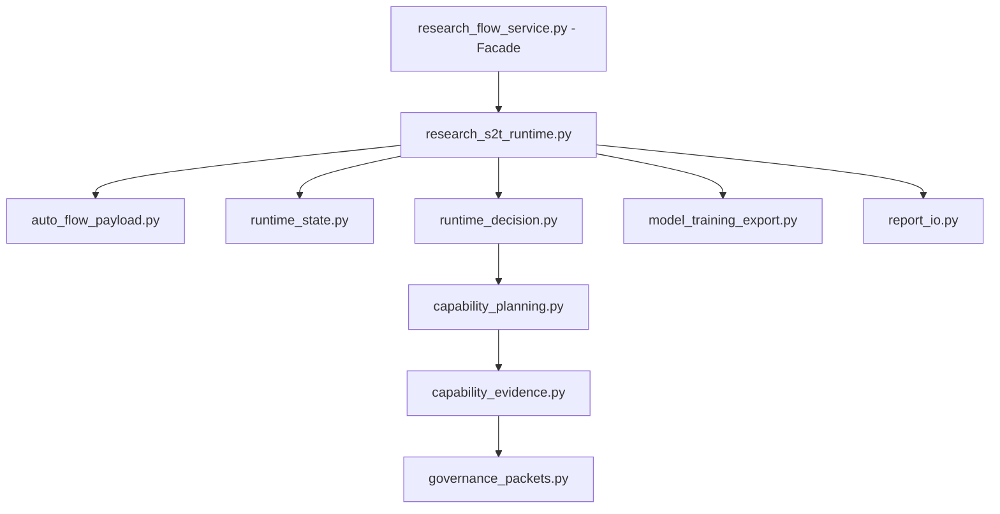

# Research Flow Leaf Modules Architecture

本文件物理對齊 2026-05-23 對 `nexus/app/research_flow_service.py` 進行的大規模模組化拆分。我們將原本臃腫的大一統服務分解為 10 個具備單一職責原則（SRP）的葉子模組，使 Nexus 的科研研究環路更加易於 AI 維護與獨立測試。

---

## 🏛️ 10 個葉子模組職責對照表 (Single Responsibility Mapping)

所有拆分後的葉子模組皆位於 `nexus/research/flow/` 或是 `nexus/app/` 底下，其 AST 物理職責劃分如下：

| 葉子模組物理路徑 | 核心類別 / 函數 | 單一職責原則 (SRP) 物理描述 |
| :--- | :--- | :--- |
| **`nexus/app/research_s2t_runtime.py`** | `ResearchS2TRuntime` | 管理 S2T (Spec-to-Task) 運行期的上下文轉換，充當外部 CLI 與內部研究環路的安全網。 |
| **`nexus/research/flow/auto_flow_payload.py`** | `AutoFlowPayload` | 管理與解析 `research:auto-flow` 的輸入 Payload，執行嚴格的欄位 schema 校驗。 |
| **`nexus/research/flow/capability_evidence.py`** | `CapabilityEvidence` | 集中處理運行期所搜集到的 capability receipts 與 evidence 簽章結構化包裝。 |
| **`nexus/research/flow/capability_planning.py`** | `CapabilityPlanning` | 計算 HEEP 13 種能力的依賴 DAG。對接 `capability_planner.py` 的調度演算法。 |
| **`nexus/research/flow/governance_packets.py`** | `GovernancePackets` | 封裝 delivery_gate 與 acceptance_gate 的物理決策包，供門禁驗證器調用。 |
| **`nexus/research/flow/runtime_decision.py`** | `RuntimeDecision` | 自主決策是否要升級至 Swarm 模式、NightShift 模式或維持 Hyper 模式的核心路由點。 |
| **`nexus/research/flow/runtime_state.py`** | `RuntimeState` | 無狀態（Stateless）維護當前研究任務的 metadata、token 耗量與狀態變遷。 |
| **`nexus/research/flow/task_classifier.py`** | `TaskClassifier` | 將傳入任務分類為 `feature`、`bugfix` 或 `run`。 |
| **`nexus/research/flow/model_training_export.py`**| `ModelTrainingExport`| 將成功驗證的 receipts 匯出為微調 (Fine-tuning) 與強化學習所需之資料集。 |
| **`nexus/research/flow/report_io.py`** | `ReportIO` | 負責處理 `NEXUS_REFACTOR_REMAINING_*` 等實體報告在 Wiki 下的唯讀寫入。 |

---

## 🔄 AST 依賴與調用鏈 (Dependency Diagram)

拆分後，`ResearchFlowService` 扮演門面（Facade Pattern），內部依賴調用結構如下：

---

## 🛡️ 模組隔離與安全邊界

1. **循環引用阻斷 (No Circular Imports)**: 10 個葉子模組之間禁止任何直接的交叉引用。所有跨模組通信必須透過 Facade 調度器或是無狀態的資料物件（DTO）進行中轉。
2. **無狀態執行 (Stateless Flow)**: 除了 `runtime_state.py` 負責狀態封裝之外，其餘 9 個模組均為無狀態函數或純計算類，這大幅降低了多 subagent 併發調用時的資料競爭風險。

[NEXUS IDENTITY: de0969ff + v2.8 RUNTIME-ALIGNED]
