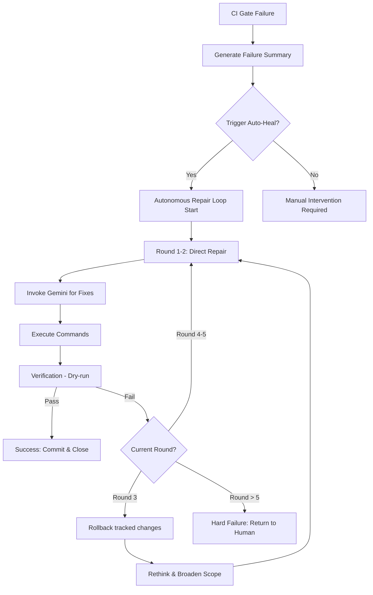

# Flow - Recursive Auto-Repair

## 🌀 核心流程圖 (State Machine)



---

### 🛠️ 執行環境與規則

1.  **安全回滾 (Safe Rollback)**：
    *   預設使用 `git checkout .` 僅還原 tracked 變更。
    *   **不使用** `git clean -fd`（防止誤刪新建檔案）。
    *   `hard_reset()` 方法僅在人類明確下令時使用。
2.  **悔棋機制 (Rollback)**：
    *   在進入 Loop 前，系統自動記錄 HEAD hash。
    *   在第 3 輪失敗後，執行 `git checkout .` 以消除累積的錯誤修改。
    *   新建的檔案不受影響（保留現場供後續分析）。
3.  **修復策略 (Repair Strategy)**：
    *   **精確修復**：第一輪通常只針對報錯行進行局部修正。
    *   **結構修正**：第三輪回滾後，Gemini 會被要求「從架構層面反思」。

---

### 📊 觸發方式

```bash
# 方式一：CI Gate 自動觸發
python scripts/ops/ci_gate.py --auto-heal

# 方式二：手動觸發
python scripts/ops/autonomous_repair_loop.py
```

## One-sentence summary
本流程定義 CI 失敗後以多輪修復、回滾與重構反思為主軸的遞迴自我修正序列。 [Source: scripts/ops/autonomous_repair_loop.py]

## Role / responsibility
- 提供失敗後的自動修復策略與回滾節奏。 [Source: scripts/ops/autonomous_repair_loop.py]
- 限制 unsafe 動作，保留新建檔案與可追溯痕跡。 [Source: scripts/ops/ci_gate.py]

## Upstream
- **[scripts/ops/autonomous_repair_loop.py](../scripts/ops/autonomous_repair_loop.py)**: 流程執行入口。 [Source: scripts/ops/autonomous_repair_loop.py]
- **[06_Ops/Ops - CI Failure Playbook](../06_Ops/Ops - CI Failure Playbook.md)**: 啟動條件與處置參考。 [Source: 06_Ops/Ops - CI Failure Playbook.md]

## Downstream
- **[06_Ops/Ops - Closeout Hard Gate](../06_Ops/Ops - Closeout Hard Gate.md)**: 修復結果回報交付。 [Source: 06_Ops/Ops - Closeout Hard Gate.md]
- **[06_Ops/Ops - Governance SLO Dashboard](../06_Ops/Ops - Governance SLO Dashboard.md)**: 監控迭代失敗率。 [Source: 06_Ops/Ops - Governance SLO Dashboard.md]

## Related modules / files
- `scripts/ops/autonomous_repair_loop.py`
- `nexus/orchestrator/pipeline.py`
- `06_Ops/Ops - CI Failure Playbook.md`

## Source notes
- 本流程依據自修復 loop 與 ci_gate 交互行為整理。 [Source: scripts/ops/autonomous_repair_loop.py]

## Open questions / conflicts
- [ ] 第 4-5 輪仍可否加入架構改造分支？
- [ ] 需不需要加入 cross-scope checkpoint 保存快照，降低重試副作用？

[METADATA]
Status: ACTIVE
Version: v23.8.1
Module: scripts/ops/autonomous_repair_loop.py

**[Source: scripts/ops/autonomous_repair_loop.py]**

[[System Overview]]
