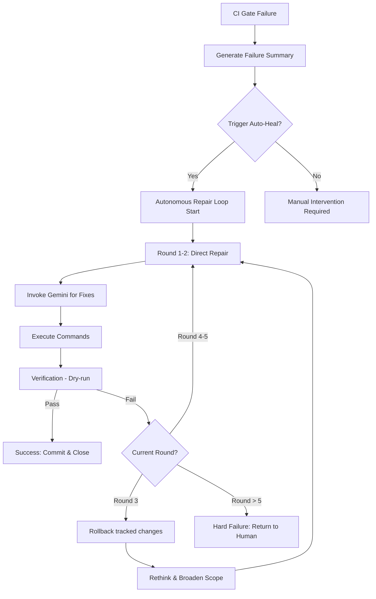

# Flow - Recursive Auto-Repair

## 🌀 核心流程圖 (State Machine)



---

### 🛠️ 執行環境與規則

1.  **安全回滾 (Safe Rollback)**：
    *   預設使用 `git checkout .` 僅還原 tracked 變更。
    *   **不使用** `git clean -fd`（防止誤刪新建檔案）。
    *   `hard_reset()` 方法僅在人類明確下令時使用。
2.  **悔棋機制 (Rollback)**：
    *   在進入 Loop 前，系統自動記錄 HEAD hash。
    *   在第 3 輪失敗後，執行 `git checkout .` 以消除累積的錯誤修改。
    *   新建的檔案不受影響（保留現場供後續分析）。
3.  **修復策略 (Repair Strategy)**：
    *   **精確修復**：第一輪通常只針對報錯行進行局部修正。
    *   **結構修正**：第三輪回滾後，Gemini 會被要求「從架構層面反思」。

---

### 📊 觸發方式

```bash
# 方式一：CI Gate 自動觸發
python scripts/ops/ci_gate.py --auto-heal

# 方式二：手動觸發
python scripts/ops/autonomous_repair_loop.py
```

[METADATA]
Status: ACTIVE
Version: v23.8.1
Module: scripts/ops/autonomous_repair_loop.py
