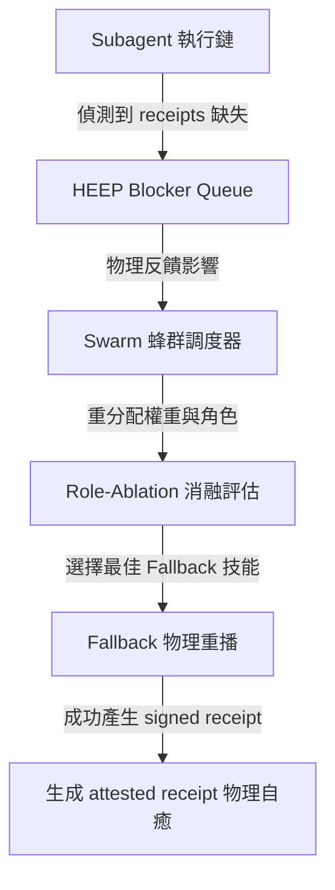

# HEEP Blocker Queue & Swarm Feedback Loop

本文件物理對齊 HEEP（Harness Evaluation & Execution Platform）自主治理架構，揭示當 13 個核心能力被阻斷時，Blocker Queue 如何作為強大的反向反饋迴路，動態調控 Swarm 蜂群 subagent 協作機制，實現高度自治的自我自我修復（Self-Healing）。

---

## 🔄 HEEP-Swarm 反向回饋機制圖 (Feedback Loop)

在運行期，當 subagent 的執行鏈遭遇 receipts 缺失或權限阻斷時，系統不會直接失敗崩潰，而是觸發以下自我癒合環路：

---

## 🧠 自我癒合 (Self-Healing) 詳細步驟

### 1. 偵測與入隊 (Detection & Enqueue)
當 `capability_planner.py` 判定當前任務所需的 13 種 HEEP 能力（例如 `drone`、`nightshift`、`swarm`）缺少對應的 attested runtime receipts 時，該能力會被標記為 `BLOCKED`，並自動寫入 `NEXUS_HEEP_MAT_B_BLOCKER_RESOLUTION_QUEUE.json`。

### 2. Swarm 反向調度與角色重分配 (Role Re-allocation)
Swarm 蜂群調度器（`nexus/orchestrator/swarm.py`）會自動「訂閱」此 Blocker Queue 的狀態。一旦偵測到特定的 `BLOCKED` 能力：
- **調整優先權**: 調度器會自動將與解鎖該 blocker 相關的任務權重調至最高（`Priority: critical`）。
- **角色重分配 (Role Re-allocation)**: Swarm 會自動調整 subagent 蜂群的角色配置。例如，將原本執行常規開發的 `DeveloperSubagent` 升級並轉換為 `SandboxAttestationSubagent`，全力進行 sandbox 物理重播以解鎖 blocker。

### 3. 消融評估與 Fallback 物理重播
Swarm 協同 `SkillFitCandidateIndex` 進行消融評估（Ablation Evaluation）：
- **單一 vs 多技能評估**: 若 provider-token 被阻斷，優先選擇 internal non-cost multi-skill fallback。
- **物理重播**: 驅動 subagent 在 macOS `sandbox-exec` 唯讀沙盒中重播能力。一旦重播成功並通過 `ci_gate.py` 的合規簽章，便會在物理層生成新的 attested receipts，並將該能力從 Blocker Queue 中移除，完成自我修復。

---

## 📊 Blocker Queue 治理特徵 (Governance Attributes)

| 佇列欄位 | 數據類型 | 治理目的 | 自癒觸發門檻 |
| :--- | :--- | :--- | :--- |
| `blocked_capability` | `string (enum)` | 精確識別被阻斷的能力名 | 存在即觸發 Swarm 重新配置 |
| `blocker_reason` | `string` | 紀錄是因為 provider-token 還是 executor-receipt 缺失 | 區分 fallback 路由策略 |
| `swarm_redirection_state` | `boolean` | 標記 Swarm 是否已成功重定向蜂群 | 若 `false` 則在 3 分鐘後觸發超時安全降級 |

[NEXUS IDENTITY: de0969ff + v2.8 RUNTIME-ALIGNED]
