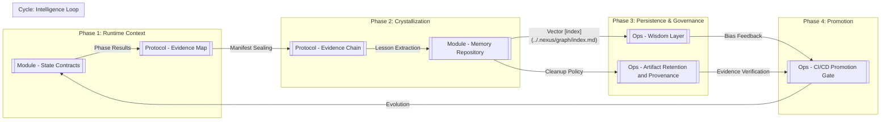

---
aliases:
- Lineage Map
- Knowledge Data Fabric
confidence: high
last_compiled: 2026-04-06
owner: agent
related_pages:
- '[State Contracts](../02_Modules/Module - State Contracts.md)|[[Module - [[Module - State Contracts|State
  Contracts]]|Module - [State Contracts](../02_Modules/Module - State Contracts.md)]]]]'
- '[Evidence Map](Protocol - Evidence Map.md)|[[Protocol - [[Protocol - Evidence Map|Evidence
  Map]]|Protocol - [Evidence Map](Protocol - Evidence Map.md)]]]]'
- '[Module - Memory Repository](../02_Modules/Module - Memory Repository.md)'
- '[Ops - Artifact Retention and Provenance](../06_Ops/Ops - Artifact Retention and Provenance.md)'
- Ops - CI/[Promotion Gate](../06_Ops/Ops - CI/CD Promotion Gate.md)|[[CD [[CD Promotion Gate|Promotion
  Gate]]|CD [Promotion Gate](../06_Ops/Ops - CI/CD Promotion Gate.md)]]]]
- '[System Overview](../00_Home/System Overview.md)'
- '[Unknowns](../01_System/System - Unknowns and Conflicts.md) and Conflicts|[[System - [[System
  - Unknowns and Conflicts|Unknowns]] and Conflicts|System - [[System - Unknowns and
  Conflicts|Unknowns]] and Conflicts]]]]'
source_of_truth: MUSE-NEXUS-v22#DataFabric
status: active
tags:
- protocol
- knowledge
- lineage
- fabric
title: Protocol - Knowledge Lineage
type: protocol
version_scope:
- v17.1
- v22
- v23
---

# Protocol - Knowledge Lineage

## One-sentence summary
本頁呈現 Nexus 從 Runtime 工件到長期記憶與治理決策的完整知識血緣全景圖。 [Source: MUSE-NEXUS-Engine-Specification-v22-Eternal.md]

## Role / responsibility
- **全景視覺化**: 將破碎的 Wiki 頁面串聯成單一的知識演化流向圖。 [Source: 00_Home/System Overview.md]]]
- **生命週期追蹤**: 描述知識如何從「瞬時狀態」萃取為「智慧經驗」。 [Source: 02_Modules/Module - Memory Repository.md]]]
- **治理校準**: 確保 Lineage 中的每一個節點都有對應的 Wiki 治理定義。 [Source: 06_Ops/Ops - Provenance Exceptions and Waivers.md]]]

## Knowledge Lineage Map (全血緣地圖)

## Upstream
- **[System Overview](../00_Home/System Overview.md)**: 提供宏觀數據演化背景。
- **Runtime Trace**: 實體任務執行紀錄。

## Downstream
- **[Ops - Wisdom Layer](../06_Ops/Ops - Wisdom Layer.md)**: 指導智慧層的教訓應用。
- **[[Ops - CI/CD Promotion Gate]]**: 提供全鏈路審核證據。

## Related modules / files
- `05_Protocols/[Protocol - Evidence Map](Protocol - Evidence Map.md).md`: 原始證據圖譜。 [Source: 05_Protocols/Protocol - Evidence Map.md]]]
- `06_Ops/[Ops - Artifact Retention and Provenance](../06_Ops/Ops - Artifact Retention and Provenance.md).md`: 保存政策。 [Source: 06_Ops/Ops - Artifact Retention and Provenance.md]]]

## Source notes
- v22 Engine Spec: 確立 Knowledge Lineage 作為 Data Fabric 的最高層現。 [Source: MUSE-NEXUS-Engine-Specification-v22-Eternal.md]

## Open questions / conflicts
- [ ] **Lineage Drift**: 智慧層產出的決策是否應建立獨立的血緣分支。
- [ ] **Storage Tiers**: 線上 (Hot) 與 離線 (Cold) 知識資產在 Lineage 中的區隔顯示。