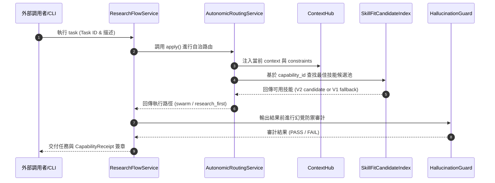

# CodeGraph File Dependency Map & Class Hierarchy

本報告展示 Nexus 系統核心類別（Classes）之繼承關係與跨模組調用圖，協助開發者理清系統物理依賴。

---

## 🏛️ 系統核心類別階層架構 (Class Hierarchy)

Nexus 系統的核心控制流圍繞著幾個主要管理類別，其 AST 物理結構如下：

### 1. 策略調度與執行類 (Dispatcher & Runner)
* 🏛️ `OracleDispatcher` (定義於 `nexus/app/oracle_dispatcher.py`)
  - 核心職責: 管理 Shadow Mode 預演、分流調度、與 Oracle 溝通。
* 🏛️ `ResearchFlowService` (定義於 `nexus/app/research_flow_service.py`)
  - 核心職責: 管理 A/B 研究實驗生命週期，控制 Learn/Converge 多輪反覆運算。
* 🏛️ `AutonomicRoutingService` (定義於 `nexus/engine/autonomic_routing_service.py`)
  - 核心職責: 自動識別任務模式（Swarm/Research/Direct/Self-Heal），執行外部技能動態載入。

### 2. 感知與防禦類 (Sensors & Guards)
* 🏛️ `ContextHub` (定義於 `nexus/core/context_hub.py`)
  - 核心職責: 物理隔離上下文、注入當前任務所需的 dependencies。
* 🏛️ `HallucinationGuard` (定義於 `nexus/core/hallucination_guard.py`)
  - 核心職責: 利用語意比對、證據鏈審計來攔截幻覺輸出。

### 3. 零信任適配與消融類 (Learning & Ablation)
* 🏛️ `SkillFitCandidateIndex` (定義於 `nexus/learning/skill_fit_candidate_index.py`)
  - 核心職責: 2026-05-23 全新部署。集中式管理 V2 零信任候選技能的索引、過濾與負控制查找。
* 🏛️ `SkillFitAblationCore` (定義於 `nexus/learning/skill_fit_ablation_core.py`)
  - 核心職責: 控制消融測試的執行環路，驗證單一技能的必要性。

---

## 🔄 核心模組調用與數據流向 (Call Flow)

下圖展示在啟動一次自動化 `research:auto-flow` 任務時，系統內部的 AST 調用鏈：

---

## 📌 跨模組物理依賴矩陣 (Import Matrix)

本矩陣展示核心檔案之間的直接 `import` 物理引用（`Yes` 表示有直接 import 依賴）：

| 依賴源 (Imported) ➡️ 調用者 (Caller) ⬇️ | `context_hub` | `capability_planner` | `completion_contract` | `skill_fit_candidate_index` | `oracle_dispatcher` |
| :--- | :---: | :---: | :---: | :---: | :---: |
| **`research_flow_service`** | **Yes** | No | **Yes** | No | **Yes** |
| **`autonomic_routing_service`** | **Yes** | No | No | **Yes** | No |
| **`capability_planner`** | No | - | **Yes** | No | No |
| **`skill_fit_ablation_core`** | **Yes** | No | No | **Yes** | No |

---

## 💡 依賴優化建議
* **解耦 ContextHub**: `autonomic_routing_service` 與 `skill_fit_ablation_core` 皆直接引用了 `context_hub`，這使得 Context Hub 成為極高風險的核心單點。建議未來引進 **依賴注入容器 (DI Container)**，將物理引用降為介面級（Interface-level）依賴。

[NEXUS IDENTITY: de0969ff + v2.8 RUNTIME-ALIGNED]
