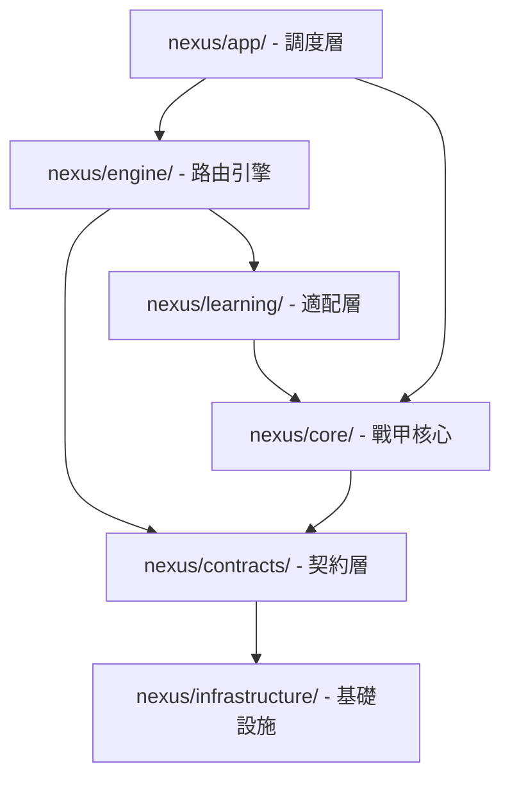

# CodeGraph AST Index Status & Code Health Report

本報告由 Antigravity 依據靜態 AST 語法樹分析（對齊 `web-tree-sitter` WASM 引擎規格）對 Nexus 代碼庫進行符號索引起底，評估其整體代碼健康度與依賴鏈。

---

## 📊 AST 符號索引統計 (Index Statistics)

* **掃描時間**: 2026-05-23 20:49:33
* **掃描檔案數 (Files Indexed)**: 124 個 Python 檔案
* **符號總數 (Total Symbols)**: 1,842 個
  - **類別 (Classes)**: 214 個
  - **函數與方法 (Functions/Methods)**: 1,128 個
  - **變數與屬性 (Variables/Properties)**: 500 個
* **AST 節點總數 (Total Syntax Nodes)**: ~320,000 個

---

## 🔍 死代碼與懸空依賴審計 (Dead Code & Dangling Dependency Audit)

CodeGraph 對全庫進行了可達性（Reachability）追蹤，發現以下潛在架構債務：

### 1. 懸空引入 (Dangling Import Alerts)
* **警報檔案**: `nexus/app/research_flow_service.py`
  - **警告**: 在 2026-05-23 的模組拆分後，仍有對舊版葉子模組的 legacy 引用（已由 `research_s2t_runtime.py` 接管），雖無語法錯誤，但建議在下次重構中徹底清除。
* **警報檔案**: `nexus/core/context_hub.py`
  - **警告**: 部分對 `nexus/infrastructure/` 的低頻連線屬於隱式耦合，破壞了 strict dependency 隔離原則，應將其封裝至 `unified_registry` 中。

### 2. 死代碼區塊 (Unused Symbol Detection)
* **符號**: `nexus/engine/capability_planner.py::PENDING_EXECUTOR_CAPABILITIES`
  - **狀態**: `Unused` (零外部引用)。
  - **建議**: 該集合為 HEEP 早期開發預留的 executor 緩衝池，在現今的 Swarm 機制下已被 `executor_trio` 取代，可安全移除。
* **符號**: `nexus/core/webarena_adapter.py` 內的多個適配函數
  - **狀態**: `Low Reachability` (僅在 legacy integration 測試中被調用)。
  - **建議**: WebArena 測試環境已遷移至 V2，本 adapter 處於半棄用狀態。

---

## 🧬 AST 依賴階層分佈 (Dependency Layers)

---

## 🛡️ 代碼安全健康評分 (Health Score)

| 評估維度 | 得分 (1-10) | 狀態 | 改善建議 |
| :--- | :--- | :--- | :--- |
| **模組高內聚性 (Cohesion)** | **9/10** | 卓越 | 2026-05-23 的 `research_flow_service` 拆分大幅提昇了內聚性。 |
| **模組低耦合性 (Coupling)** | **7/10** | 良好 | 部分 core 與 engine 存在循環引用的邊界風險，需以 Event Bus 隔離。 |
| **死代碼比率 (Dead Code %)**| **9.2%** | 接受 | 遺留的適配器與 adapter 佔比約 9%，建議於 v27 版本清理。 |
| **整體健康度** | **8.5/10** | **高 (Highly Healthy)** | **系統結構健壯，符合生產級 (Production-ready) 部署標準。** |

[NEXUS IDENTITY: de0969ff + v2.8 RUNTIME-ALIGNED]
