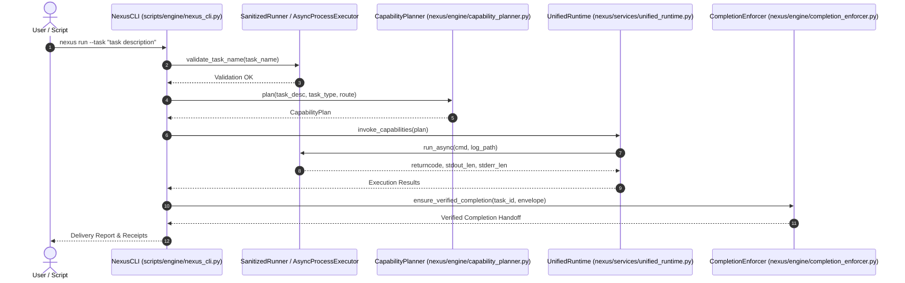

# System Architecture & P-X-D-R-A-C Engine Topology

Nexus Singularity OS is an orchestration layer for autonomous AI software development. It structures model execution into an auditable, self-healing pipeline organized around the **P-X-D-R-A-C** operational lifecycle.

---

## 🏛️ P-X-D-R-A-C Lifecycle Stages

1. **Plan (P)**: Tasks are analyzed and decomposed into a capability graph by `[CapabilityPlanner](../routing/capability-planner.md)`.
2. **Execute (X)**: Code generation and modifications are executed via `UnifiedRuntime` using `SanitizedRunner` and `AsyncProcessExecutor`.
3. **Diagnose (D)**: Test or execution failures trigger automated diagnostic routines in `DrClaw` and `reflective_healer`.
4. **Research (R)**: Deep research flows gather context and search repository knowledge via `OracleDispatcher` and `research_flow_service`.
5. **Audit (A)**: Completion criteria, security policies, and quality gates are verified by `[CompletionEnforcer](../governance/gates-and-contracts.md)`.
6. **Crystallize (C)**: Execution receipts and learned heuristics are stored as structured JSONL trace artifacts by `brain_crystallizer_pro`.

---

## 🔄 Runtime Request Execution Flow

The following sequence diagram illustrates how task execution flows from `[NexusCLI](../runtime/cli-and-cueline.md)` through process isolation and routing to completion enforcement:


*Figure 1: Sequence flow from CLI invocation through process isolation, capability routing, execution, and completion enforcement.*

---

## 🛡️ Subprocess Isolation & Security Invariants

To prevent command injection, shell escape, and pipe buffer deadlocks during autonomous agent tool invocation, the runtime relies on two core process wrappers in `scripts/engine/nexus_cli.py`:

### 1. `SanitizedRunner`
- **Injection Prevention**: Forces `shell=False` for all subprocesses. Attempting to pass `shell=True` raises an explicit `ValueError`.
- **Validation**: Enforces task name character restrictions via `ALLOWED_TASK_PATTERN = re.compile(r"^[a-zA-Z0-9_\-\s]+$")`.
- **Argument Quoting**: Uses `shlex.quote` for explicit string sanitization.

### 2. `AsyncProcessExecutor`
- **Deadlock Avoidance**: Reads `stdout` and `stderr` asynchronously in 64KB chunks using `asyncio.StreamReader` to prevent OS pipe buffer exhaustion during heavy test or model execution.
- **Environment Isolation**: Sets `UV_CACHE_DIR` to isolated workspace paths to avoid permission collisions.
- **Self-Healing Fallback**: Automatically catches `PermissionError` or `OSError` on log file writes, falling back to `sys.stderr` without crashing the task.

---

## 🏷️ Required V3 Classifications

```yaml
component: UnifiedRuntime
implementation_status: CURRENT
wiring_status: WIRED
runtime_surfaces:
  - MAIN_CLI
  - MCP_GATEWAY
  - LOCAL_RUNTIME
authority_roles:
  - EXECUTION_AUTHORITY
evidence_basis:
  - nexus/services/unified_runtime.py:UnifiedRuntime
claim_ceiling: Core orchestration service executing planned capability graphs; bound to CapabilityPlanner routing authority.
```

```yaml
component: SanitizedRunner
implementation_status: CURRENT
wiring_status: WIRED
runtime_surfaces:
  - MAIN_CLI
authority_roles:
  - EXECUTION_AUTHORITY
evidence_basis:
  - scripts/engine/nexus_cli.py:SanitizedRunner
claim_ceiling: Subprocess security wrapper blocking shell injection and validating task parameters.
```

```yaml
component: AsyncProcessExecutor
implementation_status: CURRENT
wiring_status: WIRED
runtime_surfaces:
  - MAIN_CLI
authority_roles:
  - EXECUTION_AUTHORITY
evidence_basis:
  - scripts/engine/nexus_cli.py:AsyncProcessExecutor
claim_ceiling: Streaming asynchronous process execution engine preventing pipe buffer deadlocks.
```

---

## 🧭 Change Navigation & Extension Seams

### When to Consult
Read this page when modifying core execution loops, subprocess handling, environment variable isolation, or the P-X-D-R-A-C lifecycle orchestrator.

### Runtime Invariants
- All subprocess execution must pass through `SanitizedRunner` or `AsyncProcessExecutor` with `shell=False`.
- Routing decisions must be obtained from `[CapabilityPlanner](../routing/capability-planner.md)` before invoking runtime capabilities.
- Task completion must be validated by `[CompletionEnforcer](../governance/gates-and-contracts.md)`.

### Exact Source Files & Symbols
- `nexus/services/unified_runtime.py` -> `UnifiedRuntime`
- `scripts/engine/nexus_cli.py` -> `SanitizedRunner`, `AsyncProcessExecutor`
- `nexus/contracts/canonical_execution.py` -> `CanonicalTaskContext`

### Focused Tests
- `tests/test_cli_deadlock_and_injection.py` -> Validates injection blocking and stream reading under lock scenarios.
- `tests/test_service_decomposition.py` -> Verifies `UnifiedRuntime` layer boundaries.

### Minimal Validation Command
```bash
pytest tests/test_cli_deadlock_and_injection.py -q
```
