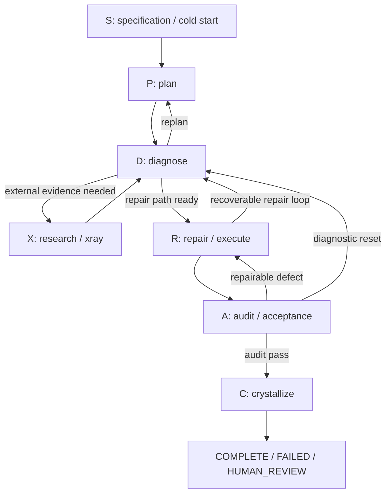

# System Architecture & S-P-D-X-R-A-C Runtime Topology

Nexus currently separates **runtime lifecycle semantics**, **route/capability selection**, **task-service lifecycle**, and **continuity projection** instead of collapsing them into one orchestrator. The canonical runtime phase vocabulary is defined physically in `nexus/engine/runtime_phase_contract.py` and consumed by `NexusPipeline`.

> **Current-source correction:** the runtime order is `S → P → D → X → R → A → C`. In this contract, **X means optional external research / xray**, while **R is repair / execution**. Older descriptions that expand `P-X-D-R-A-C` as `Plan → Execute → Diagnose → Research → Audit → Crystallize` are not the current runtime phase contract.

---

## 🏛️ Canonical Runtime Phases

`RUNTIME_PHASE_FLOW` is the ordered tuple of every runtime phase. `PRODUCT_VISIBLE_PHASES` omits only the internal `S` gate.

| Phase | Current source meaning | Contractual next steps |
| :--- | :--- | :--- |
| **S** | specification / cold-start gate | `P` or `HARD_BLOCK` |
| **P** | plan | `D` or `HARD_BLOCK` |
| **D** | diagnose | `X`, `R`, `P`, `RECOVERABLE_BLOCK`, or `HARD_BLOCK` |
| **X** | optional external research / xray | returns to `D`, or blocks |
| **R** | repair / execute | `A`, `D`, or blocks |
| **A** | audit / acceptance | `C`, `R`, `D`, or blocks |
| **C** | crystallize | `COMPLETE`, `FAILED`, or `HUMAN_REVIEW` |

`A → C` is fail-closed: `validate_transition()` rejects the transition unless `audit_passed is True`.



`nexus/engine/pipeline.py` derives `CANONICAL_STAGE_FLOW` directly from `RUNTIME_PHASE_FLOW`, so the phase contract is not merely documentation vocabulary.

---

## ⚙️ Task-Scoped Online / Local Execution Seam

`nexus/services/unified_runtime.py` describes itself as the canonical task-scoped runtime seam for Online and Local execution. Its source-level responsibilities include:

- carrying task identity through `UnifiedRuntimeRequest` / receipt contracts;
- invoking `CapabilityPlanner` rather than inventing a second route source;
- applying `LIGHT`, `STANDARD`, and `FULL` execution-depth semantics;
- evaluating runtime workforce admission before model/worker use;
- generating fail-closed execution and replan evidence;
- keeping `public_claim_allowed=False` on execution-replan requests.

The provider registry is adapter metadata only. Presence of a provider entry does **not** prove that its binary was invoked in a given task.

---

## 🧠 Task Continuity Is a Projection, Not Lifecycle Authority

`nexus/core/task_continuity.py` was added after the previous OpenWiki synchronization. It projects an existing task/attempt event stream into immutable `ContinuitySnapshot` and `ResumeContext` objects.

Its own module contract is explicit: continuity carries summaries and evidence references only; it is **not** a task state machine, router, verifier, or lifecycle authority. It preserves items such as rejected strategies, unresolved risks, evidence refs, next action, and claim ceiling across attempts while validating sequence and hash-chain integrity.

This distinction matters for implementation work:

- use continuity to recover **what is already known**;
- use the task/lifecycle service to decide **what action is legal next**;
- use `CapabilityPlanner` to decide **route/capability selection**;
- use independent verification/acceptance to decide **whether a Candidate is acceptable**.

---

## 🏷️ Required V3 Classifications

```yaml
component: RuntimePhaseContract
implementation_status: CURRENT
wiring_status: WIRED
runtime_surfaces:
  - LOCAL_RUNTIME
authority_roles:
  - NONE
evidence_basis:
  - nexus/engine/runtime_phase_contract.py:RUNTIME_PHASE_FLOW
  - nexus/engine/runtime_phase_contract.py:LEGAL_RUNTIME_TRANSITIONS
  - nexus/engine/pipeline.py:CANONICAL_STAGE_FLOW
claim_ceiling: Canonical runtime phase/transition contract used by NexusPipeline; it explicitly does not own routing, development-task state, approval, integration, or learning authority.
```

```yaml
component: UnifiedRuntime
implementation_status: CURRENT
wiring_status: UNKNOWN
runtime_surfaces: []
authority_roles:
  - EXECUTION_AUTHORITY
evidence_basis:
  - nexus/services/unified_runtime.py:UnifiedRuntimeRequest
  - nexus/services/unified_runtime.py:CapabilityPlanner
claim_ceiling: Current provider-neutral task-scoped Online/Local runtime implementation exists and binds planning to CapabilityPlanner; this bounded source review does not by itself claim every external runtime caller.
```

```yaml
component: TaskContinuity
implementation_status: CURRENT
wiring_status: WIRED
runtime_surfaces:
  - LOCAL_RUNTIME
authority_roles:
  - NONE
evidence_basis:
  - nexus/core/task_continuity.py:ContinuitySnapshot
  - nexus/orchestrator/self_hosted_task_service.py:events_from_attempt_records
claim_ceiling: Privacy-safe continuity projection consumed by the self-hosted task service; it has no routing, verification, or lifecycle authority.
```

---

## 🧭 Change Navigation & Validation

### When to Consult
Read this page when changing runtime phase order, transition semantics, task-scoped Online/Local execution, replan behavior, or cross-attempt continuity projection.

### Runtime Invariants
- Canonical runtime order is `S → P → D → X → R → A → C`.
- `X` is optional research/xray and returns to `D`.
- `A → C` requires an explicit audit pass.
- `CapabilityPlanner` is the sole route and capability-selection authority.
- Task continuity must remain projection-only and must not become another task state machine.

### Exact Source Files & Symbols
- `nexus/engine/runtime_phase_contract.py` → `RuntimePhase`, `RuntimeStatus`, `RUNTIME_PHASE_FLOW`, `LEGAL_RUNTIME_TRANSITIONS`, `validate_transition`
- `nexus/engine/pipeline.py` → `CANONICAL_STAGE_FLOW`, `NexusPipeline`
- `nexus/services/unified_runtime.py` → task-scoped execution/replan seam
- `nexus/core/task_continuity.py` → `ContinuityEvent`, `ContinuitySnapshot`, `ResumeContext`

### Focused Tests
- `tests/engine/test_runtime_phase_contract.py`
- `tests/core/test_task_continuity.py`
- `tests/test_service_decomposition.py`

### Minimal Validation Command
```bash
pytest tests/engine/test_runtime_phase_contract.py tests/core/test_task_continuity.py -q
```
