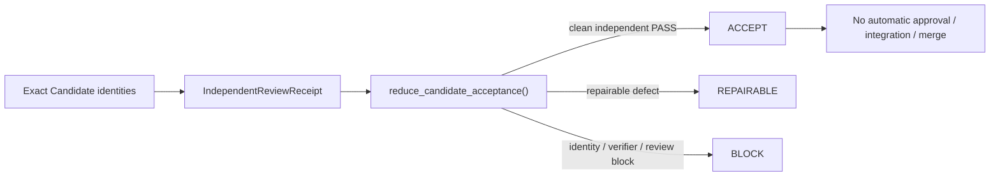

# Governance Gates, Independent Acceptance & Evidence Contracts

Nexus separates **verification evidence**, **independent Candidate acceptance**, **operator-observed outcomes**, and **GitHub merge intent** so that no single receipt silently acquires approval or integration authority.

> 🏛️ **Authority contract**: `AGENTS.md` remains repository/agent governance authority. [`CapabilityPlanner`](../routing/capability-planner.md) is the sole route/capability-selection authority. OpenWiki is `derived_non_authoritative`. A passing verifier, an `ACCEPT` result, an operator outcome receipt, or a prepared merge intent does not by itself authorize merge, push, integration, release, or public claims.

---

## 🛡️ Fail-Closed Completion

The existing completion layer remains the navigation point for task-delivery verification:

- `nexus/engine/completion_enforcer.py` — fail-closed completion enforcement;
- `nexus/engine/completion_contract.py` — structured completion envelope construction and verification contracts.

Avoid hard-coding a global test-count baseline in implementation guidance. Current validation should be bound to the exact command, revision, and artifact used for the change under review.

---

## ✅ Exact-Candidate Independent Acceptance

`nexus/orchestrator/acceptance_loop.py` introduces an immutable acceptance reducer for one exact Candidate. It binds:

- `task_id` and `attempt_id`;
- implementer and independent reviewer identity;
- candidate commit/tree/state/diff hashes;
- verified receipt hash and verifier artifact hash;
- review status and exit code.

The reducer can return:

- `ACCEPT`
- `REPAIRABLE`
- `BLOCK`

It explicitly does **not** perform promotion. `CandidateAcceptanceResult` defaults all of the following to false:

- `approval_performed`
- `integration_performed`
- `merge_performed`
- `public_claim_allowed`

A reviewer equal to the implementer, identity mismatch, blocking review, non-zero verifier exit, or failed verified-repair evidence forces a non-accepting result.



---

## 🧾 Operator Outcome Receipts

`nexus/contracts/operator_outcome_receipt.py` defines `nexus.operator_outcome_receipt.v1`, a privacy-bounded immutable observational receipt.

It distinguishes observation basis from authority:

- `OPERATOR_REPORT`
- `SYSTEM_OBSERVATION`
- `NOT_OBSERVED`

Allowed observed outcomes are `SUCCESS`, `FAILURE`, `PARTIAL`, `UNKNOWN`, and `NOT_OBSERVED`. Fields carry explicit provenance and canonical hashes. The contract contains no free-form approval authority and must not be converted into a release or merge decision.

---

## 🔀 GitHub Orchestration Is Intent Preparation, Not Merge Execution

`nexus/contracts/github_orchestration.py` defines strict immutable evidence for GitHub merge-intent preparation. Current evidence may include:

- terminal successful required checks;
- review state and unresolved-thread count;
- exact Candidate lineage and independent acceptance;
- impact classification and regression status;
- freshness timestamps.

`nexus/orchestrator/github_orchestration.py` is deliberately a **pure reducer/preparer**. Its module contract says it performs no provider, subprocess, network, or merge call. `prepare_merge_intent()` rejects stale evidence, failed/missing checks, unresolved review state, unknown/regressing impact, or missing independent acceptance.

A successful result still carries:

```text
schema = nexus.github_merge_intent.v2
kind = MERGE_INTENT
mutation_authorized = false
claim_ceiling = m4_merge_eligible_and_intent_ready_only
```

So the strongest supportable claim is **merge intent ready under fresh evidence**, not “merged” or “approved”.

---

## 🏷️ Required V3 Classifications

```yaml
component: CandidateAcceptanceReducer
implementation_status: CURRENT
wiring_status: WIRED
runtime_surfaces:
  - LOCAL_RUNTIME
authority_roles:
  - GOVERNANCE_AUTHORITY
evidence_basis:
  - nexus/orchestrator/acceptance_loop.py:reduce_candidate_acceptance
  - nexus/orchestrator/self_hosted_task_service.py:CandidateAcceptanceResult
claim_ceiling: Independently reduces exact Candidate and reviewer evidence to ACCEPT/REPAIRABLE/BLOCK without performing approval, integration, merge, or public-claim promotion.
```

```yaml
component: OperatorOutcomeReceipt
implementation_status: CURRENT
wiring_status: WIRED
runtime_surfaces:
  - LOCAL_RUNTIME
authority_roles:
  - NONE
evidence_basis:
  - nexus/contracts/operator_outcome_receipt.py:OperatorOutcomeReceipt
  - nexus/orchestrator/self_hosted_task_service.py:validate_operator_outcome_receipt
claim_ceiling: Immutable privacy-bounded observation receipt consumed by the task service; observational evidence is not approval or route authority.
```

```yaml
component: GitHubMergeIntent
implementation_status: CURRENT
wiring_status: UNKNOWN
runtime_surfaces: []
authority_roles:
  - NONE
evidence_basis:
  - nexus/contracts/github_orchestration.py:MergeIntent
  - nexus/orchestrator/github_orchestration.py:prepare_merge_intent
claim_ceiling: Current source can prepare and revalidate a non-mutating merge intent from fresh evidence; this bounded source review does not claim that the intent is automatically executed or merged.
```

```yaml
component: CompletionEnforcer
implementation_status: CURRENT
wiring_status: UNKNOWN
runtime_surfaces: []
authority_roles:
  - GOVERNANCE_AUTHORITY
evidence_basis:
  - nexus/engine/completion_enforcer.py:CompletionEnforcer
claim_ceiling: Current fail-closed completion implementation exists; runtime-surface claims require a current caller or bound receipt beyond class existence.
```

---

## 🧭 Change Navigation & Validation

### When to Consult
Consult this page for completion gates, Candidate acceptance, verifier/receipt identity binding, operator-observed outcomes, or GitHub merge-intent evidence.

### Governance Invariants
- Independent reviewer identity must remain separate from implementer identity.
- Candidate commit/tree/state/diff/receipt identities must bind exactly.
- `ACCEPT` does not mean approval, integration, merge, or public claim.
- Operator outcome evidence remains observational.
- GitHub merge intent remains `mutation_authorized=false` until a separate authority explicitly performs an allowed mutation.
- OpenWiki must not elevate any of these evidence objects into approval or release authority.

### Exact Source Files & Symbols
- `nexus/orchestrator/acceptance_loop.py` → `CandidateAcceptanceRequest`, `IndependentReviewReceipt`, `reduce_candidate_acceptance`
- `nexus/contracts/operator_outcome_receipt.py` → `OperatorOutcomeReceipt`, `build_operator_outcome_receipt`
- `nexus/contracts/github_orchestration.py` → `GitHubOrchestrationEvidence`, `MergeIntent`
- `nexus/orchestrator/github_orchestration.py` → `prepare_merge_intent`, `revalidate_merge_intent`
- `nexus/engine/completion_enforcer.py` / `completion_contract.py` → completion gates

### Focused Tests
- `tests/nexus/orchestrator/test_acceptance_loop.py`
- `tests/contracts/test_operator_outcome_receipt.py`
- `tests/contracts/test_github_orchestration.py`
- `tests/nexus/orchestrator/test_github_orchestration.py`
- `tests/test_task_runner_completion_gate.py`

### Minimal Validation Command
```bash
pytest tests/nexus/orchestrator/test_acceptance_loop.py tests/contracts/test_operator_outcome_receipt.py tests/contracts/test_github_orchestration.py tests/nexus/orchestrator/test_github_orchestration.py -q
```
