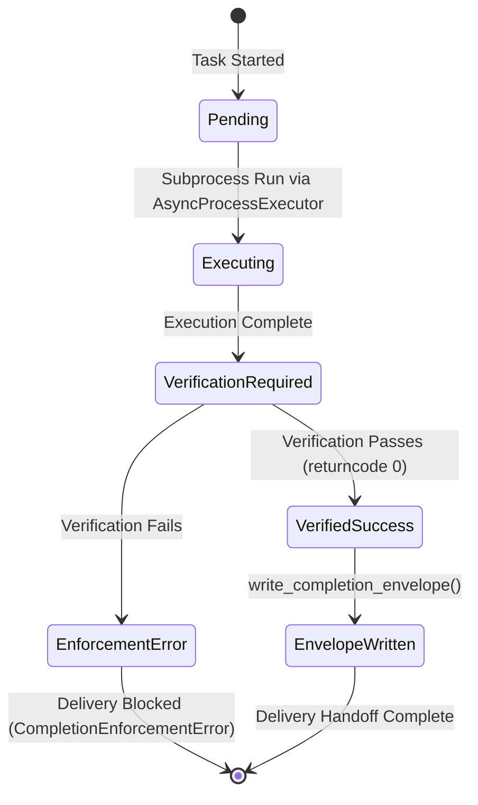

# Governance Gates & Completion Contracts

Nexus Singularity OS uses fail-closed **Governance Gates** and structured **Completion Envelopes** to ensure that task execution and code modifications meet strict verification criteria before delivery.

> 🏛️ **Authority Contract Requirement**: `AGENTS.md` remains repository/agent governance authority. `CapabilityPlanner` and `HybridRouteDecision` remain Nexus route authority. OpenWiki is `derived_non_authoritative` and holds zero approval or release authority.

---

## 🛡️ Core Verified Gates

1. **Pytest Collect (P0)**: Mandatory discovery check ensuring test suite integrity without regression (`4246` test items baseline).
2. **Enterprise Audit (P1)**: Machine-verifiable isolation and hallucination checks executed via `nexus status`.
3. **PR-Safe Lint (P1)**: Quality enforcement on changed files via Ruff.
4. **`CompletionEnforcer` Fail-Closed Gate**: Blocks delivery handoff if behavioral verification commands fail or output receipts are missing.

---

## 🔄 Completion Envelope Lifecycle State Machine


*Figure 1: State transitions of a completion envelope from task execution through fail-closed verification to delivery handoff.*

---

## 🏷️ Required V3 Classifications

```yaml
component: CompletionEnforcer
implementation_status: CURRENT
wiring_status: WIRED
runtime_surfaces:
  - MAIN_CLI
  - MCP_GATEWAY
  - LOCAL_RUNTIME
authority_roles:
  - GOVERNANCE_AUTHORITY
evidence_basis:
  - nexus/engine/completion_enforcer.py:CompletionEnforcer
  - nexus/engine/completion_enforcer.py:CompletionEnforcementError
claim_ceiling: Fail-closed governance enforcer preventing task closeout when completion criteria or verification checks fail.
```

```yaml
component: build_completion_envelope
implementation_status: CURRENT
wiring_status: WIRED
runtime_surfaces:
  - MAIN_CLI
  - MCP_GATEWAY
  - LOCAL_RUNTIME
authority_roles:
  - GOVERNANCE_AUTHORITY
evidence_basis:
  - nexus/engine/completion_contract.py:build_completion_envelope
claim_ceiling: Constructs structured JSON verification envelopes capturing task artifacts and evidence hashes.
```

```yaml
component: PreWriteGate
implementation_status: CURRENT
wiring_status: WIRED
runtime_surfaces:
  - MAIN_CLI
  - LOCAL_RUNTIME
authority_roles:
  - GOVERNANCE_AUTHORITY
evidence_basis:
  - scripts/pre_write_quality_gate.py:main
claim_ceiling: Quality gate inspecting file modifications prior to disk persistence.
```

---

## 🛠️ Extension Recipe: Adding a Custom Completion Verifier

To add a domain-specific completion verification check:

1. **Define Verifier Function**: Add the verifier signature in `nexus/engine/completion_contract.py`.
2. **Hook into Enforcer**: Call the verifier in `ensure_verified_completion()` within `nexus/engine/completion_enforcer.py`.
3. **Raise Enforcement Error**: On validation failure, raise `CompletionEnforcementError` to trigger fail-closed delivery blocking.
4. **Unit Verification**: Add a test in `tests/test_task_runner_completion_gate.py`.
5. **Run Verification**: `pytest tests/test_task_runner_completion_gate.py -q`.

---

## 🧭 Change Navigation & Validation

### When to Consult
Consult this page when modifying delivery verification rules, altering completion envelope schemas, updating pre-write quality gates, or troubleshooting blocked delivery reports.

### Runtime Invariants
- `CompletionEnforcer` must fail closed when verification output is absent or returns non-zero exit codes.
- `openwiki/` output must be kept strictly derived and non-authoritative.

### Exact Source Files & Symbols
- `nexus/engine/completion_enforcer.py` -> `CompletionEnforcer`, `CompletionEnforcementError`
- `nexus/engine/completion_contract.py` -> `build_completion_envelope`, `ensure_verified_completion`
- `scripts/pre_write_quality_gate.py` -> `main`

### Focused Tests
- `tests/test_task_runner_completion_gate.py`
- `tests/test_iron_gate_governance.py`

### Minimal Validation Command
```bash
pytest tests/test_task_runner_completion_gate.py -q
```
