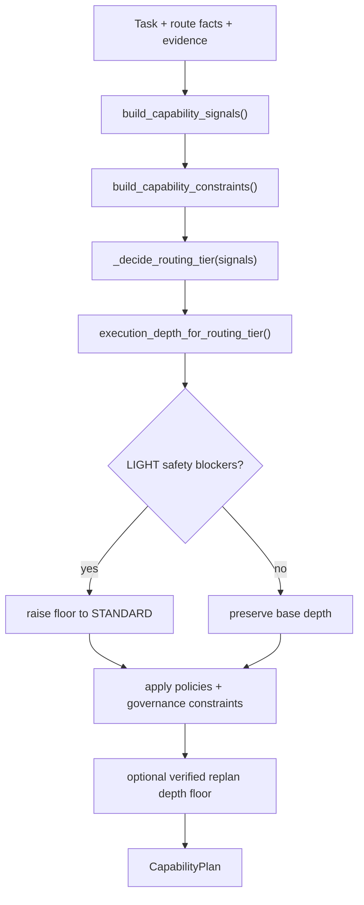

# Capability Planner & Routing Authority

In current Nexus source, **`CapabilityPlanner` is the sole route and capability-selection authority**. `nexus/contracts/canonical_execution.py` hard-binds `_ROUTE_AUTHORITY = "CapabilityPlanner"`, and its module contract explicitly says canonical planning contracts do not themselves select a provider, model, execution lane, Target, lifecycle, or execution world.

`HybridRouteDecision` is a Planner-derived route decision payload/projection. It carries fields such as `execution_world`, `execution_topology`, `route_mode`, `authority`, and evidence, but its own default `route_truth_source` is `"CapabilityPlanner"` and `adapter_output_is_route_truth` defaults to `False`. It is therefore **not a second selector, router, or planner**.

> 🏛️ **Authority ceiling**: `AGENTS.md` remains repository/agent governance authority. OpenWiki is `derived_non_authoritative`. No Wiki page, adapter, workforce admission result, execution receipt, or HybridRouteDecision may become a parallel route source.

---

## 🎯 Planner Inputs and Output

`CapabilityPlanner.plan()` accepts explicit task and evidence inputs including:

- `execution_world`
- `task_desc`
- `task_type`
- `route`
- optional `pillars`, `codeintel`, `phase_trace`, `budget`, `skills`
- optional `ExecutionReplanAuthorization`

The planner builds capability signals and constraints, applies governance and policy floors, and returns one `CapabilityPlan`.

The current execution-depth vocabulary is:

- `LIGHT`
- `STANDARD`
- `FULL`

Older OpenWiki wording that used `DEEP` is stale for this contract.



`UnifiedRuntime` consumes `CapabilityPlanner` for task-scoped planning and may build a verifier-evidence-backed replan request. A replan request is not a free-form route override: it is tied to the source planner decision and can only raise the execution-depth floor through the planner contract.

---

## 🔒 Hard Governance Nodes Are Not Route Alternatives

The planner marks key governance capabilities as hard constraints or required nodes. Current source includes:

- `mempalace_gate`
- `artifact_gate`
- `claim_gate`
- `delivery_gate`
- `harness_preflight_sensor`
- `research_route`

These gates constrain execution; they do not become independent route authorities.

The capability graph also includes phase-scoped execution capabilities such as `codeintel`, `research`, `nightshift`, `swarm`, `drone`, and `local_model_executor`. Their presence in `default_capability_nodes()` proves that the planner can represent them; runtime invocation must still be verified separately.

---

## 🏷️ Required V3 Classifications

```yaml
component: CapabilityPlanner
implementation_status: CURRENT
wiring_status: WIRED
runtime_surfaces:
  - LOCAL_RUNTIME
authority_roles:
  - ROUTE_AUTHORITY
evidence_basis:
  - nexus/engine/capability_planner.py:CapabilityPlanner
  - nexus/contracts/canonical_execution.py:_ROUTE_AUTHORITY
  - nexus/services/unified_runtime.py:CapabilityPlanner
claim_ceiling: Sole canonical route and capability-selection authority for the task-scoped runtime planning seam.
```

```yaml
component: CanonicalPlanningBundle
implementation_status: CURRENT
wiring_status: WIRED
runtime_surfaces:
  - LOCAL_RUNTIME
authority_roles:
  - NONE
evidence_basis:
  - nexus/contracts/canonical_execution.py:CanonicalPlanningBundle
  - nexus/services/unified_runtime.py:CanonicalPlanningBundle
claim_ceiling: Immutable planner-output bundle used by the task-scoped runtime; it carries planning truth but does not independently select provider, model, execution lane, Target, lifecycle, or world.
```

```yaml
component: HybridRouteDecision
implementation_status: CURRENT
wiring_status: UNKNOWN
runtime_surfaces: []
authority_roles:
  - NONE
evidence_basis:
  - nexus/contracts/hybrid_route.py:HybridRouteDecision
  - nexus/contracts/hybrid_route.py:route_truth_source
  - nexus/contracts/hybrid_route.py:adapter_output_is_route_truth
claim_ceiling: Current Planner-derived route payload implementation exists; this bounded source evidence does not establish a specific runtime caller and does not grant route-selection authority.
```

---

## 🛠️ Extension Recipe: Adding or Changing a Capability Node

1. **Define or edit the node** in `default_capability_nodes()` in `nexus/engine/capability_planner.py`.
2. **Preserve phase semantics** against the canonical runtime contract (`S`, `P`, `D`, `X`, `R`, `A`, `C`).
3. **Preserve route authority**: do not add a new Router/Planner/topology selector or adapter-owned route truth.
4. **Bind execution separately** through the existing runtime/invoker surface; node existence alone is not runtime wiring proof.
5. **Add focused planner and contract tests** for state, constraints, depth, route truth, and any replan behavior.
6. **Run the focused gate** below before broader tests.

---

## 🧭 Change Navigation & Validation

### When to Consult
Consult this page when modifying capability selection, route facts, execution-depth floors, replan semantics, planner-owned workforce demands, or a Planner-derived route contract.

### Runtime Invariants
- `CapabilityPlanner` is the only route/capability-selection authority.
- `_ROUTE_AUTHORITY` remains `"CapabilityPlanner"`.
- `HybridRouteDecision.route_truth_source` must remain `"CapabilityPlanner"` for valid Planner-derived decisions.
- `adapter_output_is_route_truth` must not be promoted into a parallel route source.
- Execution-depth values are `LIGHT`, `STANDARD`, and `FULL`.

### Exact Source Files & Symbols
- `nexus/engine/capability_planner.py` → `CapabilityPlanner`, `default_capability_nodes`, `CapabilityPlan`
- `nexus/contracts/canonical_execution.py` → `_ROUTE_AUTHORITY`, `CanonicalTaskContext`, `CanonicalPlanningBundle`
- `nexus/contracts/hybrid_route.py` → `HybridRouteDecision`, `RouteMode`, `Authority`
- `nexus/services/unified_runtime.py` → planner invocation and evidence-backed replan seam

### Focused Tests
- `tests/engine/test_capability_planner.py`
- `tests/contracts/test_canonical_execution.py`
- `tests/contracts/test_hybrid_route_contract.py`

### Minimal Validation Command
```bash
pytest tests/engine/test_capability_planner.py tests/contracts/test_canonical_execution.py tests/contracts/test_hybrid_route_contract.py -q
```
