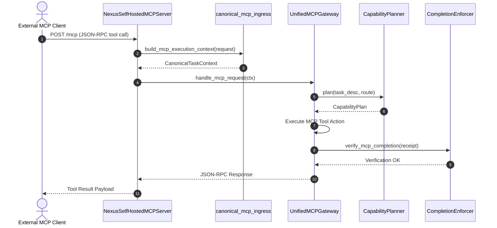

# MCP Gateway & Ingress Protocols

The **Model Context Protocol (MCP) Gateway** exposes Nexus capabilities to external agents, MCP tools, and HTTP clients. It translates incoming tool calls into canonical task contexts while delegating route authorization strictly to `[CapabilityPlanner](../routing/capability-planner.md)` and delivery verification to `[CompletionEnforcer](../governance/gates-and-contracts.md)`.

---

## 🏗️ Gateway Architecture & Ingress Pipeline

The MCP subsystem consists of three primary components:
1. **`UnifiedMCPGateway`** (`nexus/orchestrator/unified_mcp_gateway.py`): Core gateway orchestrator managing MCP tool registration, health checking, and execution contexts (`schema: nexus.mcp_canonical_runtime.v1`).
2. **`NexusSelfHostedMCPServer`** (`nexus/orchestrator/self_hosted_mcp.py`): MCP server handling tool requests; the HTTP adapter in `nexus/orchestrator/self_hosted_mcp_http.py` exposes the `/mcp` endpoint and rejects non-MCP paths.
3. **`canonical_mcp_ingress`** (`nexus/orchestrator/canonical_mcp_ingress.py`): Constructs `CanonicalTaskContext` payloads with `transport_ingress="mcp"`.

---

## 🔄 MCP Ingress Sequence Flow


*Figure 1: Request flow for incoming Model Context Protocol tool invocations through HTTP ingress and CapabilityPlanner routing.*

---

## 🏷️ Required V3 Classifications

```yaml
component: UnifiedMCPGateway
implementation_status: CURRENT
wiring_status: WIRED
runtime_surfaces:
  - MCP_GATEWAY
authority_roles:
  - EXECUTION_AUTHORITY
evidence_basis:
  - nexus/orchestrator/unified_mcp_gateway.py:UnifiedMCPGateway
  - scripts/ops/nexus_mcp_gateway.py:main
claim_ceiling: Core MCP execution gateway; handles MCP tool requests and binds execution contexts to CapabilityPlanner routing.
```

```yaml
component: NexusSelfHostedMCPServer
implementation_status: CURRENT
wiring_status: WIRED
runtime_surfaces:
  - MCP_GATEWAY
authority_roles:
  - EXECUTION_AUTHORITY
evidence_basis:
  - nexus/orchestrator/self_hosted_mcp.py:NexusSelfHostedMCPServer
  - nexus/orchestrator/self_hosted_mcp_http.py:create_http_server
claim_ceiling: Self-hosted HTTP server providing JSON-RPC transport over /mcp endpoints.
```

```yaml
component: canonical_mcp_ingress
implementation_status: CURRENT
wiring_status: WIRED
runtime_surfaces:
  - MCP_GATEWAY
authority_roles:
  - NONE
evidence_basis:
  - nexus/orchestrator/canonical_mcp_ingress.py:build_mcp_execution_context
  - nexus/orchestrator/unified_mcp_gateway.py:build_mcp_execution_context
claim_ceiling: Ingress context builder standardizing incoming MCP requests into CanonicalTaskContext.
```

---

## 🛠️ Extension Recipe: Adding an MCP Tool Endpoint

To expose a new tool through the MCP Gateway:

1. **Define Tool Schema**: Add the JSON Schema declaration returned by `UnifiedMCPGateway.tool_specs()` in `nexus/orchestrator/unified_mcp_gateway.py`.
2. **Implement Dispatch**: Add the bounded handler path used by `UnifiedMCPGateway._task_run()` or the relevant existing tool dispatch method.
3. **Preserve Authority Boundaries**: Route/task-dispatch tools must use `[CapabilityPlanner](../routing/capability-planner.md)` where current source delegates route authority. Direct status, inspection, and explicitly handled MCP tools remain governed by their own permission/handler contracts and must not invent a Planner route.
4. **Validation Test**: Add focused coverage under `tests/nexus/orchestrator/` for tool invocation, ingress, or HTTP transport behavior.
5. **Execute Validation**: Run the focused MCP tests listed below.

---

## 🧭 Change Navigation & Validation

### When to Consult
Consult this page when extending MCP tool APIs, debugging HTTP/stdio transport errors, or modifying MCP ingress context construction.

### Runtime Invariants
- Direct MCP tool execution without obtaining a `CapabilityPlan` from `[CapabilityPlanner](../routing/capability-planner.md)` is prohibited.
- Requests to non-`/mcp` HTTP paths must be rejected by `NexusSelfHostedMCPServer`.

### Exact Source Files & Symbols
- `nexus/orchestrator/unified_mcp_gateway.py` -> `UnifiedMCPGateway`
- `nexus/orchestrator/self_hosted_mcp.py` -> `NexusSelfHostedMCPServer`
- `nexus/orchestrator/self_hosted_mcp_http.py` -> `build_handler`, `create_http_server`
- `nexus/orchestrator/canonical_mcp_ingress.py` -> `build_mcp_execution_context`

### Focused Tests
- `tests/nexus/orchestrator/test_unified_mcp_gateway.py`
- `tests/nexus/orchestrator/test_mcp_canonical_ingress.py`
- `tests/nexus/orchestrator/test_unified_mcp_gateway_http.py`
- `tests/nexus/orchestrator/test_self_hosted_mcp.py`

### Minimal Validation Command
```bash
pytest tests/nexus/orchestrator/test_unified_mcp_gateway.py tests/nexus/orchestrator/test_mcp_canonical_ingress.py tests/nexus/orchestrator/test_unified_mcp_gateway_http.py tests/nexus/orchestrator/test_self_hosted_mcp.py -q
```

## 🧭 Diagnostic Boundary: `HOST_ACTION_BINDING_GAP`

When ChatGPT discovers an MCP action or tool but direct invocation fails
host-side with `The nexus tool has been disabled` or an equivalent action
binding error, classify the event as `HOST_ACTION_BINDING_GAP` only when the
same event shows no ingress in DevSpace or Gateway evidence and the Nexus
server processes remain healthy. The absence of ingress is load-bearing
evidence: do not patch, restart, reinstall, or rewrite the Nexus Gateway for
this class of event without separate runtime evidence.

The historical maximum claim for this diagnosis is
`B1_HOST_BINDING_FAILURE_LOCALIZED`; it does not establish that the ChatGPT
platform is permanently fixed. Record the event, host-side error, ingress
observation, process-health observation, and evidence timestamp before any
independent remediation.

### Required evidence fields

The classification is valid only when the receipt or incident note preserves:

- the exact host-side error and action/tool name;
- the event timestamp and repository/runtime identity;
- the corresponding DevSpace and Gateway ingress observations;
- the server-process health observation and its evidence source; and
- the operator or system that made the classification.

These fields make the boundary auditable; they do not authorize a Gateway
restart or change the claim ceiling.
