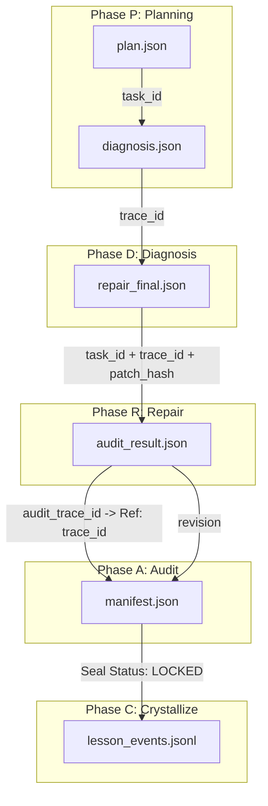

# Phase 36.10 審核文件包

## 1. Source of Truth Rules
(Source: AGENT_SCHEMA.md)

### 2. Source of Truth Rules

#### 2.1 Primary truth
The following are authoritative:
- repository source code,
- `.nexus` artifacts,
- schema contracts,
- `manifest.json`,
- acceptance and audit artifacts,
- active specifications.

#### 2.2 This vault is compiled knowledge
Pages in this vault must summarize, connect, and explain.
They must not become an independent truth source.

#### 2.3 Conflict handling
If two sources disagree:
- do not silently merge,
- do not guess,
- create or update `[System - Unknowns and Conflicts](../01_System/System - Unknowns and Conflicts.md)`,
- note version scope and source path,
- mark confidence as low or medium until resolved.

(Source: OPS_03_TRUTH_CLAIMS_AND_VERIFICATION.md)
### Verification Command
本頁集中管理所有關於 Nexus 物理狀態的真值聲明 (Truth Claims)，並提供可機器執行的驗證命令。
[ID | Claim Description | Evidence | Verification Command]
- `C-03` | Wiki Linter v1.4 主線硬閘啟用。 | `scripts/ops/wiki_linter.py` | `uv run scripts/ops/wiki_linter.py --strict`
- `C-07` | Agent Schema 指導規約存在。 | `99_Schema/AGENT_SCHEMA.md` | `test -f nexus_wiki_vault/99_Schema/AGENT_SCHEMA.md`
- `C-08` | CI Gate Dry-run 鏈路完整通透。 | `scripts/ops/ci_gate.py` | `uv run scripts/ops/ci_gate.py --dry-run`

## 2. Naming Rules
(Source: AGENT_SCHEMA.md)

### 5. Naming Rules

#### 5.1 Page prefixes
Use one of these page prefixes only:
- `System - ...`
- `Module - ...`
- `Flow - ...`
- `State - ...`
- `Protocol - ...`
- `Ops - ...`
- `Diff - ...`

#### 5.2 Stable naming
Do not rename pages casually.
If renaming is necessary:
- preserve old title in `aliases`
- update backlinks
- note rename in page history section if relevant

#### 5.3 No raw file mirror naming
Do not create pages named after every source file by default.
They may only appear as module references unless repeated usage justifies a dedicated module page.

### 6.2 Frontmatter template
All pages should include:
```yaml
---
title:
aliases: []
type:
status: draft
version_scope: []
source_of_truth: compiled-wiki
raw_sources: []
related_pages: []
related_modules: []
tags: [nexus]
last_compiled:
last_verified:
confidence: medium
owner: agent
---
```

## 3. Evidence Contracts
(Source: PROTO_02_EVIDENCE_MAP_AND_KNOWLEDGE_LINEAGE.md)

### Evidence Dependency Map


### Artifact Producer Gate
門禁可視化: 標註哪些工件是 Promotion Gate 的強制輸入。

### Evidence Alignment Matrix (高保真對位矩陣)
| Artifact | Producer (產生者) | Gate Criticality | Retention Path |
|---|---|---|---|
| `plan.json` | Planner (P) | MEDIUM | `.nexus/runs/<id>/` |
| `diagnosis.json` | Diagnoser (D) | **HIGH** | `.nexus/runs/<id>/` |
| `repair_final.json`| Repairer (R) | **HIGH** | `.nexus/runs/<id>/` |
| `audit_result.json`| Auditor (A) | **CRITICAL** | `.nexus/runs/<id>/` |
| `manifest.json` | Manifest Sealer (C) | **CRITICAL** | Root: `manifest.json` |

## 4. JSON Schemas
(Source: MUSE_ENGINE_SPEC_V17.1_HARDENED.md)

### 📄 JSON 資料結構 (Schemas)

#### 1. `plan.json` (Contract v1)
```json
{
  "task_id": "UUID-001",
  "goal": "Description",
  "code_map": ["src/service.py"],
  "env_ok": true,
  "status": "PLAN_READY"
}
```

#### 2. `diagnosis.json` (Strict Schema)
```json
{
  "root_cause": "The timeout calculation used local time instead of UTC.",
  "category": "One of [CONFIG, LOGIC, ENVIRONMENT, DATA, SECURITY]",
  "target_modules": ["src/services/auth.py"],
  "risk_assessment": "Low | Medium | High",
  "red_tests": ["tests/test_auth.py::test_session_expiry"],
  "trace_id": "UUID-v4"
}
```

#### 3. `repair_final.json` (Strict Schema)
```json
{
  "task_id": "UUID-001",
  "trace_id": "UUID-v4",
  "success": true,
  "patch_hash": "SHA256_HASH",
  "iterations_used": 3,
  "round_history": [
    { "round": 1, "result": "FAIL", "reason": "Linter failed" },
    { "round": 2, "result": "PASS", "reason": "Logic fixed" }
  ]
}
```

#### 4. `audit_result.json` (Machine Truth)
```json
{
  "task_id": "UUID-001",
  "trace_id": "UUID-v4",
  "audit_passed": true,
  "recommendation": "PASS | REPAIR | ABORT | HUMAN_REVIEW"
}
```

#### 5. `manifest.json` (Evidence Index)
```json
{
  "task_id": "UUID-001",
  "trace_id": "UUID-v4",
  "artifacts": [
    { "file": ".nexus/runs/<task_id>/phase_metrics/<task_id>_metrics.json", "sha256": "...", "phase": "PDRAC" }
  ],
  "seal_status": "VERIFIED"
}
```

## 5. Service Responsibilities
(Source: ARCH_03_SERVICES_COMMANDS_AND_SECURITY.md)

### Services Component Registry

| Category | Component Name | Responsibility (職責) |
|---|---|---|
| **Memory** | **memory_repository.py** | 實體 LanceDB 表與磁碟 IO 管理。 |
| **Logic** | **planner_enhancer.py** | 調度計畫增強。 |
| **Logic** | **prompt_builder.py** | 動態 Prompt 構建。 |
| **UI** | **ui_budget.py** | 前端資源預算管理。 |
